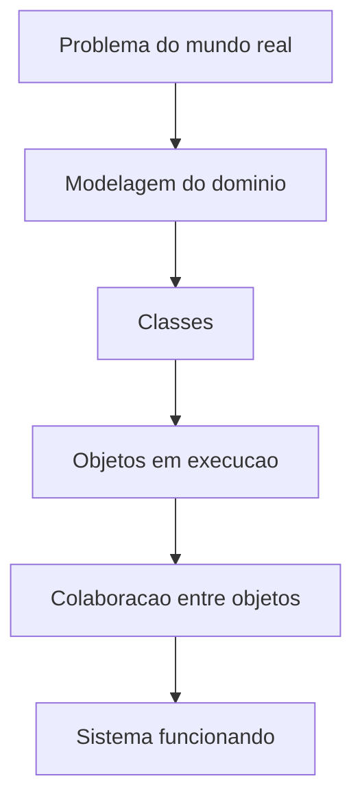

# Aula 0 - Introducao a POO

## Visao geral

Orientacao a objetos e uma forma de pensar software colocando objetos no centro da solucao. Em vez de enxergar o programa apenas como uma sequencia de passos, enxergamos entidades com estado, comportamento e relacoes.

No livro-base, a ideia central e que POO nao e uma linguagem, mas um modelo de organizacao. `C#` foi desenhada para aplicar esse modelo com classes, objetos, interfaces, propriedades e hierarquias.

A sigla POO reune tres palavras: **Objeto** (algo com existencia concreta num dominio), **Orientada** (direcao do pensamento) e **Programacao** (instrucoes ao computador). Juntando tudo, POO significa escrever programas mantendo objetos como unidade central de raciocinio.

## Paradigmas de programacao

Existem outros paradigmas alem de POO. A **programacao procedural** (linguagem C) organiza o codigo como sequencia de funcoes. A **programacao funcional** (F#) trata computacao como avaliacao de funcoes puras. `C#` permite misturar paradigmas, mas seu nucleo e orientado a objetos.

## O que e um objeto

Um objeto possui:

- **identidade**: qual objeto estamos observando
- **estado**: os dados que ele guarda
- **comportamento**: as acoes que ele executa

O livro-base usa uma analogia: um ser humano possui propriedades (altura, peso, idade) e comportamentos (andar, falar, comer). A **classe** agrupa essas propriedades e comportamentos num molde. O **objeto** e uma instancia concreta desse molde.

## Por que usar POO

- aproxima o codigo do mundo real
- melhora a modularidade e o reuso
- facilita manutencao e extensao
- ajuda a dividir sistemas grandes em partes menores

## Mapa conceitual



## De procedural a orientado a objetos

No estilo procedural, dados e operacoes vivem separados:

```csharp
// Procedural — dados soltos
static void Creditar(ref decimal saldo, decimal valor) { saldo += valor; }
static void Debitar(ref decimal saldo, decimal valor) { if (valor <= saldo) saldo -= valor; }
```

No estilo OO, dados e operacoes ficam juntos na classe:

```csharp
public class ContaBancaria
{
    public decimal Saldo { get; private set; }
    public void Creditar(decimal valor) { if (valor > 0) Saldo += valor; }
    public bool Debitar(decimal valor)
    {
        if (valor <= 0 || valor > Saldo) return false;
        Saldo -= valor;
        return true;
    }
}
```

---

## 🏦 Hands-on: App Bancario — Apresentacao do Projeto

Ao longo de toda a serie de aulas, vamos construir progressivamente um **sistema bancario**. A cada aula, aplicaremos o conceito aprendido para evoluir a aplicacao. No final, teremos um sistema completo com contas, clientes, transacoes, notificacoes e persistencia.

### O dominio

Nosso banco precisa gerenciar:

- **Clientes** que possuem dados pessoais
- **Contas** (corrente e poupanca) com saldo e operacoes
- **Transacoes** (deposito, saque, transferencia)
- **Notificacoes** quando eventos importantes ocorrem
- **Relatorios** e extratos

### Identificando objetos

Antes de escrever qualquer codigo, vamos pensar como objetos:

| Objeto | Estado (dados) | Comportamento (acoes) |
|--------|---------------|----------------------|
| Cliente | Nome, CPF, Email | AtualizarEmail() |
| ContaBancaria | Numero, Saldo, Titular | Depositar(), Sacar() |
| Transacao | Valor, Data, Tipo | — |

### Primeiro rascunho (apenas estrutura)

Nesta aula, vamos apenas definir o esqueleto. Nao se preocupe com protecao de dados ainda — isso vem na proxima aula.

```csharp
// === MiniBank v0.0 — Rascunho inicial ===

public class Cliente
{
    public string Nome;
    public string Cpf;
    public string Email;
}

public class ContaBancaria
{
    public string Numero;
    public decimal Saldo;
    public Cliente Titular;

    public void Depositar(decimal valor)
    {
        Saldo += valor;
    }

    public void Sacar(decimal valor)
    {
        Saldo -= valor;
    }
}
```

### Testando no Main

```csharp
var cliente = new Cliente();
cliente.Nome = "Ana Silva";
cliente.Cpf = "123.456.789-00";
cliente.Email = "ana@email.com";

var conta = new ContaBancaria();
conta.Numero = "0001";
conta.Saldo = 0;
conta.Titular = cliente;

conta.Depositar(1000m);
conta.Sacar(250m);

Console.WriteLine($"{conta.Titular.Nome} - Saldo: {conta.Saldo:C}");
// Ana Silva - Saldo: R$ 750,00
```

### Problemas que vamos resolver nas proximas aulas

1. **Saldo desprotegido** — qualquer codigo pode fazer `conta.Saldo = -9999` → *Aula 1–2 (encapsulamento)*
2. **Saque sem validacao** — permite sacar mais que o saldo → *Aula 1*
3. **Sem tipos de conta** — corrente e poupanca se comportam diferente → *Aula 2 (heranca/polimorfismo)*
4. **Sem contratos** — nao ha interface definindo o que uma conta deve fazer → *Aula 3*
5. **Sem notificacoes** — ninguem sabe quando uma transacao ocorre → *Aula 6 e 8*
6. **Sem persistencia** — dados somem ao fechar o programa → *Aula 7 e 9*

Esse rascunho cru e o ponto de partida. A cada aula, vamos melhorar.

---

## Vocabulario essencial

- **Classe**: molde que define propriedades e comportamentos
- **Objeto**: instancia concreta de uma classe
- **Atributo / Propriedade**: dado que o objeto armazena
- **Metodo**: acao que o objeto pode executar
- **Construtor**: metodo especial chamado na criacao do objeto
- **Instanciar**: criar um objeto usando `new`

## Para discutir em aula

1. Quais outros objetos voce identifica num sistema bancario real?
2. Quais dados e comportamentos pertencem a cada objeto?
3. O que acontece se qualquer parte do codigo puder alterar o saldo diretamente?
