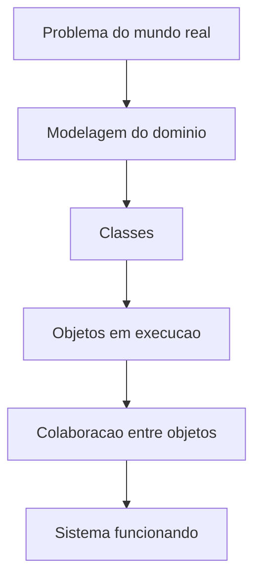

# Aula 0 - Introducao a POO

## Objetivo da aula

Entender o que POO resolve, diferenciar objeto de classe e enxergar o `MiniBank` como um dominio que sera refinado ao longo da trilha.

## Pre-requisitos

- saber criar e executar um projeto console em `C#`
- reconhecer variaveis, tipos e metodos simples
- estar confortavel com leitura de codigo basico

## Ao final, o aluno sera capaz de...

- explicar o que sao identidade, estado e comportamento
- diferenciar classe de objeto sem reduzir OO a "sintaxe de classe"
- identificar objetos iniciais de um dominio simples
- apontar por que o rascunho `v0.0` do `MiniBank` ainda precisa de encapsulamento e validacao

## Teoria essencial

Orientacao a objetos e uma forma de pensar software colocando objetos no centro da solucao. Em vez de enxergar o programa apenas como uma sequencia de passos, enxergamos entidades com estado, comportamento e relacoes.

No livro-base, a ideia central e que POO nao e uma linguagem, mas um modelo de organizacao. `C#` foi desenhada para aplicar esse modelo com classes, objetos, interfaces, propriedades e hierarquias.

A sigla POO reune tres palavras: **Objeto** (algo com existencia concreta num dominio), **Orientada** (direcao do pensamento) e **Programacao** (instrucoes ao computador). Juntando tudo, POO significa escrever programas mantendo objetos como unidade central de raciocinio.

## Paradigmas de programacao

Existem outros paradigmas alem de POO. A **programacao procedural** (linguagem C) organiza o codigo como sequencia de funcoes. A **programacao funcional** (F#) trata computacao como avaliacao de funcoes puras. `C#` permite misturar paradigmas, mas seu nucleo e orientado a objetos.

## O que e um objeto

Um objeto possui:

- **identidade**: qual objeto estamos observando
- **estado**: os dados que ele guarda
- **comportamento**: as acoes que ele executa

O livro-base usa uma analogia: um ser humano possui propriedades (altura, peso, idade) e comportamentos (andar, falar, comer). A **classe** agrupa essas propriedades e comportamentos num molde. O **objeto** e uma instancia concreta desse molde.

## Vocabulario essencial

- **Classe**: molde que define propriedades e comportamentos
- **Objeto**: instancia concreta de uma classe
- **Atributo / Propriedade**: dado que o objeto armazena
- **Metodo**: acao que o objeto pode executar
- **Construtor**: metodo especial chamado na criacao do objeto
- **Instanciar**: criar um objeto usando `new`

## Por que usar POO

- aproxima o codigo do mundo real
- melhora a modularidade e o reuso
- facilita manutencao e extensao
- ajuda a dividir sistemas grandes em partes menores

## Mapa conceitual



## Erros e confusoes comuns

- achar que POO e apenas "usar `class`"
- confundir classe com objeto em memoria
- modelar dados soltos antes de pensar no dominio
- assumir que qualquer dado publico e aceitavel so porque o codigo "funciona"

## De procedural a orientado a objetos

No estilo procedural, dados e operacoes vivem separados:

```csharp
// Procedural — dados soltos
static void Creditar(ref decimal saldo, decimal valor) { saldo += valor; }
static void Debitar(ref decimal saldo, decimal valor) { if (valor <= saldo) saldo -= valor; }
```

No estilo OO, dados e operacoes ficam juntos na classe:

```csharp
public class ContaBancaria
{
    public decimal Saldo { get; private set; }
    public void Creditar(decimal valor) { if (valor > 0) Saldo += valor; }
    public bool Debitar(decimal valor)
    {
        if (valor <= 0 || valor > Saldo) return false;
        Saldo -= valor;
        return true;
    }
}
```

---

## 🏦 Hands-on: App Bancario — Apresentacao do Projeto

### Estado atual do MiniBank

- Versao de entrada: sem projeto orientado a objetos definido
- Versao de saida: `v0.0`, um rascunho com `Cliente` e `ContaBancaria`
- Classes novas: `Cliente`, `ContaBancaria`
- Classes alteradas: nenhuma
- Comportamentos novos: depositar e sacar sem protecao de invariantes
- Como testar no Main: instanciar cliente e conta, fazer um deposito e um saque, e observar o saldo final

### O que muda nesta aula

Saimos de uma explicacao abstrata de POO e montamos um primeiro modelo cru do dominio. O foco nao e acertar o design final, e sim criar um ponto de partida concreto para justificar as proximas melhorias.

### Por que muda

Iniciantes entendem melhor o valor de encapsulamento, heranca, interfaces e colaboracao quando enxergam primeiro um modelo imperfeito que ainda tem problemas reais.

### Organizando o projeto

1. Crie um projeto console chamado `MiniBank`.
2. Na raiz do projeto, mantenha `Program.cs` para os testes manuais.
3. Crie a pasta `Models`.
4. Dentro de `Models`, crie os arquivos `Cliente.cs` e `ContaBancaria.cs`.
5. Coloque temporariamente todas as classes de dominio nessa pasta; nas proximas aulas vamos separar melhor por responsabilidade.

Ao longo de toda a serie de aulas, vamos construir progressivamente um **sistema bancario**. A cada aula, aplicaremos o conceito aprendido para evoluir a aplicacao. No final, teremos um sistema completo com contas, clientes, transacoes, notificacoes e persistencia.

### O dominio

Nosso banco precisa gerenciar:

- **Clientes** que possuem dados pessoais
- **Contas** (corrente e poupanca) com saldo e operacoes
- **Transacoes** (deposito, saque, transferencia)
- **Notificacoes** quando eventos importantes ocorrem
- **Relatorios** e extratos

### Identificando objetos

Antes de escrever qualquer codigo, vamos pensar como objetos:

| Objeto | Estado (dados) | Comportamento (acoes) |
|--------|---------------|----------------------|
| Cliente | Nome, CPF, Email | AtualizarEmail() |
| ContaBancaria | Numero, Saldo, Titular | Depositar(), Sacar() |
| Transacao | Valor, Data, Tipo | — |

### Primeiro rascunho (apenas estrutura)

Nesta aula, vamos apenas definir o esqueleto. Nao se preocupe com protecao de dados ainda — isso vem na proxima aula.

```csharp
// === MiniBank v0.0 — Rascunho inicial ===

public class Cliente
{
    public string Nome;
    public string Cpf;
    public string Email;
}

public class ContaBancaria
{
    public string Numero;
    public decimal Saldo;
    public Cliente Titular;

    public void Depositar(decimal valor)
    {
        Saldo += valor;
    }

    public void Sacar(decimal valor)
    {
        Saldo -= valor;
    }
}
```

### Testando no Main

```csharp
var cliente = new Cliente();
cliente.Nome = "Ana Silva";
cliente.Cpf = "123.456.789-00";
cliente.Email = "ana@email.com";

var conta = new ContaBancaria();
conta.Numero = "0001";
conta.Saldo = 0;
conta.Titular = cliente;

conta.Depositar(1000m);
conta.Sacar(250m);

Console.WriteLine($"{conta.Titular.Nome} - Saldo: {conta.Saldo:C}");
// Ana Silva - Saldo: R$ 750,00
```

### Problemas que vamos resolver nas proximas aulas

1. **Saldo desprotegido** — qualquer codigo pode fazer `conta.Saldo = -9999` → *Aula 1–2 (encapsulamento)*
2. **Saque sem validacao** — permite sacar mais que o saldo → *Aula 1*
3. **Sem tipos de conta** — corrente e poupanca se comportam diferente → *Aula 2 (heranca/polimorfismo)*
4. **Sem contratos** — nao ha interface definindo o que uma conta deve fazer → *Aula 3*
5. **Sem notificacoes** — ninguem sabe quando uma transacao ocorre → *Aula 6 e 8*
6. **Sem persistencia** — dados somem ao fechar o programa → *Aula 7 e 9*

Esse rascunho cru e o ponto de partida. A cada aula, vamos melhorar.

---

## Checklist de verificacao da versao

- existe uma classe `Cliente` com pelo menos nome, CPF e email
- existe uma classe `ContaBancaria` com numero, saldo e titular
- o `Main` instancia objetos reais do dominio, em vez de variaveis soltas
- o saldo final do exemplo fica em `R$ 750,00`
- voce consegue apontar pelo menos dois problemas do design atual

## Exercicios

1. Liste mais tres objetos que poderiam existir em um banco real e descreva um dado e um comportamento de cada um.
2. No rascunho atual, explique por que `Saldo` publico e um risco para o sistema.
3. Adicione uma classe `Transacao` apenas com estrutura minima (`Valor`, `Tipo`, `Data`) e explique por que ela ainda nao esta integrada ao fluxo principal.

### Gabarito comentado

1. Resposta esperada: exemplos validos incluem `Transacao`, `Extrato`, `Banco`, `Cartao`, `Agencia`, `Notificacao`. O criterio e que cada objeto tenha estado e comportamento coerentes com o dominio. Exemplo de resposta correta: `Transacao` tem `Valor` e `Registrar()`, `Extrato` tem lista de transacoes e `Imprimir()`, `Banco` tem nome e `AbrirConta()`.
2. Resposta esperada: qualquer parte do codigo pode fazer `conta.Saldo = -9999m`, burlar saque, deposito e consistencia do dominio. A justificativa precisa mencionar quebra de encapsulamento e perda de invariantes.
3. Implementacao de referencia:

```csharp
public class Transacao
{
    public decimal Valor;
    public string Tipo = "";
    public DateTime Data;
}
```

Como verificar:
- a classe compila e pode ser instanciada no `Main`
- o aluno consegue explicar que ela existe, mas ainda nao participa do saque/deposito

Erros comuns:
- criar uma classe desconectada do dominio, como `Utilitario`
- responder com "saldo publico e ruim" sem explicar o impacto no comportamento

## Fechamento e conexao com a proxima aula

Nesta aula, o objetivo foi montar o primeiro recorte do dominio e tornar visiveis os problemas de um design sem encapsulamento. A proxima aula melhora exatamente esse ponto ao introduzir classes com construtor, propriedades e validacao.

### Versao esperada apos esta aula

- Versao de entrada: sem `MiniBank`
- Versao de saida: `v0.0`
- Classes novas: `Cliente`, `ContaBancaria`
- Classes alteradas: nenhuma
- Comportamentos novos: `Depositar`, `Sacar`
- Como testar no Main: repetir o exemplo da aula e confirmar o saldo final de `R$ 750,00`
