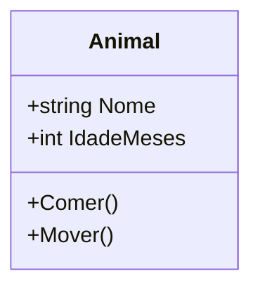
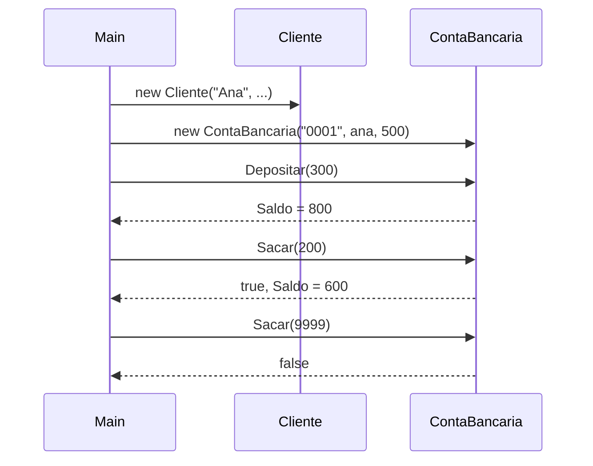

# Aula 1 - Classes e Objetos

## Teoria

A classe descreve a estrutura geral de uma entidade. O objeto e a instancia concreta dessa classe em memoria. Classe = projeto da casa; objeto = casa construida.

### Forma geral de uma classe

```csharp
class NomeDaClasse
{
    // propriedades, metodos, construtores
}
```

### Construtores

O construtor inicializa o estado do objeto. Possui o mesmo nome da classe e nao tem tipo de retorno:

```csharp
public ContaBancaria(string numero, decimal saldoInicial)
{
    Numero = numero;
    Saldo = saldoInicial;
}
```

Se nenhum construtor for declarado, `C#` cria um padrao sem parametros. Uma classe pode ter multiplos construtores (sobrecarga).

### Variaveis de referencia

Quando escrevemos `var conta = new ContaBancaria(...)`, a variavel `conta` guarda uma **referencia** ao objeto no heap. Se fizermos `var outra = conta`, ambas apontam para o mesmo objeto:

```csharp
var conta = new ContaBancaria("0001", 1000m);
var outra = conta; // mesma referencia!
outra.Depositar(500m);
Console.WriteLine(conta.Saldo); // 1500 — mesmo objeto
```

### Exemplo conceitual — classe Animal



```csharp
public class Animal
{
    public string Nome { get; set; } = "";
    public int IdadeMeses { get; set; }
    public void Comer() => Console.WriteLine($"{Nome} esta comendo.");
    public void Mover() => Console.WriteLine($"{Nome} esta se movendo.");
}
```

---

## 🏦 Hands-on: App Bancario — Classes com construtor e validacao

Na Aula 0, criamos um rascunho com campos publicos e sem validacao. Agora vamos melhorar usando **construtores**, **propriedades** e **validacao basica**.

### Evolucao do `Cliente`

```csharp
// === MiniBank v0.1 — Classes com construtores ===

public class Cliente
{
    public string Nome { get; private set; }
    public string Cpf { get; private set; }
    public string Email { get; set; }

    public Cliente(string nome, string cpf, string email)
    {
        Nome = nome;
        Cpf = cpf;
        Email = email;
    }

    public override string ToString() => $"{Nome} (CPF: {Cpf})";
}
```

`Nome` e `Cpf` sao `private set` — so podem ser definidos no construtor. `Email` pode ser alterado depois.

### Evolucao da `ContaBancaria`

```csharp
public class ContaBancaria
{
    public string Numero { get; private set; }
    public decimal Saldo { get; private set; }
    public Cliente Titular { get; private set; }

    public ContaBancaria(string numero, Cliente titular, decimal saldoInicial = 0)
    {
        Numero = numero;
        Titular = titular;
        Saldo = saldoInicial;
    }

    public void Depositar(decimal valor)
    {
        if (valor <= 0)
        {
            Console.WriteLine("Valor de deposito deve ser positivo.");
            return;
        }
        Saldo += valor;
        Console.WriteLine($"Deposito de {valor:C} na conta {Numero}. Saldo: {Saldo:C}");
    }

    public bool Sacar(decimal valor)
    {
        if (valor <= 0 || valor > Saldo)
        {
            Console.WriteLine("Saque invalido ou saldo insuficiente.");
            return false;
        }
        Saldo -= valor;
        Console.WriteLine($"Saque de {valor:C} na conta {Numero}. Saldo: {Saldo:C}");
        return true;
    }

    public override string ToString()
        => $"Conta {Numero} | Titular: {Titular.Nome} | Saldo: {Saldo:C}";
}
```

### Testando no Main

```csharp
// Criando objetos
var ana = new Cliente("Ana Silva", "123.456.789-00", "ana@email.com");
var conta = new ContaBancaria("0001", ana, 500m);

Console.WriteLine(conta);
// Conta 0001 | Titular: Ana Silva | Saldo: R$ 500,00

conta.Depositar(300m);  // Deposito de R$ 300,00. Saldo: R$ 800,00
conta.Sacar(200m);      // Saque de R$ 200,00. Saldo: R$ 600,00
conta.Sacar(9999m);     // Saque invalido ou saldo insuficiente.

// Tentativa de acesso indevido:
// conta.Saldo = -1000; // Erro de compilacao! private set
```

### O que melhorou desde a v0.0

| Antes (v0.0) | Agora (v0.1) |
|--------------|-------------|
| Campos publicos | Propriedades com `private set` |
| Sem construtor | Construtor obrigatorio |
| Saque sem validacao | Valida saldo e valor |
| Deposito sem validacao | Valida valor positivo |

### Diagrama de sequencia atual



---

## Exercicios

1. Adicione uma propriedade `DataAbertura` (tipo `DateTime`) na `ContaBancaria`, inicializada automaticamente no construtor com `DateTime.Now`.
2. Crie um segundo cliente e uma segunda conta. Realize transferencia manual (saque de uma, deposito na outra).
3. O que acontece se voce fizer `var copia = conta`? Altere o saldo via `copia` e observe `conta`. Explique o resultado.
