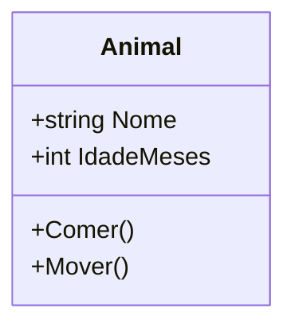
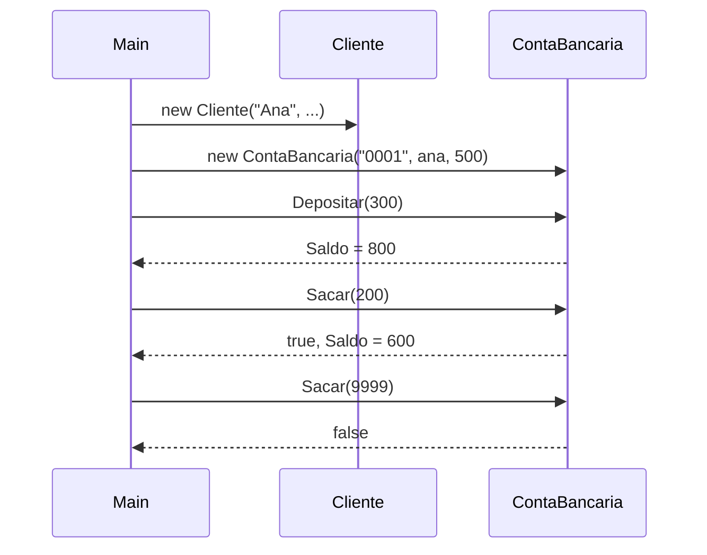

# Aula 1 - Classes e Objetos

## Objetivo da aula

Transformar o rascunho `v0.0` em um modelo mais seguro, usando construtores, propriedades e validacao basica.

## Pre-requisitos

- compreender o rascunho do `MiniBank` da Aula 0
- saber instanciar objetos com `new`
- reconhecer metodos e atributos simples

## Ao final, o aluno sera capaz de...

- explicar a diferenca entre classe, objeto e referencia
- usar construtores para inicializar estado obrigatorio
- proteger o estado com propriedades e `private set`
- validar depositos e saques simples sem expor o saldo diretamente

## Teoria essencial

A classe descreve a estrutura geral de uma entidade. O objeto e a instancia concreta dessa classe em memoria. Classe = projeto da casa; objeto = casa construida.

### Forma geral de uma classe

```csharp
class NomeDaClasse
{
    // propriedades, metodos, construtores
}
```

### Construtores

O construtor inicializa o estado do objeto. Possui o mesmo nome da classe e nao tem tipo de retorno:

```csharp
public ContaBancaria(string numero, decimal saldoInicial)
{
    Numero = numero;
    Saldo = saldoInicial;
}
```

Se nenhum construtor for declarado, `C#` cria um padrao sem parametros. Uma classe pode ter multiplos construtores (sobrecarga).

### Variaveis de referencia

Quando escrevemos `var conta = new ContaBancaria(...)`, a variavel `conta` guarda uma **referencia** ao objeto no heap. Se fizermos `var outra = conta`, ambas apontam para o mesmo objeto:

```csharp
var conta = new ContaBancaria("0001", 1000m);
var outra = conta; // mesma referencia!
outra.Depositar(500m);
Console.WriteLine(conta.Saldo); // 1500 — mesmo objeto
```

### Exemplo conceitual — classe Animal



```csharp
public class Animal
{
    public string Nome { get; set; } = "";
    public int IdadeMeses { get; set; }
    public void Comer() => Console.WriteLine($"{Nome} esta comendo.");
    public void Mover() => Console.WriteLine($"{Nome} esta se movendo.");
}
```

## Erros e confusoes comuns

- achar que construtor serve apenas para "economizar linhas"
- usar `set` publico em tudo por comodidade
- esquecer que duas variaveis podem apontar para o mesmo objeto
- validar apenas na interface do usuario e nao dentro da classe

---

## 🏦 Hands-on: App Bancario — Classes com construtor e validacao

### Estado atual do MiniBank

- Versao de entrada: `v0.0`
- Versao de saida: `v0.1`
- Classes novas: nenhuma
- Classes alteradas: `Cliente`, `ContaBancaria`
- Comportamentos novos: construtor obrigatorio, `private set`, validacao de deposito e saque
- Como testar no Main: criar conta com saldo inicial, depositar, sacar e tentar operacoes invalidas

### O que muda nesta aula

Substituimos campos publicos por propriedades controladas e passamos a exigir informacoes minimas no momento da criacao do objeto.

### Por que muda

Sem construtor e sem validacao, o estado do objeto fica inconsistente desde o nascimento. A ideia aqui e introduzir invariantes basicas.

### Organizando o projeto

1. Reaproveite a pasta `Models` criada na Aula 0.
2. Atualize os arquivos `Models/Cliente.cs` e `Models/ContaBancaria.cs` em vez de criar classes duplicadas.
3. Mantenha `Program.cs` apenas para demonstrar o fluxo da aula.
4. Se quiser registrar os testes manuais, crie a pasta `Examples` com um arquivo `Aula01-Exemplos.txt` ou comentarios no proprio `Program.cs`.

Na Aula 0, criamos um rascunho com campos publicos e sem validacao. Agora vamos melhorar usando **construtores**, **propriedades** e **validacao basica**.

### Evolucao do `Cliente`

```csharp
// === MiniBank v0.1 — Classes com construtores ===

public class Cliente
{
    public string Nome { get; private set; }
    public string Cpf { get; private set; }
    public string Email { get; set; }

    public Cliente(string nome, string cpf, string email)
    {
        Nome = nome;
        Cpf = cpf;
        Email = email;
    }

    public override string ToString() => $"{Nome} (CPF: {Cpf})";
}
```

`Nome` e `Cpf` sao `private set` — so podem ser definidos no construtor. `Email` pode ser alterado depois.

### Evolucao da `ContaBancaria`

```csharp
public class ContaBancaria
{
    public string Numero { get; private set; }
    public decimal Saldo { get; private set; }
    public Cliente Titular { get; private set; }

    public ContaBancaria(string numero, Cliente titular, decimal saldoInicial = 0)
    {
        Numero = numero;
        Titular = titular;
        Saldo = saldoInicial;
    }

    public void Depositar(decimal valor)
    {
        if (valor <= 0)
        {
            Console.WriteLine("Valor de deposito deve ser positivo.");
            return;
        }
        Saldo += valor;
        Console.WriteLine($"Deposito de {valor:C} na conta {Numero}. Saldo: {Saldo:C}");
    }

    public bool Sacar(decimal valor)
    {
        if (valor <= 0 || valor > Saldo)
        {
            Console.WriteLine("Saque invalido ou saldo insuficiente.");
            return false;
        }
        Saldo -= valor;
        Console.WriteLine($"Saque de {valor:C} na conta {Numero}. Saldo: {Saldo:C}");
        return true;
    }

    public override string ToString()
        => $"Conta {Numero} | Titular: {Titular.Nome} | Saldo: {Saldo:C}";
}
```

### Testando no Main

```csharp
// Criando objetos
var ana = new Cliente("Ana Silva", "123.456.789-00", "ana@email.com");
var conta = new ContaBancaria("0001", ana, 500m);

Console.WriteLine(conta);
// Conta 0001 | Titular: Ana Silva | Saldo: R$ 500,00

conta.Depositar(300m);  // Deposito de R$ 300,00. Saldo: R$ 800,00
conta.Sacar(200m);      // Saque de R$ 200,00. Saldo: R$ 600,00
conta.Sacar(9999m);     // Saque invalido ou saldo insuficiente.

// Tentativa de acesso indevido:
// conta.Saldo = -1000; // Erro de compilacao! private set
```

### O que melhorou desde a v0.0

| Antes (v0.0) | Agora (v0.1) |
|--------------|-------------|
| Campos publicos | Propriedades com `private set` |
| Sem construtor | Construtor obrigatorio |
| Saque sem validacao | Valida saldo e valor |
| Deposito sem validacao | Valida valor positivo |

### Diagrama de sequencia atual



---

## Checklist de verificacao da versao

- `Cliente` e `ContaBancaria` exigem dados obrigatorios no construtor
- `Saldo` nao pode mais ser alterado livremente fora da classe
- `Depositar` rejeita valor menor ou igual a zero
- `Sacar` rejeita valor invalido ou maior que o saldo
- o aluno consegue explicar por que `var copia = conta` aponta para o mesmo objeto

## Exercicios

1. Adicione uma propriedade `DataAbertura` (tipo `DateTime`) na `ContaBancaria`, inicializada automaticamente no construtor com `DateTime.Now`.
2. Crie um segundo cliente e uma segunda conta. Realize transferencia manual (saque de uma, deposito na outra).
3. O que acontece se voce fizer `var copia = conta`? Altere o saldo via `copia` e observe `conta`. Explique o resultado.

### Gabarito comentado

1. Implementacao de referencia:

```csharp
public class ContaBancaria
{
    public DateTime DataAbertura { get; }

    public ContaBancaria(string numero, Cliente titular, decimal saldoInicial = 0)
    {
        Numero = numero;
        Titular = titular;
        Saldo = saldoInicial >= 0 ? saldoInicial : 0;
        DataAbertura = DateTime.Now;
    }
}
```

Como verificar:
- `DataAbertura` recebe valor automaticamente
- nao existe `set` publico para alterar a data

2. Implementacao de referencia:

```csharp
var bruno = new Cliente("Bruno Lima", "222.333.444-55", "bruno@email.com");
var contaBruno = new ContaBancaria("0002", bruno, 100m);

if (conta.Sacar(150m))
    contaBruno.Depositar(150m);
```

Como verificar:
- a conta de origem perde `150`
- a conta de destino ganha `150`
- a transferencia manual so acontece se `Sacar` retornar `true`

3. Resposta esperada: `copia` e `conta` apontam para o mesmo objeto no heap. Alterar o saldo via `copia` muda o mesmo estado observado por `conta`.

Exemplo de verificacao:

```csharp
var copia = conta;
copia.Depositar(50m);
Console.WriteLine(conta.Saldo); // saldo refletira o deposito
```

Erros comuns:
- criar `DataAbertura` com `set` publico
- fazer transferencia sem verificar o retorno de `Sacar`
- dizer que `var copia = conta` cria um clone do objeto

## Fechamento e conexao com a proxima aula

Agora o `MiniBank` ja nasce com invariantes basicas: o objeto passa a controlar seu proprio estado. A Aula 2 amplia esse raciocinio para tipos diferentes de conta, contratos e comportamento polimorfico.

### Versao esperada apos esta aula

- Versao de entrada: `v0.0`
- Versao de saida: `v0.1`
- Classes novas: nenhuma
- Classes alteradas: `Cliente`, `ContaBancaria`
- Comportamentos novos: construtores, validacao basica, encapsulamento inicial
- Como testar no Main: repetir o fluxo de deposito/saque e confirmar que acessos indevidos ao saldo nao compilam
