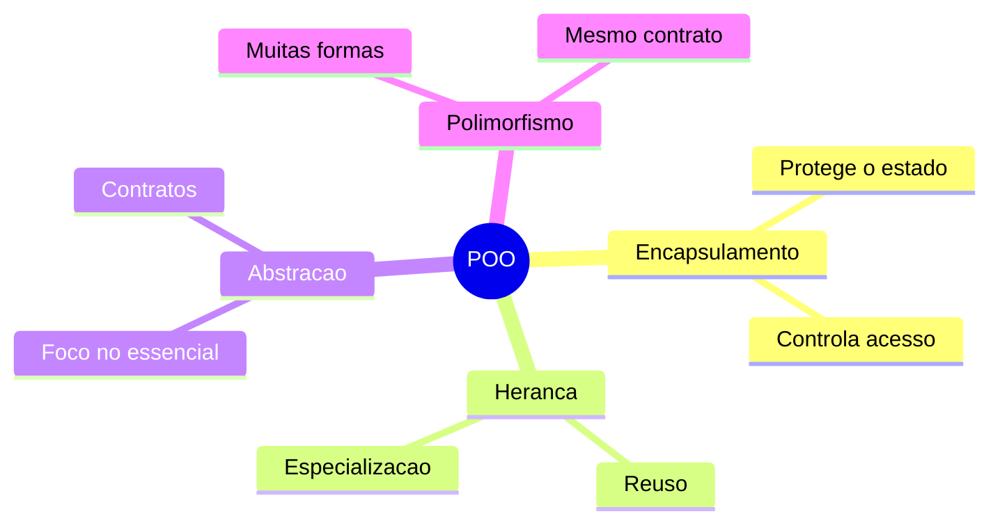
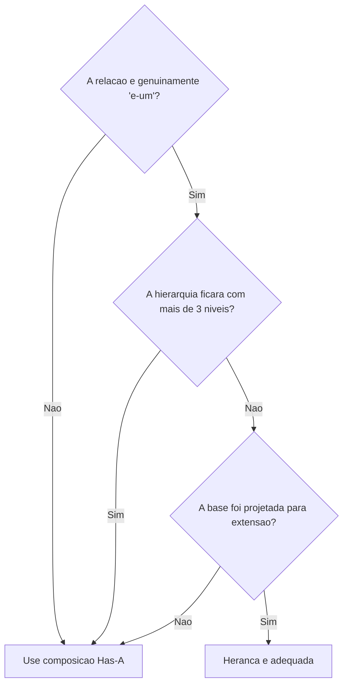
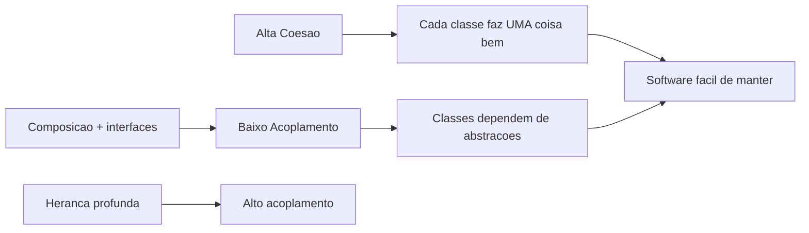
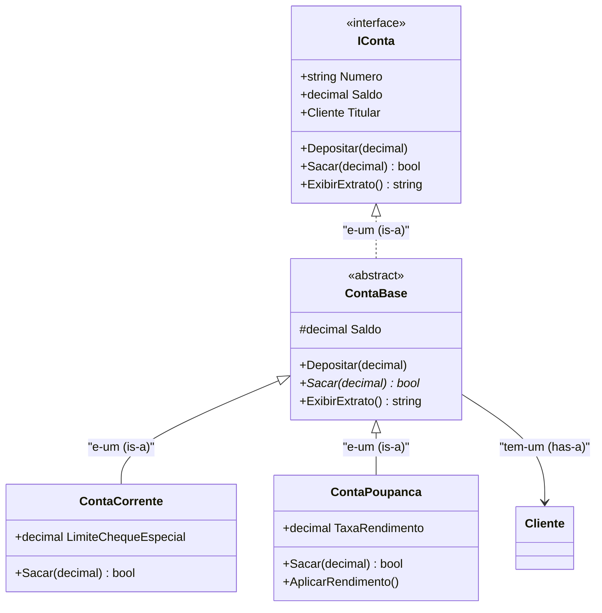

# Aula 2 - Os Quatro Pilares da POO

## Objetivo da aula

Entender os quatro pilares da POO sem reduzir o tema a heranca, e aplicar esses pilares na evolucao do `MiniBank`.

## Pre-requisitos

- dominar a versao `v0.1` do `MiniBank`
- entender construtores, propriedades e validacao basica
- estar confortavel com leitura de classes em `C#`

## Ao final, o aluno sera capaz de...

- diferenciar conceito OO de mecanismo de linguagem
- justificar quando heranca faz sentido e quando composicao e melhor
- reconhecer abstracao e polimorfismo como contratos de uso
- aplicar encapsulamento, heranca, abstracao e polimorfismo no `MiniBank`

## Teoria essencial

Os quatro pilares — encapsulamento, heranca, abstracao e polimorfismo — funcionam juntos para manter o codigo coeso e extensivel.



## Encapsulamento

Esconder detalhes internos e expor apenas o necessario. Sem encapsulamento, qualquer parte do sistema poderia colocar um saldo negativo sem regra. A classe define uma "fronteira" que protege seu estado e controla como o mundo externo interage com ela.

## Heranca

Uma classe especializada reaproveita e estende uma classe base. A palavra `virtual` na base indica que o metodo pode ser sobrescrito. A palavra `override` na derivada substitui a implementacao.

### A relacao "E-um" (Is-A)

Heranca modela a relacao **"e-um"** (is-a): uma `ContaCorrente` *e uma* `ContaBancaria`. Um `Cachorro` *e um* `Animal`. Isso significa que a subclasse pode ser usada em qualquer lugar onde a superclasse e esperada.

A pergunta que valida a heranca e: **"Faz sentido dizer que X e um Y?"**

- "Um Gerente *e um* Funcionario" → ✅ faz sentido
- "Um Cachorro *e um* Animal" → ✅ faz sentido
- "Um Motor *e um* Carro" → ❌ nao faz sentido (motor *faz parte de* um carro)

Se a resposta e "nao", a relacao nao e heranca — e composicao (Has-A), como veremos adiante.

### O perigo de heranca profunda

Heranca parece a solucao perfeita para reuso, mas cadeias profundas criam problemas serios:

```
Ser
  └─ SerVivo
       └─ Animal
            └─ Mamifero
                 └─ AnimalDomestico
                      └─ Cachorro
                           └─ CachorroPastor
                                └─ CachorroPastorAlemaoBranco
```

Problemas com hierarquias profundas:

1. **Fragilidade**: qualquer mudanca na classe `Animal` pode quebrar todas as 5 classes abaixo dela. Quanto mais niveis, mais efeitos colaterais inesperados.

2. **Rigidez**: se precisarmos de um `AnimalDomestico` que nao e `Mamifero` (como um papagaio), a hierarquia inteira nao funciona.

3. **Dificuldade de compreensao**: para entender o comportamento de `CachorroPastorAlemaoBranco`, voce precisa ler 7 classes em cadeia.

4. **Acoplamento forte**: a subclasse depende de detalhes internos da superclasse. Mudar a implementacao da base pode forcar mudancas em cascata.

**Regra pratica**: tente manter hierarquias com no maximo 2–3 niveis. Se voce precisa de mais, provavelmente esta usando heranca onde deveria usar composicao.

### A relacao "Tem-um" (Has-A) e Composicao

A alternativa a heranca e **composicao**: em vez de herdar comportamento, o objeto **contem** outro objeto que fornece esse comportamento. A relacao e **"tem-um"** (has-a): um `Carro` *tem um* `Motor`. Uma `ContaBancaria` *tem um* `Extrato`.

```csharp
// HERANCA (is-a): Carro E-UM Veiculo
public class Veiculo { public void Mover() { } }
public class Carro : Veiculo { } // herda Mover()

// COMPOSICAO (has-a): Carro TEM-UM Motor
public class Motor
{
    public void Ligar() => Console.WriteLine("Motor ligado");
    public void Desligar() => Console.WriteLine("Motor desligado");
}

public class Carro
{
    private readonly Motor motor = new(); // TEM-UM motor

    public void Ligar() => motor.Ligar();  // delega ao motor
    public void Desligar() => motor.Desligar();
}
```

### "Favor composition over inheritance"

Esse e um dos principios mais repetidos em design orientado a objetos (presente no livro "Design Patterns" da Gang of Four). Significa: **prefira composicao a heranca** quando ambas resolverem o problema.

Por que?

| Criterio | Heranca | Composicao |
|----------|---------|------------|
| Acoplamento | Forte (subclasse depende dos internos da base) | Fraco (depende apenas da interface publica) |
| Flexibilidade | Decidida em compilacao | Pode trocar em runtime |
| Reuso | Rigido (heranca unica em C#) | Flexivel (pode compor N objetos) |
| Testabilidade | Dificil isolar | Facil substituir dependencias |

**Exemplo classico do problema**: imagine que voce quer criar entidades que podem voar, nadar e andar. Com heranca:

```csharp
// Heranca: hierarquia impossivel
public class Animal { }
public class AnimalVoador : Animal { public void Voar() { } }
public class AnimalNadador : Animal { public void Nadar() { } }
// Pato voa E nada... herda de quem? C# nao tem heranca multipla!
```

Com composicao via interfaces:

```csharp
public interface IVoador { void Voar(); }
public interface INadador { void Nadar(); }
public interface ICaminhante { void Andar(); }

public class Pato : IVoador, INadador, ICaminhante
{
    public void Voar() => Console.WriteLine("Pato voando");
    public void Nadar() => Console.WriteLine("Pato nadando");
    public void Andar() => Console.WriteLine("Pato andando");
}

public class Pinguim : INadador, ICaminhante
{
    public void Nadar() => Console.WriteLine("Pinguim nadando");
    public void Andar() => Console.WriteLine("Pinguim andando");
    // Pinguim nao voa — simplesmente nao implementa IVoador
}
```

Composicao via interfaces permite combinar capacidades livremente, sem ficar preso a uma hierarquia rigida.

### Quando heranca AINDA faz sentido

Heranca nao e o inimigo — mas deve ser usada com criterio:

- Quando a relacao "e-um" e genuina e estavel (improvavel de mudar)
- Quando ha logica compartilhada substancial que seria duplicada sem heranca
- Em hierarquias rasas (1–2 niveis)
- Quando a classe base foi projetada para ser herdada (`abstract`, membros `virtual`)



## Acoplamento e Coesao

Esses dois conceitos sao centrais para avaliar a qualidade do design OO.

### Coesao

Coesao mede o quanto os membros de uma classe estao relacionados entre si. **Alta coesao e bom**: todos os metodos e campos da classe servem a mesma responsabilidade.

```csharp
// ALTA coesao: tudo sobre calculo de imposto
public class CalculadoraImposto
{
    public decimal CalcularIR(decimal renda) { /* ... */ return 0; }
    public decimal CalcularINSS(decimal salario) { /* ... */ return 0; }
    public decimal CalcularTotal(decimal renda) => CalcularIR(renda) + CalcularINSS(renda);
}

// BAIXA coesao: faz coisas nao relacionadas
public class Utilitarios
{
    public decimal CalcularImposto(decimal renda) { /* ... */ return 0; }
    public void EnviarEmail(string dest, string msg) { /* ... */ }
    public string FormatarCpf(string cpf) { /* ... */ return ""; }
    public void GerarRelatorio() { /* ... */ }
}
```

### Acoplamento

Acoplamento mede o grau de dependencia entre classes. **Baixo acoplamento e bom**: alterar uma classe nao exige alterar muitas outras.

```csharp
// ALTO acoplamento: depende da classe concreta
public class Relatorio
{
    private readonly BancoDeDadosSqlServer banco = new(); // preso ao SQL Server
    public void Gerar() { var dados = banco.Consultar("SELECT ..."); }
}

// BAIXO acoplamento: depende de abstracao
public class Relatorio
{
    private readonly IFonteDados fonte;
    public Relatorio(IFonteDados fonte) { this.fonte = fonte; }
    public void Gerar() { var dados = fonte.Consultar(); }
}
```

### A relacao entre os conceitos



O objetivo e maximizar coesao (cada classe focada) e minimizar acoplamento (classes independentes). Heranca profunda aumenta acoplamento. Composicao com interfaces favorece ambos.

## Abstracao

Mostrar apenas a ideia essencial. Quem usa `IConta.Depositar(valor)` nao precisa saber se a conta e corrente, poupanca ou investimento. A abstracao esconde a complexidade e expoe apenas o contrato necessario.

## Polimorfismo

Tratar objetos diferentes pelo mesmo contrato. Dois tipos:

- **Sobrecarga** (overloading): mesmo nome, parametros diferentes — decidido em compilacao
- **Sobrescrita** (overriding): `virtual`/`override` — decidido em execucao

## Tabela comparativa

| Pilar | Pergunta-chave | Mecanismo em C# |
|-------|----------------|-----------------|
| Encapsulamento | Quem pode acessar? | `private`, `protected`, propriedades |
| Heranca | E-um caso especial? | `: ClasseBase` |
| Abstracao | Qual o contrato essencial? | `interface`, `abstract class` |
| Polimorfismo | Posso trocar a implementacao? | `virtual`/`override`, interfaces |

---

## Erros e confusoes comuns

- sair da aula achando que POO e sinonimo de heranca
- usar heranca so para reaproveitar codigo
- chamar qualquer interface de "abstracao boa" sem olhar o contrato
- esquecer que composicao tambem e uma ferramenta central de OO

## 🏦 Hands-on: App Bancario — Aplicando os 4 pilares

### Estado atual do MiniBank

- Versao de entrada: `v0.1`
- Versao de saida: `v0.2`
- Classes novas: `IConta`, `ContaBase`, `ContaCorrente`, `ContaPoupanca`
- Classes alteradas: o modelo anterior de `ContaBancaria` e refinado para uma hierarquia simples
- Comportamentos novos: contratos de conta, saque polimorfico, especializacao por tipo de conta
- Como testar no Main: colocar contas diferentes na mesma lista e chamar `Sacar` e `ExibirExtrato`

### O que muda nesta aula

Em vez de uma unica conta concreta, o banco passa a ter um contrato comum (`IConta`) e duas especializacoes com regras diferentes.

### Por que muda

O dominio agora tem variacao real de comportamento. Isso pede abstracao e polimorfismo, mas ainda com uma hierarquia curta e justificavel.

### Organizando o projeto

1. Crie a pasta `Contracts` para interfaces do dominio.
2. Crie a pasta `Models/Contas` para os tipos de conta.
3. Adicione o arquivo `Contracts/IConta.cs`.
4. Em `Models/Contas`, crie `ContaBase.cs`, `ContaCorrente.cs` e `ContaPoupanca.cs`.
5. Se a antiga `Models/ContaBancaria.cs` nao fizer mais sentido, substitua seu uso pela nova hierarquia para evitar dois modelos concorrentes.

Na v0.1 temos uma unica `ContaBancaria`. Mas o banco precisa de **conta corrente** e **conta poupanca** com comportamentos diferentes. Vamos aplicar os pilares — e demonstrar que a heranca aqui e adequada porque a relacao "e-um" e genuina.

### Por que heranca funciona aqui

- "Uma ContaCorrente *e uma* ContaBancaria" → ✅
- "Uma ContaPoupanca *e uma* ContaBancaria" → ✅
- A hierarquia tem apenas 2 niveis (ContaBase → ContaCorrente/Poupanca) → ✅
- Ha logica compartilhada real (Depositar, Saldo, Titular) → ✅

### Passo 1: Abstracao — interface `IConta`

Definimos o contrato que toda conta deve seguir:

```csharp
// === MiniBank v0.2 — Pilares da POO ===

public interface IConta
{
    string Numero { get; }
    decimal Saldo { get; }
    Cliente Titular { get; }
    void Depositar(decimal valor);
    bool Sacar(decimal valor);
    string ExibirExtrato();
}
```

### Passo 2: Heranca — classe base `ContaBase`

Centralizamos logica comum numa classe abstrata:

```csharp
public abstract class ContaBase : IConta
{
    public string Numero { get; }
    public decimal Saldo { get; protected set; }
    public Cliente Titular { get; }

    protected ContaBase(string numero, Cliente titular, decimal saldoInicial = 0)
    {
        Numero = numero;
        Titular = titular;
        Saldo = saldoInicial;
    }

    // Encapsulamento: deposito valida valor
    public void Depositar(decimal valor)
    {
        if (valor <= 0) return;
        Saldo += valor;
    }

    // Polimorfismo: cada tipo de conta define sua regra de saque
    public abstract bool Sacar(decimal valor);

    public virtual string ExibirExtrato()
        => $"[{GetType().Name}] Conta {Numero} | {Titular.Nome} | Saldo: {Saldo:C}";
}
```

### Passo 3: Especializacao — `ContaCorrente` e `ContaPoupanca`

```csharp
public class ContaCorrente : ContaBase
{
    public decimal LimiteChequeEspecial { get; }

    public ContaCorrente(string numero, Cliente titular, decimal saldoInicial = 0, decimal limite = 500m)
        : base(numero, titular, saldoInicial)
    {
        LimiteChequeEspecial = limite;
    }

    public override bool Sacar(decimal valor)
    {
        if (valor <= 0) return false;
        if (valor > Saldo + LimiteChequeEspecial) return false;
        Saldo -= valor;
        return true;
    }

    public override string ExibirExtrato()
        => base.ExibirExtrato() + $" | Limite: {LimiteChequeEspecial:C}";
}

public class ContaPoupanca : ContaBase
{
    public decimal TaxaRendimento { get; }

    public ContaPoupanca(string numero, Cliente titular, decimal saldoInicial = 0, decimal taxa = 0.005m)
        : base(numero, titular, saldoInicial)
    {
        TaxaRendimento = taxa;
    }

    public override bool Sacar(decimal valor)
    {
        if (valor <= 0 || valor > Saldo) return false;
        Saldo -= valor;
        return true;
    }

    public void AplicarRendimento()
    {
        Depositar(Saldo * TaxaRendimento);
    }
}
```

### Identificando Is-A e Has-A no MiniBank

| Relacao | Tipo | Justificativa |
|---------|------|---------------|
| ContaCorrente → ContaBase | **Is-A** (heranca) | Uma CC *e uma* conta bancaria |
| ContaPoupanca → ContaBase | **Is-A** (heranca) | Uma CP *e uma* conta bancaria |
| ContaBase → Cliente | **Has-A** (composicao) | Uma conta *tem um* titular. Titular nao e um tipo de conta! |
| ContaBase → Extrato | **Has-A** (composicao) | Uma conta *tem um* extrato |

Se alguem tentasse `class Cliente : ContaBase` estaria errado — um cliente nao "e uma" conta.

### Passo 4: Polimorfismo em acao

```csharp
var ana = new Cliente("Ana Silva", "123.456.789-00", "ana@email.com");

IConta contaCorrente = new ContaCorrente("CC-001", ana, 1000m, limite: 500m);
IConta contaPoupanca = new ContaPoupanca("CP-001", ana, 2000m);

var contas = new List<IConta> { contaCorrente, contaPoupanca };

foreach (var conta in contas)
{
    Console.WriteLine(conta.ExibirExtrato());
}

contaCorrente.Sacar(1200m); // usa cheque especial
bool ok = contaPoupanca.Sacar(9999m); // false — sem cheque especial
```

### Diagrama de classes atualizado



---

## Checklist de verificacao da versao

- existe um contrato `IConta` com membros essenciais
- `ContaBase` concentra estado e comportamento compartilhado
- `ContaCorrente` e `ContaPoupanca` sobrescrevem `Sacar`
- uma lista `List<IConta>` consegue tratar contas diferentes pelo mesmo contrato
- o aluno consegue justificar por que `ContaCorrente -> ContaBase` e heranca valida, mas `Motor -> Carro` nao

## Exercicios

1. Crie uma terceira conta `ContaInvestimento` que cobra taxa de 1% em saques. Adicione a lista polimorfica e teste.
2. Um colega sugere criar `class Motor : Carro`. Explique porque isso viola o principio is-a e qual seria a modelagem correta.
3. Considere um sistema com a hierarquia `Pessoa → Funcionario → Gerente → GerenteSenior → GerenteRegional → DiretorRegional`. Quais problemas essa hierarquia de 6 niveis pode causar? Como voce refatoraria usando composicao?
4. Analise o MiniBank: identifique todas as relacoes is-a e has-a. Ha alguma que voce mudaria?
5. Classifique cada par como alta/baixa coesao e alto/baixo acoplamento: (a) `ContaBase` do MiniBank, (b) uma classe hipotetica `FazTudo` que gerencia contas, envia emails e gera PDFs.

### Gabarito comentado

1. Implementacao de referencia:

```csharp
public class ContaInvestimento : ContaBase
{
    public ContaInvestimento(string numero, Cliente titular, decimal saldoInicial = 0)
        : base(numero, titular, saldoInicial) { }

    public override bool Sacar(decimal valor)
    {
        if (valor <= 0) return false;
        decimal total = valor * 1.01m;
        if (total > Saldo) return false;
        Saldo -= total;
        return true;
    }
}
```

Como verificar:
- a conta entra na mesma `List<IConta>`
- sacar `100m` reduz `101m` do saldo

2. Resposta esperada: `Motor` nao e um `Carro`; `Motor` faz parte de `Carro`. A modelagem correta e composicao, por exemplo `class Carro { private Motor motor; }`.
3. Resposta esperada: a hierarquia profunda gera fragilidade, rigidez, dificuldade de compreensao e alto acoplamento entre niveis. Uma refatoracao aceitavel extrai papeis ou capacidades em objetos colaborativos, como `Cargo`, `PoliticaAprovacao`, `FaixaSalarial` ou `ResponsabilidadesGerenciais`.
4. Resposta esperada: `ContaCorrente -> ContaBase` e `ContaPoupanca -> ContaBase` sao `is-a`; `ContaBase -> Cliente` e `has-a`. Uma resposta boa pode sugerir revisar qualquer heranca futura que exista apenas por reuso e nao por especializacao legitima.
5. Resposta esperada:
- `ContaBase`: alta coesao e acoplamento moderado/baixo, porque concentra responsabilidades do proprio dominio da conta
- `FazTudo`: baixa coesao e alto acoplamento, porque mistura negocio, notificacao e relatorio em uma unica classe

Erros comuns:
- criar `ContaInvestimento` copiando tudo de `ContaCorrente` sem reaproveitar `ContaBase`
- responder `Motor : Carro` apenas com "nao faz sentido" sem explicar `is-a` vs `has-a`
- confundir coesao com quantidade de metodos

## Fechamento e conexao com a proxima aula

Os pilares agora aparecem em codigo real: contrato comum, base abstrata, especializacao e uso polimorfico. A Aula 3 aprofunda os recursos de `C#` que ajudam a materializar essas decisoes de design com mais clareza e seguranca.

### Versao esperada apos esta aula

- Versao de entrada: `v0.1`
- Versao de saida: `v0.2`
- Classes novas: `IConta`, `ContaBase`, `ContaCorrente`, `ContaPoupanca`
- Classes alteradas: a conta unica da aula anterior e substituida por uma hierarquia curta
- Comportamentos novos: polimorfismo de saque, extrato por tipo, especializacao por conta
- Como testar no Main: criar contas diferentes, armazenar em `List<IConta>` e executar chamadas pelo mesmo contrato
