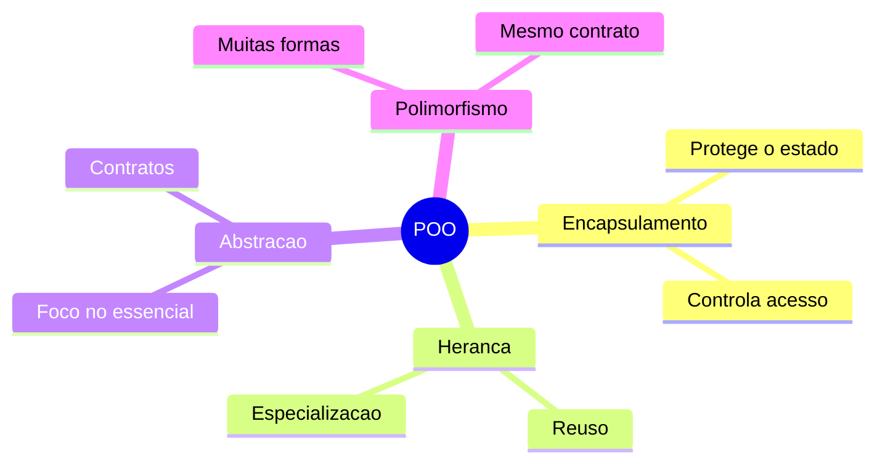
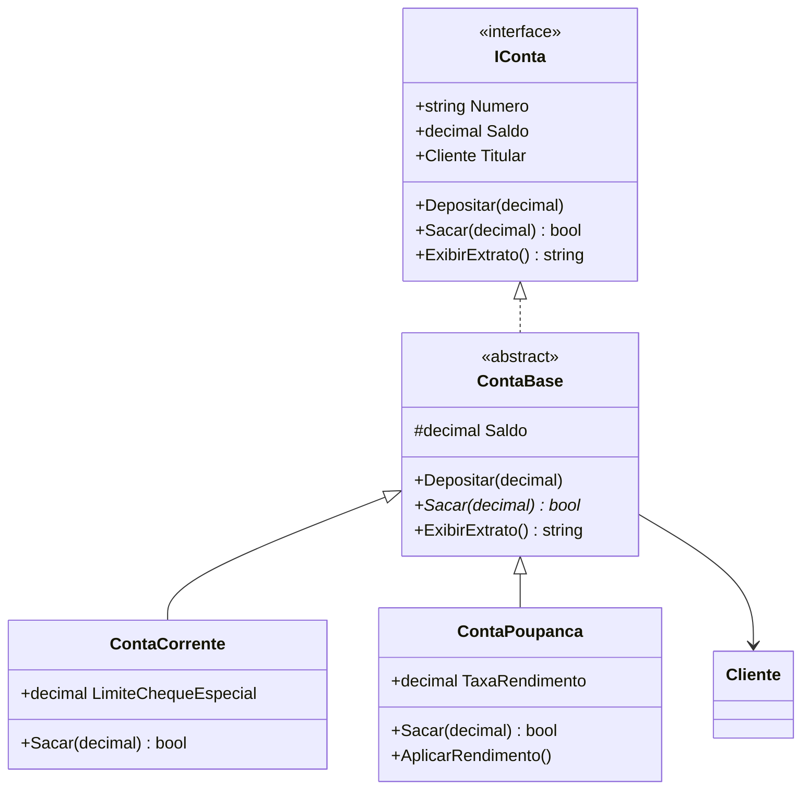

# Aula 2 - Os Quatro Pilares da POO

## Visao geral

Os quatro pilares — encapsulamento, heranca, abstracao e polimorfismo — funcionam juntos para manter o codigo coeso e extensivel.



## Encapsulamento

Esconder detalhes internos e expor apenas o necessario. Sem encapsulamento, qualquer parte do sistema poderia colocar um saldo negativo sem regra.

## Heranca

Uma classe especializada reaproveita e estende uma classe base. Relacao "e-um": um `Gerente` *e um* `Funcionario`.

A palavra `virtual` na base indica que o metodo pode ser sobrescrito. A palavra `override` na derivada substitui a implementacao.

## Abstracao

Mostrar apenas a ideia essencial. Quem usa `IConta.Depositar(valor)` nao precisa saber se a conta e corrente, poupanca ou investimento.

## Polimorfismo

Tratar objetos diferentes pelo mesmo contrato. Dois tipos:

- **Sobrecarga** (overloading): mesmo nome, parametros diferentes — decidido em compilacao
- **Sobrescrita** (overriding): `virtual`/`override` — decidido em execucao

## Tabela comparativa

| Pilar | Pergunta-chave | Mecanismo em C# |
|-------|----------------|-----------------|
| Encapsulamento | Quem pode acessar? | `private`, `protected`, propriedades |
| Heranca | E-um caso especial? | `: ClasseBase` |
| Abstracao | Qual o contrato essencial? | `interface`, `abstract class` |
| Polimorfismo | Posso trocar a implementacao? | `virtual`/`override`, interfaces |

---

## 🏦 Hands-on: App Bancario — Aplicando os 4 pilares

Na v0.1 temos uma unica `ContaBancaria`. Mas o banco precisa de **conta corrente** e **conta poupanca** com comportamentos diferentes. Vamos aplicar todos os pilares.

### Passo 1: Abstracao — interface `IConta`

Definimos o contrato que toda conta deve seguir:

```csharp
// === MiniBank v0.2 — Pilares da POO ===

public interface IConta
{
    string Numero { get; }
    decimal Saldo { get; }
    Cliente Titular { get; }
    void Depositar(decimal valor);
    bool Sacar(decimal valor);
    string ExibirExtrato();
}
```

### Passo 2: Heranca — classe base `ContaBase`

Centralizamos logica comum numa classe abstrata:

```csharp
public abstract class ContaBase : IConta
{
    public string Numero { get; }
    public decimal Saldo { get; protected set; }
    public Cliente Titular { get; }

    protected ContaBase(string numero, Cliente titular, decimal saldoInicial = 0)
    {
        Numero = numero;
        Titular = titular;
        Saldo = saldoInicial;
    }

    // Encapsulamento: deposito valida valor
    public void Depositar(decimal valor)
    {
        if (valor <= 0) return;
        Saldo += valor;
    }

    // Polimorfismo: cada tipo de conta define sua regra de saque
    public abstract bool Sacar(decimal valor);

    public virtual string ExibirExtrato()
        => $"[{GetType().Name}] Conta {Numero} | {Titular.Nome} | Saldo: {Saldo:C}";
}
```

### Passo 3: Especializacao — `ContaCorrente` e `ContaPoupanca`

```csharp
public class ContaCorrente : ContaBase
{
    public decimal LimiteChequeEspecial { get; }

    public ContaCorrente(string numero, Cliente titular, decimal saldoInicial = 0, decimal limite = 500m)
        : base(numero, titular, saldoInicial)
    {
        LimiteChequeEspecial = limite;
    }

    public override bool Sacar(decimal valor)
    {
        if (valor <= 0) return false;
        // Conta corrente permite usar cheque especial
        if (valor > Saldo + LimiteChequeEspecial) return false;
        Saldo -= valor;
        return true;
    }

    public override string ExibirExtrato()
        => base.ExibirExtrato() + $" | Limite: {LimiteChequeEspecial:C}";
}

public class ContaPoupanca : ContaBase
{
    public decimal TaxaRendimento { get; }

    public ContaPoupanca(string numero, Cliente titular, decimal saldoInicial = 0, decimal taxa = 0.005m)
        : base(numero, titular, saldoInicial)
    {
        TaxaRendimento = taxa;
    }

    public override bool Sacar(decimal valor)
    {
        // Poupanca nao tem cheque especial
        if (valor <= 0 || valor > Saldo) return false;
        Saldo -= valor;
        return true;
    }

    public void AplicarRendimento()
    {
        Depositar(Saldo * TaxaRendimento);
    }
}
```

### Passo 4: Polimorfismo em acao

```csharp
var ana = new Cliente("Ana Silva", "123.456.789-00", "ana@email.com");

// Polimorfismo: tratamos ambas como IConta
IConta contaCorrente = new ContaCorrente("CC-001", ana, 1000m, limite: 500m);
IConta contaPoupanca = new ContaPoupanca("CP-001", ana, 2000m);

// Lista polimorfica
var contas = new List<IConta> { contaCorrente, contaPoupanca };

foreach (var conta in contas)
{
    Console.WriteLine(conta.ExibirExtrato());
}

// Conta corrente usa cheque especial:
contaCorrente.Sacar(1200m); // OK — usa 200 do limite
Console.WriteLine(contaCorrente.ExibirExtrato());
// Saldo: -R$ 200,00 | Limite: R$ 500,00

// Poupanca nao permite:
bool ok = contaPoupanca.Sacar(9999m); // false
```

### Diagrama de classes atualizado



### O que melhorou desde a v0.1

| v0.1 | v0.2 |
|------|------|
| Classe unica | Hierarquia com base abstrata + especializacoes |
| Sem contrato | Interface `IConta` define o contrato |
| Mesma regra de saque | Cada tipo tem sua regra (polimorfismo) |
| Sem cheque especial | Conta corrente tem limite |
| Sem rendimento | Poupanca aplica rendimento |

---

## Exercicios

1. Crie uma terceira conta `ContaInvestimento` que cobra taxa de 1% em saques. Adicione a lista polimorfica e teste.
2. O que aconteceria se `ContaInvestimento` alterasse o comportamento de `Depositar()` de forma que quebrasse a expectativa do sistema? Relate com o principio de Liskov.
3. Adicione uma propriedade `DataAbertura` em `ContaBase` e sobrescreva `ExibirExtrato()` em `ContaPoupanca` para incluir a taxa de rendimento.
