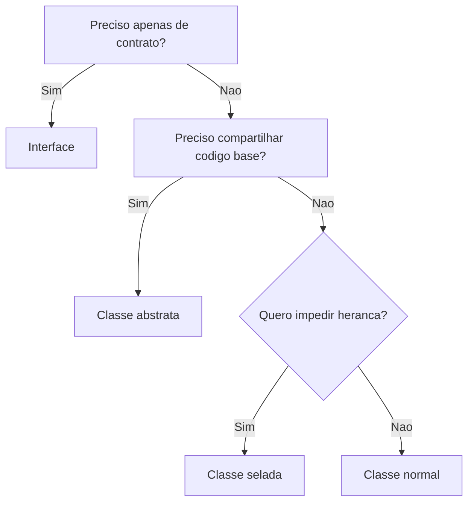
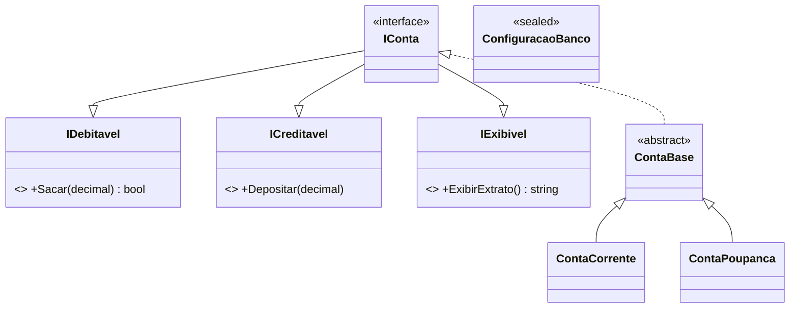

# Aula 3 - Recursos de POO em C#

## Objetivo da aula

Usar recursos de `C#` para materializar decisoes de design orientado a objetos, sem transformar a aula em um catalogo de sintaxe.

## Pre-requisitos

- compreender a versao `v0.2` do `MiniBank`
- reconhecer interface, classe abstrata e sobrescrita
- saber ler hierarquias simples em `C#`

## Ao final, o aluno sera capaz de...

- distinguir contrato, implementacao compartilhada e especializacao
- usar interfaces segregadas para reduzir acoplamento
- aplicar validacao em propriedades e modificadores de acesso com intencao de design
- explicar quando `sealed` e util e por que `partial` nao e uma ferramenta de modelagem

## Teoria essencial

O EPUB usa recursos especificos de `C#` para materializar os pilares: interfaces, classes abstratas, parciais, seladas, propriedades e modificadores de acesso.

### Interfaces — revisao

Interface = contrato puro. Nao pode ser instanciada. Uma classe pode implementar multiplas interfaces. Se nao implementar todos os membros, o compilador gera erro.

### Classes abstratas

Definem base comum e podem conter implementacao pronta. Nao podem ser instanciadas. Metodos `abstract` obrigam a derivada a fornecer implementacao.

### Classes seladas (`sealed`)

Nao podem ser herdadas. Usadas quando extensao nao faz sentido para o design.

### Classes parciais (`partial`)

Permitem dividir uma classe em varios arquivos. Util para codigo gerado automaticamente.

### Propriedades com validacao

```csharp
private decimal preco;
public decimal Preco
{
    get => preco;
    set => preco = value >= 0 ? value : throw new ArgumentException("Preco invalido.");
}
```

### Modificadores de acesso

| Modificador | Acesso |
|-------------|--------|
| `public` | Qualquer lugar |
| `private` | Somente dentro da classe |
| `protected` | Classe e derivadas |
| `internal` | Mesmo assembly |
| `protected internal` | Assembly ou derivadas |

### Quando usar o que



## Erros e confusoes comuns

- tratar interface como "classe mais fraca"
- usar `sealed` sem justificar a intencao de impedir extensao
- pensar em `partial` como recurso principal de OO
- validar estado so no `Main`, e nao na propria entidade

---

## 🏦 Hands-on: App Bancario — Interfaces multiplas e propriedades robustas

### Estado atual do MiniBank

- Versao de entrada: `v0.2`
- Versao de saida: `v0.3`
- Classes novas: `IDebitavel`, `ICreditavel`, `IExibivel`, `ConfiguracaoBanco`
- Classes alteradas: `IConta`, `Cliente`, `ContaBase`
- Comportamentos novos: interfaces segregadas, propriedades com validacao real, configuracao selada
- Como testar no Main: instanciar contas via `IConta`, usar `IExibivel` separadamente e disparar validacoes invalidas

### O que muda nesta aula

O modelo continua parecido com o da Aula 2, mas agora os contratos ficam mais finos e o controle de acesso mais intencional.

### Por que muda

Nem todo consumidor precisa do pacote completo de uma conta. Segregar contratos e endurecer validacoes prepara o terreno para desacoplamento e manutencao.

### Organizando o projeto

1. Reaproveite a pasta `Contracts` e adicione os arquivos `IDebitavel.cs`, `ICreditavel.cs` e `IExibivel.cs`.
2. Atualize `Contracts/IConta.cs` para compor os contratos menores.
3. Na pasta `Models`, mantenha `Cliente.cs`.
4. Na pasta `Models/Contas`, atualize `ContaBase.cs`, `ContaCorrente.cs` e `ContaPoupanca.cs`.
5. Crie a pasta `Configuration` e adicione `ConfiguracaoBanco.cs` para a classe selada de configuracao.

Na v0.2 temos hierarquia de contas. Agora vamos adicionar **interfaces segregadas**, uma **classe selada** para configuracao e **propriedades com validacao real**.

### Passo 1: Interfaces segregadas

Nem todo componente precisa de todas as operacoes. Vamos segregar:

```csharp
// === MiniBank v0.3 — Interfaces e propriedades ===

public interface IDebitavel
{
    bool Sacar(decimal valor);
}

public interface ICreditavel
{
    void Depositar(decimal valor);
}

public interface IExibivel
{
    string ExibirExtrato();
}

// IConta agora compoe as interfaces menores
public interface IConta : IDebitavel, ICreditavel, IExibivel
{
    string Numero { get; }
    decimal Saldo { get; }
    Cliente Titular { get; }
}
```

Codigo que so precisa creditar pode depender apenas de `ICreditavel`. Codigo que gera relatorio depende de `IExibivel`. Isso e Interface Segregation.

### Passo 2: Propriedades com validacao no `Cliente`

```csharp
public class Cliente
{
    public string Nome { get; private set; }
    public string Cpf { get; private set; }

    private string email = "";
    public string Email
    {
        get => email;
        set
        {
            if (string.IsNullOrWhiteSpace(value) || !value.Contains('@'))
                throw new ArgumentException("Email invalido.");
            email = value;
        }
    }

    public Cliente(string nome, string cpf, string email)
    {
        if (string.IsNullOrWhiteSpace(nome)) throw new ArgumentException("Nome obrigatorio.");
        if (string.IsNullOrWhiteSpace(cpf)) throw new ArgumentException("CPF obrigatorio.");
        Nome = nome;
        Cpf = cpf;
        Email = email; // passa pela validacao do setter
    }

    public override string ToString() => $"{Nome} ({Cpf})";
}
```

### Passo 3: Classe selada para configuracao

```csharp
public sealed class ConfiguracaoBanco
{
    public string NomeBanco { get; } = "MiniBank";
    public decimal TaxaTransferencia { get; } = 5.00m;
    public decimal LimitePadraoCC { get; } = 500m;
    public decimal TaxaRendimentoPoupanca { get; } = 0.005m;
}

// Nao pode herdar:
// public class ConfiguracaoEspecial : ConfiguracaoBanco { } // Erro!
```

### Passo 4: `ContaBase` protegendo o Saldo

```csharp
public abstract class ContaBase : IConta
{
    public string Numero { get; }
    public Cliente Titular { get; }

    private decimal saldo;
    public decimal Saldo
    {
        get => saldo;
        protected set
        {
            // Conta corrente pode ficar negativa (cheque especial), mas com limite
            saldo = value;
        }
    }

    protected ContaBase(string numero, Cliente titular, decimal saldoInicial)
    {
        if (saldoInicial < 0) throw new ArgumentException("Saldo inicial nao pode ser negativo.");
        Numero = numero;
        Titular = titular;
        saldo = saldoInicial;
    }

    public void Depositar(decimal valor)
    {
        if (valor <= 0) throw new ArgumentException("Valor deve ser positivo.");
        Saldo += valor;
    }

    public abstract bool Sacar(decimal valor);

    public virtual string ExibirExtrato()
        => $"[{GetType().Name}] {Numero} | {Titular.Nome} | Saldo: {Saldo:C}";
}
```

### Testando

```csharp
var config = new ConfiguracaoBanco();

var ana = new Cliente("Ana Silva", "123.456.789-00", "ana@email.com");
IConta cc = new ContaCorrente("CC-001", ana, 1000m, config.LimitePadraoCC);
IConta cp = new ContaPoupanca("CP-001", ana, 2000m, config.TaxaRendimentoPoupanca);

// Usando interface segregada:
IExibivel exibivel = cc;
Console.WriteLine(exibivel.ExibirExtrato());

// Validacao em acao:
try { new Cliente("", "123", "invalido"); }
catch (ArgumentException ex) { Console.WriteLine($"Erro: {ex.Message}"); }

try { cc.Depositar(-100m); }
catch (ArgumentException ex) { Console.WriteLine($"Erro: {ex.Message}"); }
```

### Diagrama atualizado



---

## Checklist de verificacao da versao

- `IConta` foi decomposta em interfaces menores com foco claro
- `Cliente` valida dados ao receber entradas inconsistentes
- `ContaBase` protege o saldo por meio de `protected set`
- `ConfiguracaoBanco` nao pode ser herdada
- o aluno consegue explicar por que interface e contrato e nao deposito de codigo comum

## Exercicios

1. Crie uma interface `ITransferivel` com metodo `Transferir(IConta destino, decimal valor)`. Implemente em `ContaCorrente` (que cobra taxa de R$5) e `ContaPoupanca` (sem taxa).
2. Tente criar uma classe que herde de `ConfiguracaoBanco` e observe o erro do compilador.
3. Adicione validacao de CPF (exatamente 14 caracteres com formato `XXX.XXX.XXX-XX`).

### Gabarito comentado

1. Implementacao de referencia:

```csharp
public interface ITransferivel
{
    bool Transferir(IConta destino, decimal valor);
}

public class ContaCorrente : ContaBase, ITransferivel
{
    public bool Transferir(IConta destino, decimal valor)
    {
        decimal total = valor + 5m;
        if (!Sacar(total)) return false;
        destino.Depositar(valor);
        return true;
    }
}

public class ContaPoupanca : ContaBase, ITransferivel
{
    public bool Transferir(IConta destino, decimal valor)
    {
        if (!Sacar(valor)) return false;
        destino.Depositar(valor);
        return true;
    }
}
```

Como verificar:
- uma transferencia de `100m` na corrente reduz `105m`
- uma transferencia de `100m` na poupanca reduz `100m`

2. Resposta esperada: o compilador rejeita algo como `class MinhaConfig : ConfiguracaoBanco` com erro indicando que tipo `sealed` nao pode ser base.
3. Implementacao de referencia:

```csharp
private static bool CpfValido(string cpf)
{
    return Regex.IsMatch(cpf, "^\\d{3}\\.\\d{3}\\.\\d{3}-\\d{2}$");
}
```

Criterio de aceitacao:
- CPF com formato `123.456.789-00` passa
- CPF `123` ou `12345678900` falha

Erros comuns:
- colocar `Transferir` em `IConta` sem necessidade
- usar `Contains` ou `Length == 14` como unica validacao de CPF formatado
- dizer que `sealed` melhora design sem explicar o que se quer impedir

## Fechamento e conexao com a proxima aula

Agora o `MiniBank` tem contratos mais finos e entidades mais protegidas. A Aula 4 amplia a discussao do "objeto isolado" para "objetos que colaboram", que e onde o design realmente comeca a ganhar forma.

### Versao esperada apos esta aula

- Versao de entrada: `v0.2`
- Versao de saida: `v0.3`
- Classes novas: `IDebitavel`, `ICreditavel`, `IExibivel`, `ConfiguracaoBanco`
- Classes alteradas: `IConta`, `Cliente`, `ContaBase`
- Comportamentos novos: interfaces segregadas, validacao de propriedades, configuracao selada
- Como testar no Main: executar o bloco da aula e confirmar excecoes de validacao e uso de `IExibivel`
