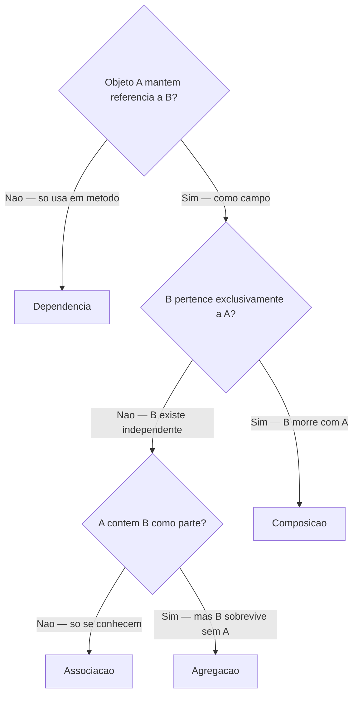
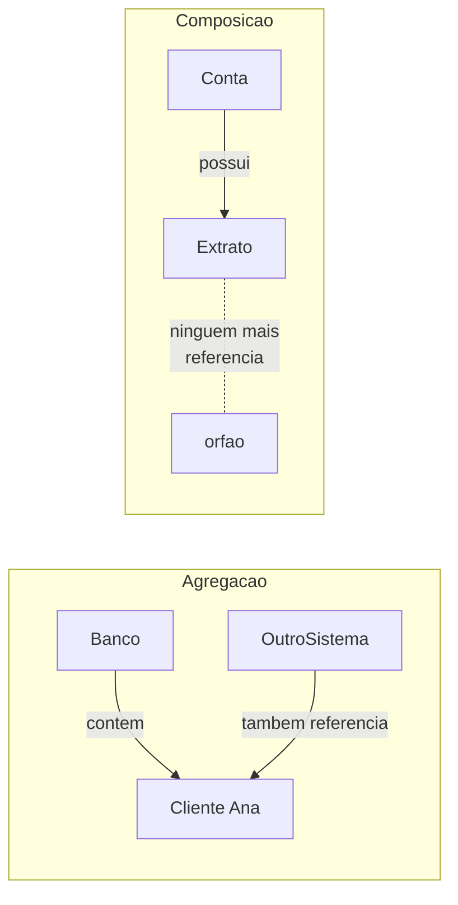
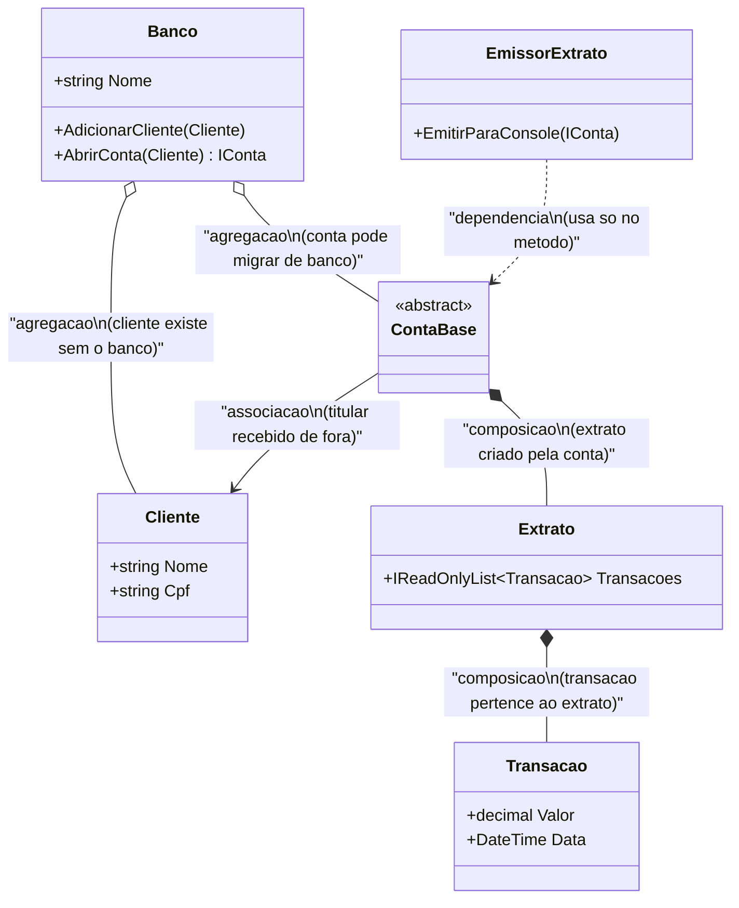
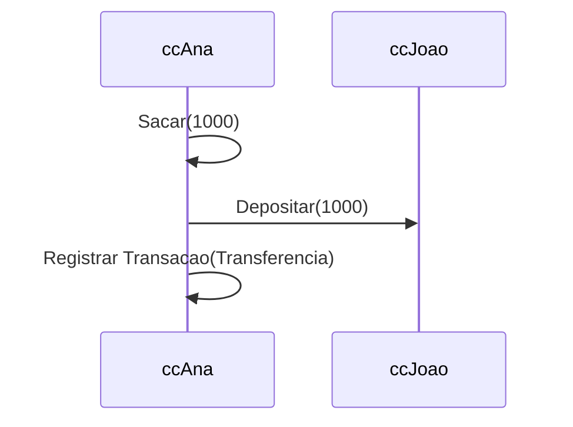

# Aula 4 - Colaboracao entre Objetos

## Objetivo da aula

Aprender a decidir conscientemente como objetos se relacionam, usando criterios observaveis para diferenciar dependencia, associacao, agregacao e composicao.

## Pre-requisitos

- compreender interfaces e hierarquias simples do `MiniBank`
- saber identificar campos, parametros e criacao de objetos
- dominar a versao `v0.3`

## Ao final, o aluno sera capaz de...

- classificar relacoes entre objetos com justificativa tecnica
- usar ciclo de vida e ownership como heuristicas de modelagem
- explicar por que colaboracao entre objetos e tao importante quanto definicao de classes
- evoluir o `MiniBank` com `Banco`, `Extrato`, `Transacao` e servicos auxiliares

## Teoria essencial

POO nao e apenas criar classes — e fazer essas classes cooperarem. Saber **como** conectar objetos e tao importante quanto saber cria-los. O tipo de relacao escolhido impacta diretamente a flexibilidade, a manutenibilidade e a testabilidade do sistema.

## As quatro relacoes entre objetos

### 1. Dependencia — "usa temporariamente"

A relacao mais fraca. Um objeto usa outro **apenas durante a execucao de um metodo** — como parametro, variavel local ou retorno. Quando o metodo termina, a relacao acaba. Nenhuma referencia e mantida.

**Analogia**: voce pede um Uber. Durante a corrida, existe uma relacao. Quando chega ao destino, voce nao mantem referencia ao motorista.

**Em UML**: seta tracejada (- - - →)

**No codigo**: o objeto aparece como **parametro** ou **variavel local**, nunca como campo.

```csharp
public class EmissorExtrato
{
    // 'conta' e usada so durante o metodo — nao e armazenada
    public void EmitirParaConsole(IConta conta)
    {
        Console.WriteLine($"{conta.Titular.Nome}: {conta.Saldo:C}");
    }
}
```

`EmissorExtrato` **depende** de `IConta`, mas nao mantem referencia. Se `IConta` mudar sua interface, `EmissorExtrato` pode ser afetado — por isso ainda e uma dependencia.

**Sinal no codigo**: se voce ve `IConta` como tipo de parametro, mas nunca como campo da classe, e dependencia.

### 2. Associacao — "conhece de forma estavel"

Uma classe mantem referencia a outra como **campo ou propriedade**. A relacao e mais duradoura que dependencia, mas os objetos tem ciclos de vida **independentes** — ambos podem existir separadamente.

**Analogia**: um professor e seus alunos. O professor conhece seus alunos, e os alunos conhecem seu professor. Mas se o professor se aposentar, os alunos continuam existindo (e vice-versa).

**Em UML**: seta solida (—→) ou linha simples

**No codigo**: o objeto aparece como **campo ou propriedade**.

```csharp
public class Matricula
{
    public Aluno Aluno { get; }     // associacao: Matricula conhece Aluno
    public Turma Turma { get; }     // associacao: Matricula conhece Turma

    public Matricula(Aluno aluno, Turma turma)
    {
        Aluno = aluno;   // recebe por fora — nao cria
        Turma = turma;   // recebe por fora — nao cria
    }
}
```

**Sinal no codigo**: referencia como campo, mas o objeto e **recebido de fora** (via construtor ou setter), nao criado internamente.

### 3. Agregacao — "contem, mas a parte sobrevive sozinha"

Caso especial de associacao. O "todo" contem "partes", mas as partes podem existir independentemente. Se o todo for destruido, as partes continuam.

**Analogia**: uma universidade tem departamentos. Se a universidade fechar, os professores dos departamentos continuam existindo — podem trabalhar em outra instituicao. Um time de futebol tem jogadores. Se o time acabar, os jogadores seguem suas carreiras.

**Em UML**: losango vazio (◇—→) no lado do "todo"

**No codigo**: o "todo" **recebe** as partes prontas, de fora. Nao as cria internamente.

```csharp
public class Banco
{
    private readonly List<Cliente> clientes = new();

    // O banco recebe clientes criados externamente
    public void AdicionarCliente(Cliente cliente)
    {
        clientes.Add(cliente);
    }

    // Se o Banco for destruido, os clientes continuam existindo
    // porque foram criados fora e podem estar referenciados em outros lugares
}
```

**Pergunta-chave**: "Se eu deletar o Banco, os clientes somem?" **Nao** — eles existiam antes do banco e podem existir sem ele. Logo, e agregacao.

### 4. Composicao — "contem, e a parte morre com o todo"

A relacao mais forte. O "todo" **cria** a parte internamente (ou a parte so faz sentido no contexto do todo). Se o todo for destruido, as partes perdem razao de existir.

**Analogia**: um pedido de restaurante tem itens. Se o pedido for cancelado, os itens nao fazem sentido sozinhos — nao existem "itens soltos" sem pedido. Uma casa tem comodos. Se a casa for demolida, os comodos deixam de existir.

**Em UML**: losango preenchido (◆—→) no lado do "todo"

**No codigo**: a parte e **criada dentro** do todo (geralmente com `new` no construtor ou na declaracao do campo).

```csharp
public class ContaBancaria
{
    // Extrato e CRIADO pela conta — nao vem de fora
    public Extrato Extrato { get; } = new();

    // Se a conta for destruida, o extrato nao faz sentido sem ela
}
```

**Pergunta-chave**: "Se eu deletar a ContaBancaria, o Extrato faz sentido sozinho?" **Nao** — ele pertence exclusivamente a essa conta. Logo, e composicao.

## Comparacao detalhada



| | Dependencia | Associacao | Agregacao | Composicao |
|---|---|---|---|---|
| **Forca** | Fraca | Media | Media-alta | Forte |
| **Duracao** | Temporaria | Estavel | Estavel | Permanente |
| **Ciclo de vida** | Independente | Independente | Independente | Compartilhado |
| **Quem cria a parte?** | Ninguem (so usa) | Recebida de fora | Recebida de fora | Criada internamente |
| **Parte existe sem o todo?** | N/A | Sim | Sim | Nao |
| **UML** | - - -→ | —→ | ◇—→ | ◆—→ |
| **Exemplo** | EmissorExtrato → IConta | Professor ↔ Aluno | Banco → Cliente | Conta → Extrato |

### Resumo visual com codigo

```csharp
// DEPENDENCIA: usa temporariamente
class A {
    void Metodo(B b) { b.FazAlgo(); }   // B nao e campo
}

// ASSOCIACAO: conhece de forma estavel
class A {
    private B b;
    A(B b) { this.b = b; }              // B recebida de fora
}

// AGREGACAO: contem, parte sobrevive
class Time {
    private List<Jogador> jogadores = new();
    void Adicionar(Jogador j) { jogadores.Add(j); }  // Jogador vem de fora
}

// COMPOSICAO: contem, parte morre com o todo
class Pedido {
    private List<ItemPedido> itens = new();  // itens criados pelo pedido
    void AdicionarItem(string produto, int qtd) {
        itens.Add(new ItemPedido(produto, qtd));  // cria internamente
    }
}
```

### Como distinguir agregacao de composicao na pratica

A confusao mais comum e entre agregacao e composicao. Tres perguntas ajudam:

1. **A parte foi criada pelo todo?** Se a parte e criada com `new` dentro do construtor/metodo do todo → tende a composicao.
2. **A parte pode pertencer a outro todo simultaneamente?** Se sim → agregacao. (Um jogador pode estar em dois times? Se sim, agregacao.)
3. **A parte tem identidade propria fora do todo?** Se nao → composicao. (Um item de pedido sem pedido? Nao faz sentido.)



## Erros e confusoes comuns

- achar que "ter um campo" significa automaticamente composicao
- confundir quem cria com quem possui o ciclo de vida
- chamar qualquer uso de outro objeto de associacao
- desenhar UML sem conseguir justificar a decisao no codigo

## Heranca como relacao (Is-A vs Has-A revisitado)

Heranca tambem e uma forma de relacao — a mais forte de todas. Conforme discutido na Aula 2:

- **Is-A** (heranca): `ContaCorrente : ContaBase` — CC *e uma* conta
- **Has-A** (composicao): `ContaBase` tem um `Extrato` — conta *tem um* extrato

**Erro classico**: usar heranca quando a relacao e has-a.

```csharp
// ERRADO: Motor nao E-UM Carro
class Motor : Carro { }

// CERTO: Carro TEM-UM Motor
class Carro {
    private Motor motor = new();
}

// ERRADO: Pilha nao E-UMA Lista
class Pilha<T> : List<T> { }   // expoe metodos que nao fazem sentido para pilha

// CERTO: Pilha TEM-UMA Lista (internamente)
class Pilha<T> {
    private readonly List<T> itens = new();  // esconde a lista
    public void Empilhar(T item) => itens.Add(item);
    public T Desempilhar() { var t = itens[^1]; itens.RemoveAt(itens.Count - 1); return t; }
}
```

No segundo exemplo, se `Pilha<T>` herdasse de `List<T>`, o usuario poderia chamar `pilha.Insert(0, item)` ou `pilha.RemoveAt(3)` — operacoes que violam o conceito de pilha. Composicao esconde esses detalhes e expoe apenas o que faz sentido.

---

## 🏦 Hands-on: App Bancario — Relacoes entre objetos

### Estado atual do MiniBank

- Versao de entrada: `v0.3`
- Versao de saida: `v0.4`
- Classes novas: `Banco`, `Transacao`, `Extrato`, `EmissorExtrato`
- Classes alteradas: `ContaBase`, `ContaCorrente`
- Comportamentos novos: extrato composto pela conta, transferencia, abertura de contas via banco, emissao de resumo
- Como testar no Main: abrir contas, registrar transacoes e emitir extrato de mais de uma conta

### O que muda nesta aula

O `MiniBank` deixa de ser apenas um conjunto de entidades isoladas e passa a ter colaboracoes explicitas entre conta, banco, extrato e transacao.

### Por que muda

Modelar objetos sem modelar relacoes gera sistemas artificiais. Esta aula mostra como ownership, dependencia e ciclo de vida moldam o design.

### Organizando o projeto

1. Crie a pasta `Models/Transacoes` para representar `Transacao` e `Extrato`.
2. Crie a pasta `Models/Banco` se quiser separar a classe `Banco` do restante do dominio.
3. Adicione os arquivos `Models/Transacoes/Transacao.cs` e `Models/Transacoes/Extrato.cs`.
4. Adicione `Models/Banco/Banco.cs`.
5. Crie a pasta `Services` e coloque `EmissorExtrato.cs` nela, para deixar claro que se trata de um colaborador do dominio e nao de uma entidade principal.

Vamos aplicar cada tipo de relacao no MiniBank.

### Diagrama de relacoes



### `Transacao` e `Extrato` — composicao

Uma transacao nao faz sentido sem o extrato/conta a qual pertence. O extrato e criado internamente pela conta.

```csharp
// === MiniBank v0.4 — Colaboracao entre objetos ===

public enum TipoTransacao { Deposito, Saque, Transferencia }

public class Transacao
{
    public decimal Valor { get; }
    public DateTime Data { get; }
    public TipoTransacao Tipo { get; }
    public string Descricao { get; }

    public Transacao(decimal valor, TipoTransacao tipo, string descricao)
    {
        Valor = valor;
        Data = DateTime.Now;
        Tipo = tipo;
        Descricao = descricao;
    }

    public override string ToString()
        => $"{Data:dd/MM/yyyy HH:mm} | {Tipo,-15} | {Valor,12:C} | {Descricao}";
}

public class Extrato
{
    private readonly List<Transacao> transacoes = new();
    public IReadOnlyList<Transacao> Transacoes => transacoes;

    public void Registrar(Transacao t) => transacoes.Add(t);

    public void Imprimir()
    {
        Console.WriteLine("--- EXTRATO ---");
        foreach (var t in transacoes)
            Console.WriteLine(t);
        Console.WriteLine("---------------");
    }
}
```

### `ContaBase` com Extrato (composicao) e Titular (associacao)

```csharp
public abstract class ContaBase : IConta
{
    public string Numero { get; }
    public decimal Saldo { get; protected set; }

    // ASSOCIACAO: Titular recebido de fora (existe independente)
    public Cliente Titular { get; }

    // COMPOSICAO: Extrato criado internamente (morre com a conta)
    public Extrato Extrato { get; } = new();

    protected ContaBase(string numero, Cliente titular, decimal saldoInicial)
    {
        Numero = numero;
        Titular = titular;    // recebido, nao criado
        Saldo = saldoInicial;

        if (saldoInicial > 0)
            Extrato.Registrar(new Transacao(saldoInicial, TipoTransacao.Deposito, "Saldo inicial"));
    }

    public void Depositar(decimal valor)
    {
        if (valor <= 0) throw new ArgumentException("Valor deve ser positivo.");
        Saldo += valor;
        Extrato.Registrar(new Transacao(valor, TipoTransacao.Deposito, "Deposito"));
    }

    public abstract bool Sacar(decimal valor);

    public string ExibirExtrato()
    {
        Extrato.Imprimir();
        return $"Saldo atual: {Saldo:C}";
    }
}
```

### `ContaCorrente` com transferencia

```csharp
public class ContaCorrente : ContaBase
{
    public decimal LimiteChequeEspecial { get; }

    public ContaCorrente(string numero, Cliente titular, decimal saldoInicial = 0, decimal limite = 500m)
        : base(numero, titular, saldoInicial) { LimiteChequeEspecial = limite; }

    public override bool Sacar(decimal valor)
    {
        if (valor <= 0 || valor > Saldo + LimiteChequeEspecial) return false;
        Saldo -= valor;
        Extrato.Registrar(new Transacao(valor, TipoTransacao.Saque, "Saque"));
        return true;
    }

    public bool Transferir(IConta destino, decimal valor)
    {
        if (!Sacar(valor)) return false;
        destino.Depositar(valor);
        Extrato.Registrar(new Transacao(valor, TipoTransacao.Transferencia, $"Transferencia para {destino.Numero}"));
        return true;
    }
}
```

### `Banco` — agregacao de clientes e contas

O banco agrega clientes e contas. Se o banco "fechar", os clientes continuam existindo como pessoas, e as contas poderiam teoricamente migrar para outro banco.

```csharp
public class Banco
{
    public string Nome { get; }
    private readonly List<Cliente> clientes = new();     // agregacao
    private readonly List<IConta> contas = new();        // agregacao
    private int proximoNumeroConta = 1;

    public Banco(string nome) { Nome = nome; }

    public void AdicionarCliente(Cliente cliente)
    {
        if (clientes.Any(c => c.Cpf == cliente.Cpf))
            throw new InvalidOperationException("Cliente ja cadastrado.");
        clientes.Add(cliente);  // recebe de fora, nao cria
    }

    public ContaCorrente AbrirContaCorrente(Cliente cliente, decimal saldoInicial = 0)
    {
        var conta = new ContaCorrente($"CC-{proximoNumeroConta++:D4}", cliente, saldoInicial);
        contas.Add(conta);
        return conta;
    }

    public ContaPoupanca AbrirContaPoupanca(Cliente cliente, decimal saldoInicial = 0)
    {
        var conta = new ContaPoupanca($"CP-{proximoNumeroConta++:D4}", cliente, saldoInicial);
        contas.Add(conta);
        return conta;
    }

    public IReadOnlyList<IConta> ListarContas() => contas;
}
```

### `EmissorExtrato` — dependencia

Usa a conta apenas como parametro do metodo. Nao armazena nenhuma referencia.

```csharp
public class EmissorExtrato
{
    public void EmitirParaConsole(IConta conta) // DEPENDENCIA: so usa no metodo
    {
        Console.WriteLine($"\n=== {conta.Titular.Nome} ===");
        Console.WriteLine(conta.ExibirExtrato());
    }
}
```

### Mapa de relacoes no MiniBank v0.4

| Classe A | Classe B | Relacao | Evidencia no codigo |
|----------|----------|---------|-------------------|
| ContaBase | Extrato | Composicao | `= new()` no campo — criado internamente |
| Extrato | Transacao | Composicao | Transacoes criadas e adicionadas pelo Extrato |
| ContaBase | Cliente | Associacao | Recebido via construtor — existe independente |
| Banco | Cliente | Agregacao | `Add()` recebe de fora — cliente sobrevive sem banco |
| Banco | IConta | Agregacao | Banco gerencia, mas contas podem existir sem ele |
| EmissorExtrato | IConta | Dependencia | Aparece so como parametro do metodo |
| ContaCorrente | ContaBase | Heranca (is-a) | CC *e uma* conta |

### Testando tudo junto

```csharp
var banco = new Banco("MiniBank");

var ana = new Cliente("Ana Silva", "123.456.789-00", "ana@email.com");
var joao = new Cliente("Joao Santos", "987.654.321-00", "joao@email.com");

banco.AdicionarCliente(ana);
banco.AdicionarCliente(joao);

var ccAna = banco.AbrirContaCorrente(ana, 5000m);
var cpAna = banco.AbrirContaPoupanca(ana, 2000m);
var ccJoao = banco.AbrirContaCorrente(joao, 1000m);

ccAna.Depositar(500m);
ccAna.Sacar(200m);
ccAna.Transferir(ccJoao, 1000m);

var emissor = new EmissorExtrato();
emissor.EmitirParaConsole(ccAna);
emissor.EmitirParaConsole(ccJoao);
```

### Fluxo de transferencia



---

## Checklist de verificacao da versao

- `ContaBase` tem um `Extrato` que nasce e vive com ela
- `Extrato` registra `Transacao` como parte da conta
- `Banco` agrega clientes e contas sem ser dono absoluto do ciclo de vida delas
- `EmissorExtrato` usa `IConta` apenas como dependencia
- o aluno consegue justificar uma classificacao usando criacao, armazenamento e sobrevida dos objetos

## Exercicios

1. Para cada par abaixo, classifique a relacao como dependencia, associacao, agregacao ou composicao. Justifique:
   - Universidade e Departamento
   - Departamento e Professor
   - Pedido e ItemPedido
   - Impressora e Documento (que ela imprime)
   - Empresa e Funcionario

2. No MiniBank, o `Banco` cria contas internamente (`AbrirContaCorrente` faz `new`). Isso torna a relacao Banco→Conta composicao em vez de agregacao? Discuta.

3. Crie uma classe `Relatorio` que receba o `Banco` por parametro (dependencia) e imprima um resumo de todas as contas e seus saldos.

4. Refatore o MiniBank para que `Banco` receba contas de fora (`AdicionarConta(IConta)`) em vez de cria-las internamente. Como isso muda o tipo de relacao?

5. Considere a frase: "Um Aluno tem Notas. Se o Aluno for excluido, as Notas perdem sentido." Que tipo de relacao e essa? Implemente em codigo.

### Gabarito comentado

1. Resposta esperada:
- Universidade e Departamento: agregacao, se departamentos puderem existir fora de uma universidade especifica
- Departamento e Professor: associacao ou agregacao, dependendo do modelo; uma resposta boa precisa justificar a independencia de ciclo de vida
- Pedido e ItemPedido: composicao
- Impressora e Documento: dependencia
- Empresa e Funcionario: agregacao

Criterio de correcao: em pares com nuance, o importante e justificar usando criacao, posse e sobrevivencia.

2. Resposta esperada: ha um argumento forte para composicao porque o `Banco` cria a conta internamente. Ainda assim, se a conta puder ser transferida para outro contexto e existir fora do banco, o modelo pode ser tratado como agregacao no dominio. O essencial e explicitar a tensao entre `quem cria` e `quem controla o ciclo de vida`.
3. Implementacao de referencia:

```csharp
public class Relatorio
{
    public void GerarResumo(Banco banco)
    {
        foreach (var conta in banco.ListarContas())
            Console.WriteLine($"{conta.Numero} | {conta.Titular.Nome} | {conta.Saldo:C}");
    }
}
```

Como verificar:
- `Relatorio` nao armazena o `Banco`
- o `Banco` aparece apenas como parametro, logo a relacao e dependencia

4. Resposta esperada: ao receber `IConta` de fora, `Banco` enfraquece sua relacao com a conta e a classificacao tende de composicao para agregacao.
5. Resposta esperada: composicao. Implementacao de referencia:

```csharp
public class Nota
{
    public string Disciplina { get; }
    public decimal Valor { get; }

    public Nota(string disciplina, decimal valor)
    {
        Disciplina = disciplina;
        Valor = valor;
    }
}

public class Aluno
{
    private readonly List<Nota> notas = new();

    public void AdicionarNota(string disciplina, decimal valor)
        => notas.Add(new Nota(disciplina, valor));
}
```

Erros comuns:
- classificar tudo que "tem lista" como agregacao
- justificar so com UML, sem falar do codigo
- no exercicio 2, responder apenas "sim" ou "nao" sem discutir criterio

## Fechamento e conexao com a proxima aula

Com o `MiniBank` em `v0.4`, o aluno ja consegue enxergar um pequeno sistema, e nao apenas classes isoladas. A Aula 5 usa esse momento para modelar o que foi construido e para planejar o que ainda falta.

### Versao esperada apos esta aula

- Versao de entrada: `v0.3`
- Versao de saida: `v0.4`
- Classes novas: `Banco`, `Transacao`, `Extrato`, `EmissorExtrato`
- Classes alteradas: `ContaBase`, `ContaCorrente`
- Comportamentos novos: transferencia, registro de extrato, abertura de contas, emissao de resumo
- Como testar no Main: executar transferencia, emitir extrato e identificar no codigo onde cada relacao aparece
