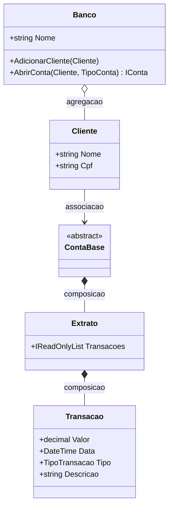
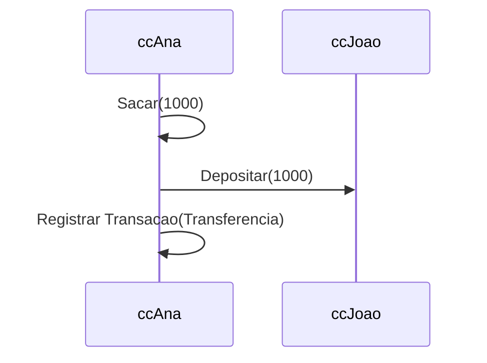

# Aula 4 - Colaboracao entre Objetos

## Teoria

POO nao e apenas criar classes — e fazer essas classes cooperarem. Relacoes principais:

| Relacao | Forca | Ciclo de vida | Exemplo |
|---------|-------|---------------|---------|
| Dependencia | Fraca | Temporaria | Metodo recebe parametro |
| Associacao | Media | Independente | Aluno ↔ Matricula |
| Agregacao | Media-alta | Partes sobrevivem | Time contem Jogadores |
| Composicao | Forte | Partes morrem com o todo | Pedido contem Itens |

**Pergunta-chave para diferenciar**: "Se o todo for destruido, a parte sobrevive?" Sim → agregacao. Nao → composicao.

---

## 🏦 Hands-on: App Bancario — Relacoes entre objetos

Nosso banco precisa de mais entidades e relacoes claras entre elas. Vamos adicionar `Banco`, `Transacao`, `Extrato` e `EmissorExtrato`.

### Diagrama de relacoes



### `Transacao` e `Extrato` — composicao

Uma transacao nao faz sentido sem a conta a qual pertence. O extrato e o conjunto de transacoes de uma conta. Ambos sao composicao.

```csharp
// === MiniBank v0.4 — Colaboracao entre objetos ===

public enum TipoTransacao { Deposito, Saque, Transferencia }

public class Transacao
{
    public decimal Valor { get; }
    public DateTime Data { get; }
    public TipoTransacao Tipo { get; }
    public string Descricao { get; }

    public Transacao(decimal valor, TipoTransacao tipo, string descricao)
    {
        Valor = valor;
        Data = DateTime.Now;
        Tipo = tipo;
        Descricao = descricao;
    }

    public override string ToString()
        => $"{Data:dd/MM/yyyy HH:mm} | {Tipo,-15} | {Valor,12:C} | {Descricao}";
}

public class Extrato
{
    private readonly List<Transacao> transacoes = new();
    public IReadOnlyList<Transacao> Transacoes => transacoes;

    public void Registrar(Transacao t) => transacoes.Add(t);

    public void Imprimir()
    {
        Console.WriteLine("--- EXTRATO ---");
        foreach (var t in transacoes)
            Console.WriteLine(t);
        Console.WriteLine("---------------");
    }
}
```

### `ContaBase` agora tem `Extrato` (composicao)

```csharp
public abstract class ContaBase : IConta
{
    public string Numero { get; }
    public decimal Saldo { get; protected set; }
    public Cliente Titular { get; }
    public Extrato Extrato { get; } = new(); // composicao: nasce com a conta

    protected ContaBase(string numero, Cliente titular, decimal saldoInicial)
    {
        Numero = numero;
        Titular = titular;
        Saldo = saldoInicial;

        if (saldoInicial > 0)
            Extrato.Registrar(new Transacao(saldoInicial, TipoTransacao.Deposito, "Saldo inicial"));
    }

    public void Depositar(decimal valor)
    {
        if (valor <= 0) throw new ArgumentException("Valor deve ser positivo.");
        Saldo += valor;
        Extrato.Registrar(new Transacao(valor, TipoTransacao.Deposito, "Deposito"));
    }

    public abstract bool Sacar(decimal valor);

    public string ExibirExtrato()
    {
        Extrato.Imprimir();
        return $"Saldo atual: {Saldo:C}";
    }
}
```

### `ContaCorrente` com transferencia

```csharp
public class ContaCorrente : ContaBase
{
    public decimal LimiteChequeEspecial { get; }

    public ContaCorrente(string numero, Cliente titular, decimal saldoInicial = 0, decimal limite = 500m)
        : base(numero, titular, saldoInicial) { LimiteChequeEspecial = limite; }

    public override bool Sacar(decimal valor)
    {
        if (valor <= 0 || valor > Saldo + LimiteChequeEspecial) return false;
        Saldo -= valor;
        Extrato.Registrar(new Transacao(valor, TipoTransacao.Saque, "Saque"));
        return true;
    }

    public bool Transferir(IConta destino, decimal valor)
    {
        if (!Sacar(valor)) return false;
        destino.Depositar(valor);
        // Corrige descricao da ultima transacao no extrato
        Extrato.Registrar(new Transacao(valor, TipoTransacao.Transferencia, $"Transferencia para {destino.Numero}"));
        return true;
    }
}
```

### `Banco` — agregacao de clientes

O banco agrega clientes e cria contas. Se o banco "fechar", os clientes continuam existindo como pessoas.

```csharp
public class Banco
{
    public string Nome { get; }
    private readonly List<Cliente> clientes = new();
    private readonly List<IConta> contas = new();
    private int proximoNumeroConta = 1;

    public Banco(string nome) { Nome = nome; }

    public void AdicionarCliente(Cliente cliente)
    {
        if (clientes.Any(c => c.Cpf == cliente.Cpf))
            throw new InvalidOperationException("Cliente ja cadastrado.");
        clientes.Add(cliente);
    }

    public ContaCorrente AbrirContaCorrente(Cliente cliente, decimal saldoInicial = 0)
    {
        var conta = new ContaCorrente($"CC-{proximoNumeroConta++:D4}", cliente, saldoInicial);
        contas.Add(conta);
        return conta;
    }

    public ContaPoupanca AbrirContaPoupanca(Cliente cliente, decimal saldoInicial = 0)
    {
        var conta = new ContaPoupanca($"CP-{proximoNumeroConta++:D4}", cliente, saldoInicial);
        contas.Add(conta);
        return conta;
    }

    public IReadOnlyList<IConta> ListarContas() => contas;
}
```

### `EmissorExtrato` — dependencia

Dependencia fraca: usa a conta como parametro, mas nao mantem referencia.

```csharp
public class EmissorExtrato
{
    public void EmitirParaConsole(IConta conta)
    {
        Console.WriteLine($"\n=== {conta.Titular.Nome} ===");
        Console.WriteLine(conta.ExibirExtrato());
    }
}
```

### Testando tudo junto

```csharp
var banco = new Banco("MiniBank");

var ana = new Cliente("Ana Silva", "123.456.789-00", "ana@email.com");
var joao = new Cliente("Joao Santos", "987.654.321-00", "joao@email.com");

banco.AdicionarCliente(ana);
banco.AdicionarCliente(joao);

var ccAna = banco.AbrirContaCorrente(ana, 5000m);
var cpAna = banco.AbrirContaPoupanca(ana, 2000m);
var ccJoao = banco.AbrirContaCorrente(joao, 1000m);

ccAna.Depositar(500m);
ccAna.Sacar(200m);
ccAna.Transferir(ccJoao, 1000m);

var emissor = new EmissorExtrato();
emissor.EmitirParaConsole(ccAna);
emissor.EmitirParaConsole(ccJoao);
```

### Fluxo de transferencia



---

## Exercicios

1. Adicione um metodo `BuscarContasPorCliente(Cliente)` no `Banco`.
2. Implemente `Transferir` tambem em `ContaPoupanca`, sem cheque especial.
3. Crie uma classe `Relatorio` que receba o `Banco` e imprima um resumo de todas as contas e seus saldos.
