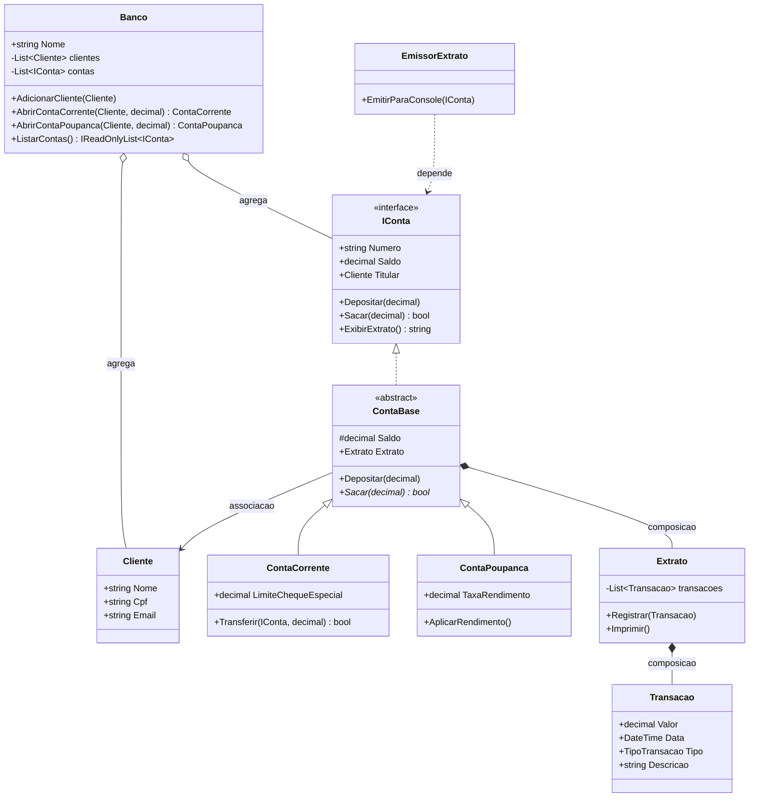
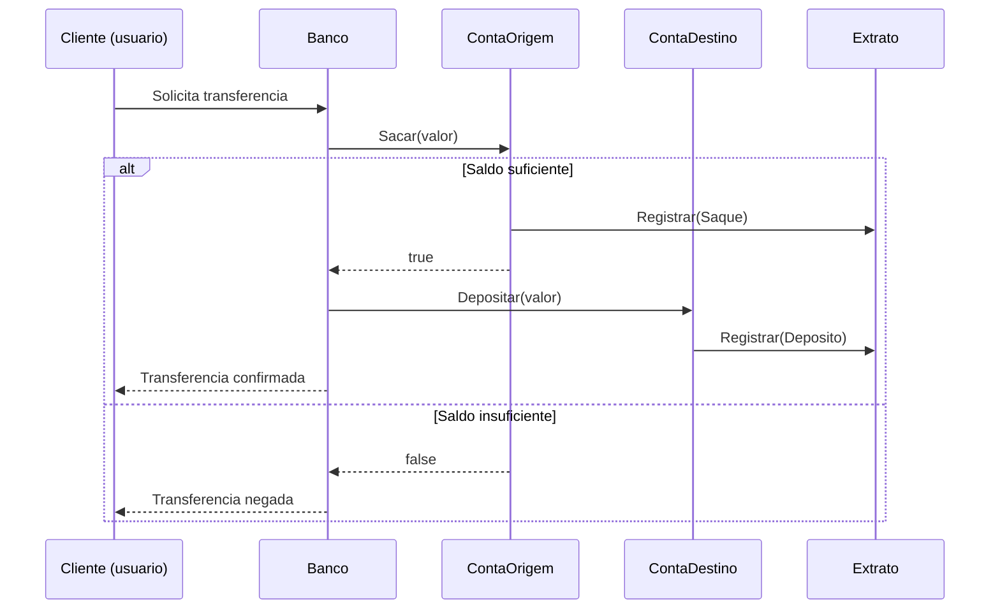
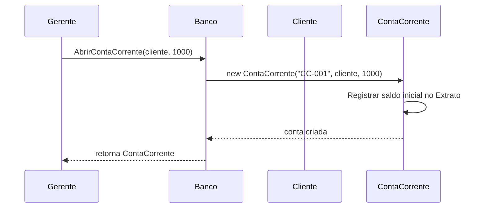
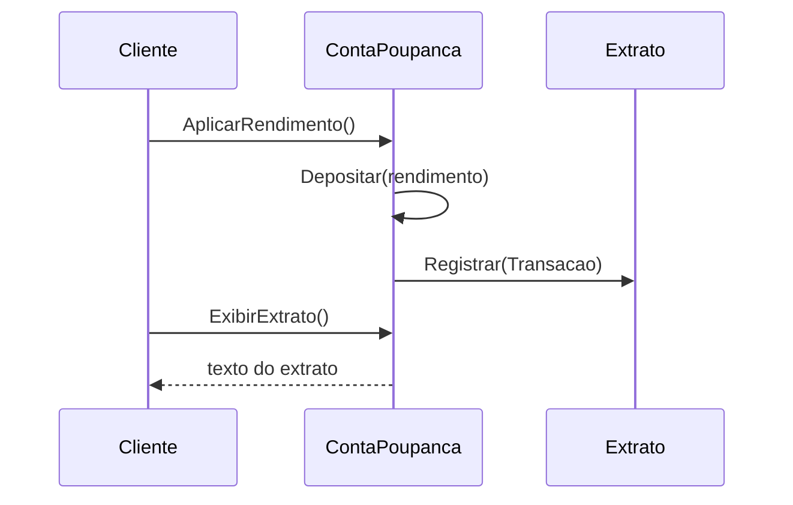
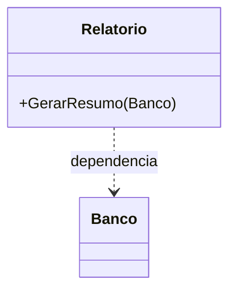

# Aula 5 - Modelagem e Diagramas

## Objetivo da aula

Usar UML e Mermaid para raciocinar sobre o `MiniBank` que ja existe e explicitar o que ainda falta construir.

## Pre-requisitos

- dominar a versao `v0.4` do `MiniBank`
- reconhecer classes, interfaces e relacoes entre objetos
- estar confortavel com leitura de diagramas simples

## Ao final, o aluno sera capaz de...

- interpretar diagramas de classes e de sequencia do `MiniBank`
- converter codigo em modelo e modelo em backlog tecnico
- usar Mermaid como linguagem de representacao e revisao
- identificar lacunas de design antes de escrever mais codigo

## Teoria essencial

Modelar antes de codificar diminui retrabalho. A **UML** (Unified Modeling Language) e o padrao para modelagem de software. Diagramas UML se dividem em estruturais (classes, componentes) e comportamentais (sequencia, caso de uso).

Para uma aula introdutoria, tres visoes sao essenciais:

- **Diagrama de classes**: estrutura estatica
- **Caso de uso**: quem interage com o sistema e para que
- **Diagrama de sequencia**: ordem temporal das mensagens

### Elementos do diagrama de classes

Cada classe e um retangulo com tres compartimentos: nome, atributos, metodos. Simbolos: `+` public, `-` private, `#` protected. Relacoes: heranca (seta com triangulo), associacao (seta), agregacao (losango vazio), composicao (losango cheio), dependencia (seta tracejada).

### Elementos do diagrama de sequencia

Lifelines verticais representam objetos. Mensagens fluem horizontalmente, de cima para baixo (tempo). Setas solidas = chamada sincrona. Setas tracejadas = retorno.

## Erros e confusoes comuns

- desenhar UML como decoracao, sem ligacao com o codigo
- usar seta correta com semantica errada
- esquecer de representar contratos (`interface`, `abstract`) no modelo
- achar que diagrama substitui validacao de comportamento

---

## 🏦 Hands-on: App Bancario — Diagramas do MiniBank

### Estado atual do MiniBank

- Versao de entrada: `v0.4`
- Versao de saida: `v0.4` modelada e preparada para as proximas evolucoes
- Classes novas: nenhuma obrigatoria
- Classes alteradas: nenhuma obrigatoria
- Comportamentos novos: leitura de arquitetura e planejamento de backlog
- Como testar no Main: comparar o diagrama com o codigo e verificar se as mensagens do fluxo batem com as chamadas reais

### O que muda nesta aula

O foco deixa de ser criar novas classes e passa a ser representar o sistema de forma externa, para enxergar estrutura, fluxo e lacunas.

### Por que muda

Sem esse passo, o aluno pode continuar adicionando codigo sem perceber acoplamentos e responsabilidades mal distribuidas.

### Organizando o projeto

1. Crie a pasta `docs/uml` na raiz do projeto.
2. Salve os diagramas desta aula em arquivos como `docs/uml/minibank-classe-v0.4.md` e `docs/uml/minibank-sequencia-transferencia.md`.
3. Se preferir, mantenha os blocos Mermaid dentro do Markdown da aula e gere os diagramas depois, mas preserve os nomes dos arquivos sugeridos para continuar a documentacao.
4. Trate a pasta `docs/uml` como parte do projeto: ela ajuda a acompanhar a evolucao do design entre as aulas.

Ja construimos bastante codigo. Agora vamos **modelar o que temos** e **planejar o que falta**.

### Diagrama de classes completo (v0.4)

### Caso de uso

### Diagrama de sequencia — Transferencia

### Diagrama de sequencia — Abrir conta

### Do diagrama ao codigo: o que falta?

Olhando o diagrama de caso de uso, identificamos funcionalidades que ainda nao implementamos:

| Caso de uso | Status | Aula prevista |
|-------------|--------|---------------|
| Abrir conta | ✅ Implementado | Aula 4 |
| Depositar | ✅ Implementado | Aula 1 |
| Sacar | ✅ Implementado | Aula 2 |
| Transferir | ✅ Implementado | Aula 4 |
| Consultar extrato | ✅ Implementado | Aula 4 |
| Notificar transacao | ❌ Pendente | Aula 6 (eventos) |
| Persistir dados | ❌ Pendente | Aula 9 (interfaces + DI) |
| Aplicar taxas variadas | ❌ Pendente | Aula 7 (Strategy) |

---

## Checklist de verificacao da versao

- o diagrama de classes representa as classes centrais do `MiniBank v0.4`
- os relacionamentos principais batem com o codigo ja apresentado
- o diagrama de sequencia mostra ordem de mensagens coerente com transferencia e abertura de conta
- o aluno consegue usar o diagrama para apontar o que ainda nao foi implementado
- ao menos uma responsabilidade excessiva e identificada no modelo

## Exercicios

1. Desenhe em Mermaid um diagrama de sequencia para "Cliente aplica rendimento na poupanca e consulta extrato".
2. Adicione ao diagrama de classes uma classe `Relatorio` com metodo `GerarResumo(Banco)` e indique o tipo de relacao com `Banco`.
3. Identifique no diagrama de classes pelo menos uma violacao potencial do SRP. Qual classe faz coisas demais?

### Gabarito comentado

1. Solucao de referencia em Mermaid:

Rubrica minima:
- o cliente inicia a acao
- a poupanca calcula/aplica rendimento
- o extrato registra a transacao
- o extrato ou a conta devolve a consulta ao cliente

2. Resposta esperada:

Justificativa: se `Relatorio` recebe `Banco` por parametro para gerar o resumo, a relacao e dependencia.

3. Resposta esperada: `Banco` e um candidato forte porque abre contas, agrega entidades e coordena operacoes. `ContaCorrente` com logica de transferencia tambem era um candidato antes da refatoracao da Aula 7.

Erros comuns:
- desenhar a resposta do exercicio 1 sem registrar a transacao
- classificar `Relatorio -> Banco` como composicao
- dizer "viola SRP" sem indicar a responsabilidade excedente

## Fechamento e conexao com a proxima aula

Esta aula organiza o que ja foi construido e deixa visivel o backlog tecnico do sistema. A Aula 6 volta ao codigo com tres frentes novas: tratamento de falhas, notificacao de eventos e primeiro passo em generics.

### Versao esperada apos esta aula

- Versao de entrada: `v0.4`
- Versao de saida: `v0.4` modelada
- Classes novas: nenhuma obrigatoria
- Classes alteradas: nenhuma obrigatoria
- Comportamentos novos: leitura arquitetural e planejamento
- Como testar no Main: conferir se os fluxos do diagrama correspondem as chamadas reais do codigo
