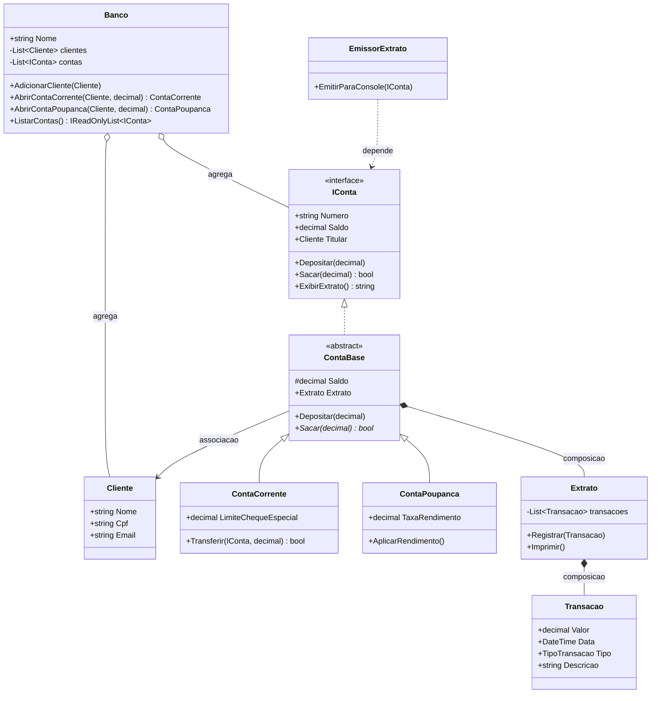
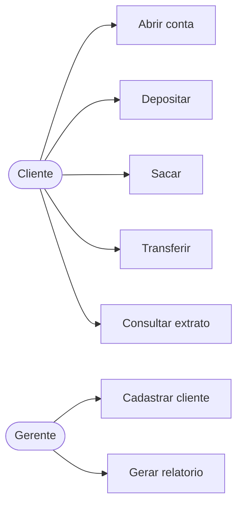
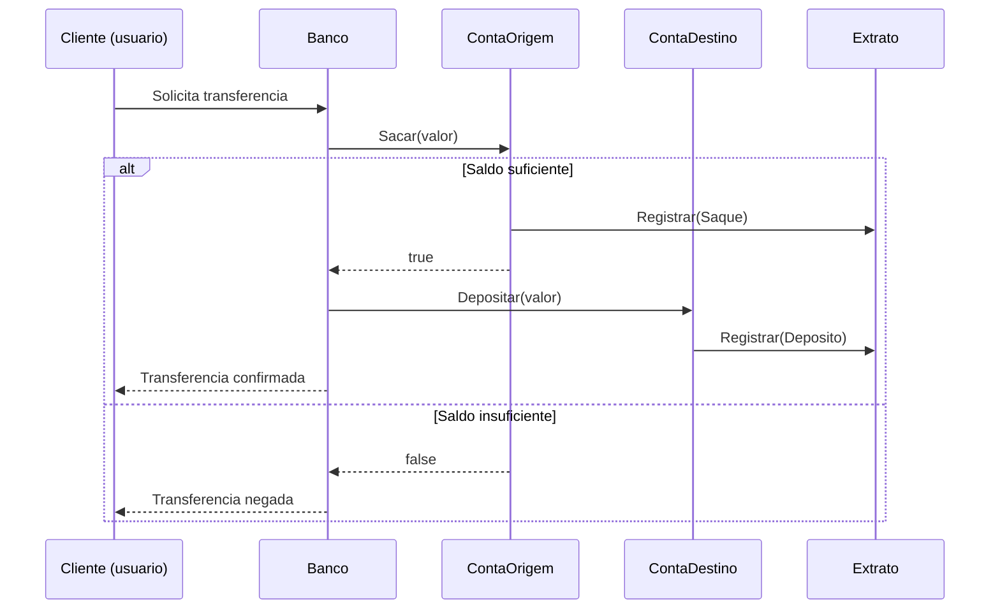
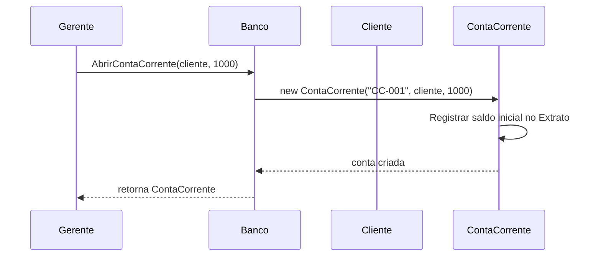

# Aula 5 - Modelagem e Diagramas

## Teoria

Modelar antes de codificar diminui retrabalho. A **UML** (Unified Modeling Language) e o padrao para modelagem de software. Diagramas UML se dividem em estruturais (classes, componentes) e comportamentais (sequencia, caso de uso).

Para uma aula introdutoria, tres visoes sao essenciais:

- **Diagrama de classes**: estrutura estatica
- **Caso de uso**: quem interage com o sistema e para que
- **Diagrama de sequencia**: ordem temporal das mensagens

### Elementos do diagrama de classes

Cada classe e um retangulo com tres compartimentos: nome, atributos, metodos. Simbolos: `+` public, `-` private, `#` protected. Relacoes: heranca (seta com triangulo), associacao (seta), agregacao (losango vazio), composicao (losango cheio), dependencia (seta tracejada).

### Elementos do diagrama de sequencia

Lifelines verticais representam objetos. Mensagens fluem horizontalmente, de cima para baixo (tempo). Setas solidas = chamada sincrona. Setas tracejadas = retorno.

---

## 🏦 Hands-on: App Bancario — Diagramas do MiniBank

Ja construimos bastante codigo. Agora vamos **modelar o que temos** e **planejar o que falta**.

### Diagrama de classes completo (v0.4)

### Caso de uso

### Diagrama de sequencia — Transferencia

### Diagrama de sequencia — Abrir conta

### Do diagrama ao codigo: o que falta?

Olhando o diagrama de caso de uso, identificamos funcionalidades que ainda nao implementamos:

| Caso de uso | Status | Aula prevista |
|-------------|--------|---------------|
| Abrir conta | ✅ Implementado | Aula 4 |
| Depositar | ✅ Implementado | Aula 1 |
| Sacar | ✅ Implementado | Aula 2 |
| Transferir | ✅ Implementado | Aula 4 |
| Consultar extrato | ✅ Implementado | Aula 4 |
| Notificar transacao | ❌ Pendente | Aula 6 (eventos) |
| Persistir dados | ❌ Pendente | Aula 9 (interfaces + DI) |
| Aplicar taxas variadas | ❌ Pendente | Aula 7 (Strategy) |

---

## Exercicios

1. Desenhe em Mermaid um diagrama de sequencia para "Cliente aplica rendimento na poupanca e consulta extrato".
2. Adicione ao diagrama de classes uma classe `Relatorio` com metodo `GerarResumo(Banco)` e indique o tipo de relacao com `Banco`.
3. Identifique no diagrama de classes pelo menos uma violacao potencial do SRP. Qual classe faz coisas demais?
