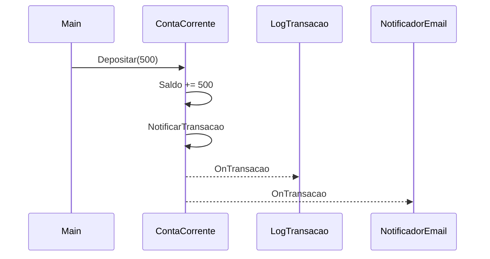

# Aula 6 - Excecoes, Eventos e Generics

## Objetivo da aula

Fazer a primeira introducao pratica a excecoes, eventos e generics, deixando claro que esta aula inaugura esses temas e nao os esgota.

## Pre-requisitos

- dominar a versao `v0.4` do `MiniBank`
- entender colaboracao entre objetos e contratos simples
- estar confortavel com `try/catch` e colecoes basicas em `C#`

## Ao final, o aluno sera capaz de...

- diferenciar erro de programacao de erro de negocio em runtime
- usar excecoes customizadas para proteger regras do dominio
- conectar assinantes a eventos no padrao idiomatico de `C#`
- criar um primeiro componente generico tipado para repositorio

## Teoria essencial

Esses tres temas ajudam a escrever objetos mais robustos, reutilizaveis e desacoplados.

### Excecoes

**Erro** = codigo nao compila. **Excecao** = codigo compila mas falha em runtime. Tratamos excecoes com `try`/`catch`/`finally`. Lancamos com `throw`. Podemos criar excecoes customizadas herdando de `Exception`.

### Eventos

Eventos permitem que objetos notifiquem outros sem conhece-los. Um **delegate** guarda referencia a metodos. Um **evento** e um delegate com restricoes de seguranca (`+=`/`-=` apenas).

### Generics

Generics criam componentes reutilizaveis com seguranca de tipo. `<T>` e um placeholder substituido por tipo concreto no uso.

## Erros e confusoes comuns

- trocar todo `bool` por excecao sem criterio
- achar que evento e apenas "metodo automatico"
- confundir `event` com delegate livre
- concluir que esta aula ja encerra o assunto de generics

---

## 🏦 Hands-on: App Bancario — Excecoes, notificacoes e repositorio

### Estado atual do MiniBank

- Versao de entrada: `v0.4`
- Versao de saida: `v0.5`
- Classes novas: `SaldoInsuficienteException`, `ContaInativaException`, `TransacaoEventArgs`, `Repositorio<T>`, `IIdentificavel`
- Classes alteradas: `ContaBase`, `Cliente`, `ContaCorrente`
- Comportamentos novos: falha via excecao, notificacao por evento, armazenamento tipado
- Como testar no Main: forcar um saque invalido, inscrever listeners e consultar repositorios genericos

### O que muda nesta aula

O `MiniBank` passa a sinalizar falhas de dominio de forma mais expressiva, emitir notificacoes para multiplos interessados e armazenar entidades por meio de um reuso generico inicial.

### Por que muda

Sem essas ferramentas, o codigo cresce com tratamento de erro pobre, acoplamento entre emissores e ouvintes e duplicacao em armazenamento.

### Organizando o projeto

1. Crie a pasta `Exceptions` para as excecoes customizadas do dominio.
2. Crie a pasta `Events` para `TransacaoEventArgs` e eventuais assinantes.
3. Crie a pasta `Repositories` para o primeiro `Repositorio<T>` e a interface `IIdentificavel`.
4. Adicione os arquivos `Exceptions/SaldoInsuficienteException.cs`, `Exceptions/ContaInativaException.cs`, `Events/TransacaoEventArgs.cs`, `Repositories/IIdentificavel.cs` e `Repositories/Repositorio.cs`.
5. Atualize `Models/Cliente.cs`, `Models/Contas/ContaBase.cs` e `Models/Contas/ContaCorrente.cs` para integrar esses novos componentes.

Vamos adicionar tres funcionalidades ao MiniBank:

1. **Excecoes customizadas** para regras de negocio
2. **Eventos** para notificar transacoes
3. **Repositorio generico** para armazenar entidades

### Passo 1: Excecoes customizadas

```csharp
// === MiniBank v0.5 — Excecoes, Eventos e Generics ===

public class SaldoInsuficienteException : Exception
{
    public decimal SaldoAtual { get; }
    public decimal ValorSolicitado { get; }

    public SaldoInsuficienteException(decimal saldo, decimal valor)
        : base($"Saldo {saldo:C} insuficiente para operacao de {valor:C}.")
    {
        SaldoAtual = saldo;
        ValorSolicitado = valor;
    }
}

public class ContaInativaException : Exception
{
    public ContaInativaException(string numero)
        : base($"Conta {numero} esta inativa.") { }
}
```

Agora `ContaCorrente.Sacar` lanca excecao em vez de retornar `false`:

```csharp
public override bool Sacar(decimal valor)
{
    if (valor <= 0) throw new ArgumentException("Valor deve ser positivo.");
    if (valor > Saldo + LimiteChequeEspecial)
        throw new SaldoInsuficienteException(Saldo, valor);

    Saldo -= valor;
    Extrato.Registrar(new Transacao(valor, TipoTransacao.Saque, "Saque"));
    return true;
}
```

Tratamento no codigo chamador:

```csharp
try
{
    ccAna.Sacar(99999m);
}
catch (SaldoInsuficienteException ex)
{
    Console.WriteLine($"Operacao negada: {ex.Message}");
    Console.WriteLine($"Saldo: {ex.SaldoAtual:C} | Solicitado: {ex.ValorSolicitado:C}");
}
catch (ArgumentException ex)
{
    Console.WriteLine($"Dados invalidos: {ex.Message}");
}
finally
{
    Console.WriteLine("Operacao finalizada.");
}
```

### Passo 2: Eventos para notificacoes

Quando uma transacao ocorre, o sistema deve poder notificar multiplos interessados (email, SMS, log).

```csharp
public class TransacaoEventArgs : EventArgs
{
    public Transacao Transacao { get; }
    public IConta Conta { get; }

    public TransacaoEventArgs(Transacao transacao, IConta conta)
    {
        Transacao = transacao;
        Conta = conta;
    }
}
```

Adicionamos o evento em `ContaBase`:

```csharp
public abstract class ContaBase : IConta
{
    // ... (propriedades anteriores)

    public event EventHandler<TransacaoEventArgs>? TransacaoRealizada;

    protected void NotificarTransacao(Transacao transacao)
    {
        Extrato.Registrar(transacao);
        TransacaoRealizada?.Invoke(this, new TransacaoEventArgs(transacao, this));
    }

    public void Depositar(decimal valor)
    {
        if (valor <= 0) throw new ArgumentException("Valor deve ser positivo.");
        Saldo += valor;
        NotificarTransacao(new Transacao(valor, TipoTransacao.Deposito, "Deposito"));
    }

    // ... Sacar agora tambem usa NotificarTransacao
}
```

Assinantes:

```csharp
public class LogTransacao
{
    public void OnTransacao(object? sender, TransacaoEventArgs e)
    {
        Console.WriteLine($"[LOG] {e.Transacao}");
    }
}

public class NotificadorEmail
{
    public void OnTransacao(object? sender, TransacaoEventArgs e)
    {
        Console.WriteLine($"[EMAIL] {e.Conta.Titular.Email}: {e.Transacao.Tipo} de {e.Transacao.Valor:C}");
    }
}
```

Conectando:

```csharp
var log = new LogTransacao();
var emailNotif = new NotificadorEmail();

ccAna.TransacaoRealizada += log.OnTransacao;
ccAna.TransacaoRealizada += emailNotif.OnTransacao;

ccAna.Depositar(500m);
// [LOG] 11/03/2026 ... | Deposito | R$ 500,00
// [EMAIL] ana@email.com: Deposito de R$ 500,00
```

### Passo 3: Repositorio generico

```csharp
public interface IIdentificavel
{
    string Id { get; }
}

public class Repositorio<T> where T : IIdentificavel
{
    private readonly List<T> itens = new();

    public void Adicionar(T item)
    {
        if (itens.Any(i => i.Id == item.Id))
            throw new InvalidOperationException($"Item com Id '{item.Id}' ja existe.");
        itens.Add(item);
    }

    public T? BuscarPorId(string id) => itens.FirstOrDefault(i => i.Id == id);
    public IReadOnlyList<T> ListarTodos() => itens;
    public bool Remover(string id)
    {
        var item = BuscarPorId(id);
        return item != null && itens.Remove(item);
    }
    public int Contar() => itens.Count;
}
```

Fazendo `Cliente` e `ContaBase` implementarem `IIdentificavel`:

```csharp
public class Cliente : IIdentificavel
{
    public string Id => Cpf; // CPF como identificador
    // ... restante igual
}

public abstract class ContaBase : IConta, IIdentificavel
{
    public string Id => Numero; // Numero da conta como identificador
    // ... restante igual
}
```

Uso:

```csharp
var repoClientes = new Repositorio<Cliente>();
repoClientes.Adicionar(ana);
repoClientes.Adicionar(joao);

var repoContas = new Repositorio<ContaCorrente>();
repoContas.Adicionar(ccAna);

Console.WriteLine($"Clientes: {repoClientes.Contar()}"); // 2
Console.WriteLine($"Contas CC: {repoContas.Contar()}");   // 1

var encontrado = repoClientes.BuscarPorId("123.456.789-00");
Console.WriteLine(encontrado?.Nome); // Ana Silva
```

### Fluxo de evento



---

## Checklist de verificacao da versao

- regras de negocio importantes agora lancam excecoes especificas
- `ContaBase` publica um evento `TransacaoRealizada`
- ha pelo menos dois assinantes reagindo ao mesmo evento
- o repositorio generico aceita tipos que implementam `IIdentificavel`
- o aluno consegue explicar que generics e eventos voltarao em aulas futuras com aprofundamento

## Exercicios

1. Crie uma excecao `LimiteExcedidoException` para quando o saque ultrapassa o cheque especial. Inclua propriedade `LimiteDisponivel`.
2. Adicione um terceiro assinante `NotificadorSms` ao evento de transacao.
3. Estenda o `Repositorio<T>` com um metodo `Buscar(Func<T, bool> filtro)` que retorna uma lista filtrada.
4. Conecte o evento de transacao na `ContaPoupanca` tambem e teste com `AplicarRendimento`.

### Gabarito comentado

1. Implementacao de referencia:

```csharp
public class LimiteExcedidoException : Exception
{
    public decimal LimiteDisponivel { get; }

    public LimiteExcedidoException(decimal limiteDisponivel)
        : base($"Limite disponivel insuficiente: {limiteDisponivel:C}.")
    {
        LimiteDisponivel = limiteDisponivel;
    }
}
```

Como verificar:
- a excecao compila
- `LimiteDisponivel` fica disponivel no `catch`

2. Implementacao de referencia:

```csharp
public class NotificadorSms
{
    public void OnTransacao(object? sender, TransacaoEventArgs e)
    {
        Console.WriteLine($"[SMS] Conta {e.Conta.Numero}: {e.Transacao.Tipo} de {e.Transacao.Valor:C}");
    }
}

ccAna.TransacaoRealizada += new NotificadorSms().OnTransacao;
```

Como verificar:
- um deposito gera tres saidas: log, email e SMS

3. Implementacao de referencia:

```csharp
public IEnumerable<T> Buscar(Func<T, bool> filtro)
    => itens.Where(filtro).ToList();
```

Como verificar:
- `repoClientes.Buscar(c => c.Nome.StartsWith("A"))` retorna apenas os clientes esperados

4. Resposta esperada: `ContaPoupanca` deve chamar `NotificarTransacao(...)` dentro de `AplicarRendimento()` ou do fluxo de deposito associado ao rendimento.

Roteiro de teste:

```csharp
cpAna.TransacaoRealizada += log.OnTransacao;
cpAna.AplicarRendimento();
```

Resultado esperado:
- uma nova transacao de tipo `Rendimento` aparece no extrato
- o assinante recebe notificacao

Erros comuns:
- criar excecao sem carregar dado adicional do dominio
- adicionar SMS sem inscrever no evento
- retornar `IEnumerable<T>` preguicoso sem explicar que a busca esta sendo materializada ou nao

## Fechamento e conexao com a proxima aula

O `MiniBank` agora reage melhor a falhas, publica eventos e reaproveita armazenamento tipado. A Aula 7 usa essa base para discutir design em escala maior, com SOLID e Strategy.

### Versao esperada apos esta aula

- Versao de entrada: `v0.4`
- Versao de saida: `v0.5`
- Classes novas: excecoes customizadas, `TransacaoEventArgs`, `Repositorio<T>`, `IIdentificavel`
- Classes alteradas: `ContaBase`, `ContaCorrente`, `Cliente`
- Comportamentos novos: excecao de negocio, evento de transacao, repositorio generico inicial
- Como testar no Main: forcar excecao, observar multiplos assinantes e consultar entidades por `Id`
