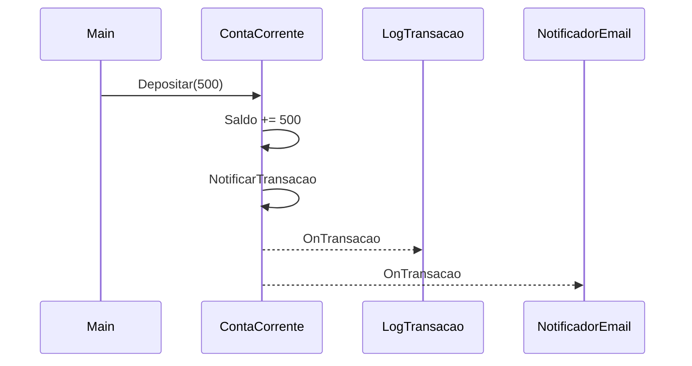

# Aula 6 - Excecoes, Eventos e Generics

## Teoria

Esses tres temas ajudam a escrever objetos mais robustos, reutilizaveis e desacoplados.

### Excecoes

**Erro** = codigo nao compila. **Excecao** = codigo compila mas falha em runtime. Tratamos excecoes com `try`/`catch`/`finally`. Lancamos com `throw`. Podemos criar excecoes customizadas herdando de `Exception`.

### Eventos

Eventos permitem que objetos notifiquem outros sem conhece-los. Um **delegate** guarda referencia a metodos. Um **evento** e um delegate com restricoes de seguranca (`+=`/`-=` apenas).

### Generics

Generics criam componentes reutilizaveis com seguranca de tipo. `<T>` e um placeholder substituido por tipo concreto no uso.

---

## 🏦 Hands-on: App Bancario — Excecoes, notificacoes e repositorio

Vamos adicionar tres funcionalidades ao MiniBank:

1. **Excecoes customizadas** para regras de negocio
2. **Eventos** para notificar transacoes
3. **Repositorio generico** para armazenar entidades

### Passo 1: Excecoes customizadas

```csharp
// === MiniBank v0.5 — Excecoes, Eventos e Generics ===

public class SaldoInsuficienteException : Exception
{
    public decimal SaldoAtual { get; }
    public decimal ValorSolicitado { get; }

    public SaldoInsuficienteException(decimal saldo, decimal valor)
        : base($"Saldo {saldo:C} insuficiente para operacao de {valor:C}.")
    {
        SaldoAtual = saldo;
        ValorSolicitado = valor;
    }
}

public class ContaInativaException : Exception
{
    public ContaInativaException(string numero)
        : base($"Conta {numero} esta inativa.") { }
}
```

Agora `ContaCorrente.Sacar` lanca excecao em vez de retornar `false`:

```csharp
public override bool Sacar(decimal valor)
{
    if (valor <= 0) throw new ArgumentException("Valor deve ser positivo.");
    if (valor > Saldo + LimiteChequeEspecial)
        throw new SaldoInsuficienteException(Saldo, valor);

    Saldo -= valor;
    Extrato.Registrar(new Transacao(valor, TipoTransacao.Saque, "Saque"));
    return true;
}
```

Tratamento no codigo chamador:

```csharp
try
{
    ccAna.Sacar(99999m);
}
catch (SaldoInsuficienteException ex)
{
    Console.WriteLine($"Operacao negada: {ex.Message}");
    Console.WriteLine($"Saldo: {ex.SaldoAtual:C} | Solicitado: {ex.ValorSolicitado:C}");
}
catch (ArgumentException ex)
{
    Console.WriteLine($"Dados invalidos: {ex.Message}");
}
finally
{
    Console.WriteLine("Operacao finalizada.");
}
```

### Passo 2: Eventos para notificacoes

Quando uma transacao ocorre, o sistema deve poder notificar multiplos interessados (email, SMS, log).

```csharp
public class TransacaoEventArgs : EventArgs
{
    public Transacao Transacao { get; }
    public IConta Conta { get; }

    public TransacaoEventArgs(Transacao transacao, IConta conta)
    {
        Transacao = transacao;
        Conta = conta;
    }
}
```

Adicionamos o evento em `ContaBase`:

```csharp
public abstract class ContaBase : IConta
{
    // ... (propriedades anteriores)

    public event EventHandler<TransacaoEventArgs>? TransacaoRealizada;

    protected void NotificarTransacao(Transacao transacao)
    {
        Extrato.Registrar(transacao);
        TransacaoRealizada?.Invoke(this, new TransacaoEventArgs(transacao, this));
    }

    public void Depositar(decimal valor)
    {
        if (valor <= 0) throw new ArgumentException("Valor deve ser positivo.");
        Saldo += valor;
        NotificarTransacao(new Transacao(valor, TipoTransacao.Deposito, "Deposito"));
    }

    // ... Sacar agora tambem usa NotificarTransacao
}
```

Assinantes:

```csharp
public class LogTransacao
{
    public void OnTransacao(object? sender, TransacaoEventArgs e)
    {
        Console.WriteLine($"[LOG] {e.Transacao}");
    }
}

public class NotificadorEmail
{
    public void OnTransacao(object? sender, TransacaoEventArgs e)
    {
        Console.WriteLine($"[EMAIL] {e.Conta.Titular.Email}: {e.Transacao.Tipo} de {e.Transacao.Valor:C}");
    }
}
```

Conectando:

```csharp
var log = new LogTransacao();
var emailNotif = new NotificadorEmail();

ccAna.TransacaoRealizada += log.OnTransacao;
ccAna.TransacaoRealizada += emailNotif.OnTransacao;

ccAna.Depositar(500m);
// [LOG] 11/03/2026 ... | Deposito | R$ 500,00
// [EMAIL] ana@email.com: Deposito de R$ 500,00
```

### Passo 3: Repositorio generico

```csharp
public interface IIdentificavel
{
    string Id { get; }
}

public class Repositorio<T> where T : IIdentificavel
{
    private readonly List<T> itens = new();

    public void Adicionar(T item)
    {
        if (itens.Any(i => i.Id == item.Id))
            throw new InvalidOperationException($"Item com Id '{item.Id}' ja existe.");
        itens.Add(item);
    }

    public T? BuscarPorId(string id) => itens.FirstOrDefault(i => i.Id == id);
    public IReadOnlyList<T> ListarTodos() => itens;
    public bool Remover(string id)
    {
        var item = BuscarPorId(id);
        return item != null && itens.Remove(item);
    }
    public int Contar() => itens.Count;
}
```

Fazendo `Cliente` e `ContaBase` implementarem `IIdentificavel`:

```csharp
public class Cliente : IIdentificavel
{
    public string Id => Cpf; // CPF como identificador
    // ... restante igual
}

public abstract class ContaBase : IConta, IIdentificavel
{
    public string Id => Numero; // Numero da conta como identificador
    // ... restante igual
}
```

Uso:

```csharp
var repoClientes = new Repositorio<Cliente>();
repoClientes.Adicionar(ana);
repoClientes.Adicionar(joao);

var repoContas = new Repositorio<ContaCorrente>();
repoContas.Adicionar(ccAna);

Console.WriteLine($"Clientes: {repoClientes.Contar()}"); // 2
Console.WriteLine($"Contas CC: {repoContas.Contar()}");   // 1

var encontrado = repoClientes.BuscarPorId("123.456.789-00");
Console.WriteLine(encontrado?.Nome); // Ana Silva
```

### Fluxo de evento



---

## Exercicios

1. Crie uma excecao `LimiteExcedidoException` para quando o saque ultrapassa o cheque especial. Inclua propriedade `LimiteDisponivel`.
2. Adicione um terceiro assinante `NotificadorSms` ao evento de transacao.
3. Estenda o `Repositorio<T>` com um metodo `Buscar(Func<T, bool> filtro)` que retorna uma lista filtrada.
4. Conecte o evento de transacao na `ContaPoupanca` tambem e teste com `AplicarRendimento`.
