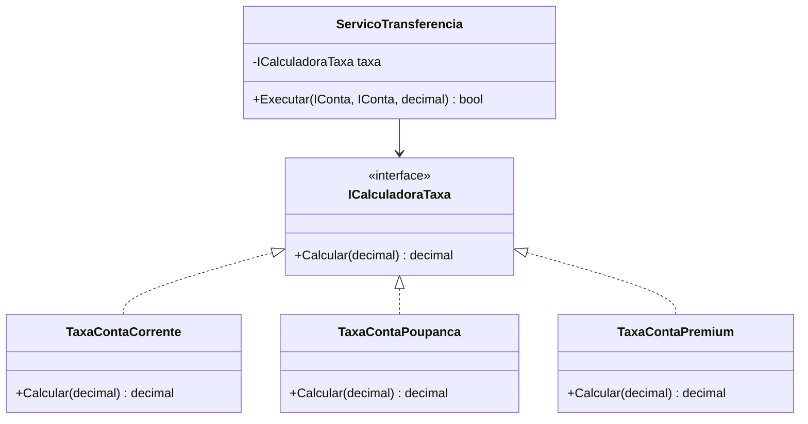

# Aula 7 - SOLID e Padroes de Projeto

## Objetivo da aula

Usar SOLID como ferramenta de diagnostico de design e aplicar Strategy no `MiniBank` para substituir logica rigida por comportamento intercambiavel.

## Pre-requisitos

- dominar a versao `v0.5`
- compreender interfaces, heranca, excecoes e eventos basicos
- reconhecer responsabilidades misturadas em uma classe

## Ao final, o aluno sera capaz de...

- explicar os principios SOLID em termos de impacto no design
- identificar SRP, OCP, DIP e ISP no `MiniBank`
- extrair uma variacao de algoritmo para Strategy
- justificar uma refatoracao com ganho de extensibilidade

## Teoria essencial

Os principios SOLID (Robert C. Martin) guiam a escrita de codigo limpo e extensivel:

- **S** — Single Responsibility: uma classe, uma razao para mudar
- **O** — Open/Closed: aberto para extensao, fechado para modificacao
- **L** — Liskov Substitution: subclasses respeitam o contrato da base
- **I** — Interface Segregation: interfaces pequenas e focadas
- **D** — Dependency Inversion: dependa de abstracoes, nao de concretos

### Padrao Strategy

Encapsula familias de algoritmos em classes separadas, tornando-os intercambiaveis. Combina polimorfismo com Open/Closed.

## Erros e confusoes comuns

- tratar SOLID como checklist decorado
- criar interface para tudo sem variacao real
- chamar qualquer classe de servico de "boa arquitetura"
- usar Strategy quando um parametro simples resolveria

---

## 🏦 Hands-on: App Bancario — Aplicando SOLID e Strategy

### Estado atual do MiniBank

- Versao de entrada: `v0.5`
- Versao de saida: `v0.6`
- Classes novas: `ServicoTransferencia`, `ICalculadoraTaxa`, `TaxaContaCorrente`, `TaxaContaPoupanca`, `TaxaContaPremium`
- Classes alteradas: regras de transferencia deixam de ficar em `ContaCorrente`
- Comportamentos novos: taxa intercambiavel, servico orquestrador, dependencia de abstracoes
- Como testar no Main: executar a mesma transferencia com estrategias de taxa diferentes

### O que muda nesta aula

Parte da logica de negocio sai da entidade e vai para servicos e estrategias que podem variar sem alterar clientes.

### Por que muda

Depois que o sistema cresce, manter toda decisao dentro de uma unica classe deixa o design rigido e dificulta teste, manutencao e extensao.

### Organizando o projeto

1. Reaproveite a pasta `Services` e adicione `ServicoTransferencia.cs`.
2. Crie a pasta `Strategies` para as estrategias de taxa.
3. Dentro de `Strategies`, crie `ICalculadoraTaxa.cs`, `TaxaContaCorrente.cs`, `TaxaContaPoupanca.cs` e `TaxaContaPremium.cs`.
4. Se existir logica de transferencia dentro de `ContaCorrente.cs`, remova ou reduza essa responsabilidade para deixar o fluxo concentrado no servico.

Vamos refatorar o MiniBank para seguir SOLID e introduzir o padrao Strategy para calculo de taxas.

### SRP: Separar `ServicoTransferencia`

Na v0.4, a transferencia estava dentro de `ContaCorrente`. Isso viola SRP — a conta nao deveria saber sobre a logica de transferencia entre contas.

```csharp
// === MiniBank v0.6 — SOLID e Strategy ===

public class ServicoTransferencia
{
    public bool Executar(IConta origem, IConta destino, decimal valor)
    {
        if (origem.Numero == destino.Numero)
            throw new InvalidOperationException("Nao pode transferir para a mesma conta.");

        if (!origem.Sacar(valor)) return false;
        destino.Depositar(valor);
        return true;
    }
}
```

Agora a conta cuida do seu saldo; o servico cuida da orquestracao.

### OCP + Strategy: Calculo de taxas intercambiavel

O banco cobra taxas diferentes em operacoes. Em vez de usar `if/else` por tipo de conta:

```csharp
// RUIM: viola OCP — cada nova taxa exige alterar o metodo
public decimal CalcularTaxa(IConta conta, decimal valor)
{
    if (conta is ContaCorrente) return valor * 0.02m;
    if (conta is ContaPoupanca) return 0m;
    // cada novo tipo exige mais ifs...
    return 0;
}
```

Usamos Strategy:

```csharp
public interface ICalculadoraTaxa
{
    decimal Calcular(decimal valor);
}

public class TaxaContaCorrente : ICalculadoraTaxa
{
    public decimal Calcular(decimal valor) => valor * 0.02m; // 2%
}

public class TaxaContaPoupanca : ICalculadoraTaxa
{
    public decimal Calcular(decimal valor) => 0m; // isenta
}

public class TaxaContaPremium : ICalculadoraTaxa
{
    public decimal Calcular(decimal valor) => valor > 10_000 ? 0m : valor * 0.01m;
}
```

Servico de transferencia com taxa:

```csharp
public class ServicoTransferencia
{
    private readonly ICalculadoraTaxa calculadoraTaxa;

    public ServicoTransferencia(ICalculadoraTaxa calculadoraTaxa)
    {
        this.calculadoraTaxa = calculadoraTaxa;
    }

    public bool Executar(IConta origem, IConta destino, decimal valor)
    {
        decimal taxa = calculadoraTaxa.Calcular(valor);
        decimal total = valor + taxa;

        if (!origem.Sacar(total)) return false;
        destino.Depositar(valor);

        Console.WriteLine($"Transferencia: {valor:C} + taxa {taxa:C} = {total:C}");
        return true;
    }
}
```

Para adicionar um novo tipo de taxa, basta criar uma classe nova. Nenhum codigo existente muda.

### DIP: Servicos dependem de abstracoes

```csharp
public interface IRepositorioConta
{
    void Salvar(IConta conta);
    IConta? BuscarPorNumero(string numero);
    IEnumerable<IConta> ListarTodas();
}

public class ServicoConta
{
    private readonly IRepositorioConta repositorio;

    public ServicoConta(IRepositorioConta repositorio)
    {
        this.repositorio = repositorio;
    }

    public IConta? Buscar(string numero) => repositorio.BuscarPorNumero(numero);
    public void Salvar(IConta conta) => repositorio.Salvar(conta);
}
```

`ServicoConta` nao sabe se os dados estao em memoria, SQL Server ou arquivo. Depende apenas da interface.

### LSP: ContaPoupanca respeita o contrato

Se substituirmos `ContaBase` por `ContaPoupanca` em qualquer lugar que espere uma `IConta`, o comportamento deve continuar correto. `Depositar` soma, `Sacar` valida saldo. O contrato e mantido.

### ISP: Ja aplicamos na Aula 3

`IDebitavel`, `ICreditavel` e `IExibivel` sao interfaces segregadas.

### Diagrama do Strategy



### Testando

```csharp
var ana = new Cliente("Ana Silva", "123.456.789-00", "ana@email.com");
var joao = new Cliente("Joao Santos", "987.654.321-00", "joao@email.com");

var ccAna = new ContaCorrente("CC-001", ana, 5000m);
var ccJoao = new ContaCorrente("CC-002", joao, 1000m);

// Transferencia com taxa de conta corrente (2%)
var servico = new ServicoTransferencia(new TaxaContaCorrente());
servico.Executar(ccAna, ccJoao, 1000m);
// Transferencia: R$ 1.000,00 + taxa R$ 20,00 = R$ 1.020,00

Console.WriteLine(ccAna.ExibirExtrato());  // Saldo: 3980
Console.WriteLine(ccJoao.ExibirExtrato()); // Saldo: 2000

// Mesma logica com taxa premium:
var servicoPremium = new ServicoTransferencia(new TaxaContaPremium());
servicoPremium.Executar(ccAna, ccJoao, 500m);
// Transferencia: R$ 500,00 + taxa R$ 5,00 = R$ 505,00
```

---

## Checklist de verificacao da versao

- `ServicoTransferencia` orquestra a transferencia sem embutir tudo na conta
- `ICalculadoraTaxa` permite trocar comportamento sem editar o servico
- o aluno consegue apontar um exemplo de DIP no `MiniBank`
- a mesma transferencia roda com estrategias diferentes
- o aluno consegue justificar a refatoracao em termos de extensibilidade e manutencao

## Exercicios

1. Crie `TaxaTransferenciaGratuita` que isenta transferencias acima de R$5.000.
2. Refatore o `Banco` (Aula 4) para receber `IRepositorioConta` via construtor (DIP).
3. Identifique no MiniBank atual se alguma classe ainda viola SRP. Refatore.
4. Crie um `ServicoRelatorio` que dependa de `IRepositorioConta` e gere um resumo do banco.

### Gabarito comentado

1. Implementacao de referencia:

```csharp
public class TaxaTransferenciaGratuita : ICalculadoraTaxa
{
    public decimal Calcular(decimal valor) => valor > 5000m ? 0m : valor * 0.02m;
}
```

Como verificar:
- `Calcular(6000m)` retorna `0`
- `Calcular(1000m)` retorna `20`

2. Solucao de referencia:

```csharp
public class Banco
{
    private readonly IRepositorioConta repositorioContas;

    public Banco(IRepositorioConta repositorioContas)
    {
        this.repositorioContas = repositorioContas;
    }
}
```

Criterio de aceitacao:
- `Banco` nao cria concretamente o repositorio
- o chamador decide qual implementacao injetar

3. Resposta esperada: exemplos validos incluem `Banco` acumulando abertura de conta, armazenamento e coordenacao de operacoes, ou outro ponto em que uma classe tenha mais de uma razao para mudar. A refatoracao pode extrair servico ou colaborador especializado.
4. Implementacao de referencia:

```csharp
public class ServicoRelatorio
{
    private readonly IRepositorioConta repositorio;

    public ServicoRelatorio(IRepositorioConta repositorio)
    {
        this.repositorio = repositorio;
    }

    public void GerarResumo()
    {
        foreach (var conta in repositorio.ListarTodas())
            Console.WriteLine($"{conta.Numero} | {conta.Titular.Nome} | {conta.Saldo:C}");
    }
}
```

Erros comuns:
- criar uma nova estrategia que ainda depende de `if` por tipo de conta
- injetar interface, mas instanciar concreto dentro do construtor
- dizer "SRP violado" sem propor uma nova fronteira de responsabilidade

## Fechamento e conexao com a proxima aula

Depois desta refatoracao, o aluno ja enxerga o `MiniBank` como um sistema com pontos de variacao controlados. A Aula 8 aprofunda o mecanismo de delegates para montar pipelines e notificacoes mais flexiveis.

### Versao esperada apos esta aula

- Versao de entrada: `v0.5`
- Versao de saida: `v0.6`
- Classes novas: `ServicoTransferencia`, estrategias de taxa
- Classes alteradas: transferencia deixa de ficar dentro da conta
- Comportamentos novos: calculo intercambiavel de taxa e dependencia de abstracoes
- Como testar no Main: trocar a estrategia de taxa e observar mudanca de comportamento sem alterar o servico
