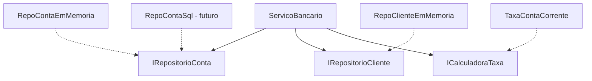

# Aula 9 - Interfaces: DI, Testabilidade e Composicao

## Objetivo da aula

Consolidar interfaces como base para injecao de dependencia, composicao raiz e testes mais confiaveis no `MiniBank`.

## Pre-requisitos

- dominar a versao `v0.7`
- compreender interfaces segregadas e Strategy
- reconhecer o problema de classes que criam suas proprias dependencias

## Ao final, o aluno sera capaz de...

- explicar por que DI reduz acoplamento e aumenta testabilidade
- separar contrato de implementacao de persistencia
- montar uma composicao raiz simples
- escrever testes de comportamento sem depender de banco de dados real

## Teoria essencial

Interfaces sao o mecanismo central para **desacoplamento**, **testabilidade** e **extensibilidade**. A Aula 3 apresentou o basico; aqui aprofundamos com injecao de dependencia, implementacao explicita e testes.

### Interface vs Classe abstrata

| Criterio | Interface | Classe Abstrata |
|----------|-----------|-----------------|
| Implementacao | Nao (classica) | Sim |
| Heranca multipla | Sim | Nao |
| Estado (campos) | Nao | Sim |
| Quando usar | Contrato puro, DI | Base com logica compartilhada |

### Injecao de Dependencia (DI)

Em vez de uma classe criar suas dependencias, ela recebe abstracoes via construtor. Isso permite trocar implementacoes sem alterar o consumidor.

## Erros e confusoes comuns

- chamar qualquer construtor com parametro de "DI"
- injetar interface e ainda instanciar concretos dentro da classe
- confundir composicao raiz com "lugar qualquer do sistema"
- tratar teste em memoria como gambiarra, e nao como vantagem de design

---

## 🏦 Hands-on: App Bancario — Persistencia e testes via interfaces

### Estado atual do MiniBank

- Versao de entrada: `v0.7`
- Versao de saida: `v0.8`
- Classes novas: `IRepositorioCliente`, `IRepositorioConta`, implementacoes em memoria, `ServicoBancario`
- Classes alteradas: montagem do sistema passa a ocorrer fora das classes de negocio
- Comportamentos novos: persistencia intercambiavel, servico de negocio com DI, testes sem banco real
- Como testar no Main: montar o sistema na composicao raiz, abrir contas, transferir e rodar testes com repositorios em memoria

### O que muda nesta aula

As dependencias deixam de nascer escondidas nas classes e passam a ser declaradas como contrato.

### Por que muda

Sem isso, a arquitetura fica dificil de testar, de trocar infraestrutura e de explicar para o aluno onde as decisoes de composicao acontecem.

### Organizando o projeto

1. Reestruture a pasta `Repositories` em subpastas, como `Repositories/Contracts` e `Repositories/InMemory`.
2. Coloque `IRepositorioCliente.cs` e `IRepositorioConta.cs` em `Repositories/Contracts`.
3. Coloque `RepositorioClienteEmMemoria.cs` e `RepositorioContaEmMemoria.cs` em `Repositories/InMemory`.
4. Na pasta `Services`, crie `ServicoBancario.cs`.
5. Se quiser separar demonstracoes de verificacao, crie `Tests/Manual` com um arquivo `TesteServicoBancario.cs`.

Vamos aplicar DI para permitir trocar a persistencia do MiniBank, e criar testes simples sem banco de dados.

### Passo 1: Interfaces de repositorio

```csharp
// === MiniBank v0.8 — Interfaces e DI ===

public interface IRepositorioCliente
{
    void Salvar(Cliente cliente);
    Cliente? BuscarPorCpf(string cpf);
    IEnumerable<Cliente> ListarTodos();
}

public interface IRepositorioConta
{
    void Salvar(IConta conta);
    IConta? BuscarPorNumero(string numero);
    IEnumerable<IConta> ListarTodas();
    IEnumerable<IConta> BuscarPorCliente(string cpf);
}
```

### Passo 2: Implementacao em memoria

```csharp
public class RepositorioContaEmMemoria : IRepositorioConta
{
    private readonly List<IConta> contas = new();

    public void Salvar(IConta conta)
    {
        var existente = BuscarPorNumero(conta.Numero);
        if (existente != null)
            contas.Remove(existente);
        contas.Add(conta);
    }

    public IConta? BuscarPorNumero(string numero)
        => contas.FirstOrDefault(c => c.Numero == numero);

    public IEnumerable<IConta> ListarTodas() => contas;

    public IEnumerable<IConta> BuscarPorCliente(string cpf)
        => contas.Where(c => c.Titular.Cpf == cpf);
}

public class RepositorioClienteEmMemoria : IRepositorioCliente
{
    private readonly List<Cliente> clientes = new();

    public void Salvar(Cliente cliente)
    {
        if (!clientes.Any(c => c.Cpf == cliente.Cpf))
            clientes.Add(cliente);
    }

    public Cliente? BuscarPorCpf(string cpf)
        => clientes.FirstOrDefault(c => c.Cpf == cpf);

    public IEnumerable<Cliente> ListarTodos() => clientes;
}
```

### Passo 3: Servico de negocio com DI

```csharp
public class ServicoBancario
{
    private readonly IRepositorioCliente repoClientes;
    private readonly IRepositorioConta repoContas;
    private readonly ICalculadoraTaxa calculadoraTaxa;
    private int contadorContas = 0;

    public ServicoBancario(
        IRepositorioCliente repoClientes,
        IRepositorioConta repoContas,
        ICalculadoraTaxa calculadoraTaxa)
    {
        this.repoClientes = repoClientes;
        this.repoContas = repoContas;
        this.calculadoraTaxa = calculadoraTaxa;
    }

    public Cliente CadastrarCliente(string nome, string cpf, string email)
    {
        if (repoClientes.BuscarPorCpf(cpf) != null)
            throw new InvalidOperationException("Cliente ja cadastrado.");

        var cliente = new Cliente(nome, cpf, email);
        repoClientes.Salvar(cliente);
        return cliente;
    }

    public ContaCorrente AbrirContaCorrente(Cliente cliente, decimal saldoInicial = 0)
    {
        var conta = new ContaCorrente($"CC-{++contadorContas:D4}", cliente, saldoInicial);
        repoContas.Salvar(conta);
        return conta;
    }

    public bool Transferir(string numeroOrigem, string numeroDestino, decimal valor)
    {
        var origem = repoContas.BuscarPorNumero(numeroOrigem)
            ?? throw new InvalidOperationException($"Conta {numeroOrigem} nao encontrada.");
        var destino = repoContas.BuscarPorNumero(numeroDestino)
            ?? throw new InvalidOperationException($"Conta {numeroDestino} nao encontrada.");

        decimal taxa = calculadoraTaxa.Calcular(valor);
        if (!origem.Sacar(valor + taxa)) return false;
        destino.Depositar(valor);
        return true;
    }
}
```

### Passo 4: Montagem (composicao raiz)

```csharp
// Composicao raiz — onde decidimos quais implementacoes usar
var repoClientes = new RepositorioClienteEmMemoria();
var repoContas = new RepositorioContaEmMemoria();
var taxa = new TaxaContaCorrente(); // 2%

var servico = new ServicoBancario(repoClientes, repoContas, taxa);

var ana = servico.CadastrarCliente("Ana Silva", "123.456.789-00", "ana@email.com");
var joao = servico.CadastrarCliente("Joao Santos", "987.654.321-00", "joao@email.com");

var ccAna = servico.AbrirContaCorrente(ana, 5000m);
var ccJoao = servico.AbrirContaCorrente(joao, 1000m);

servico.Transferir(ccAna.Numero, ccJoao.Numero, 1000m);
```

### Passo 5: Testabilidade

Sem framework de teste — apenas metodos que verificam comportamento:

```csharp
public static class TesteServicoBancario
{
    public static void TestarTransferenciaComSucesso()
    {
        // Arrange
        var repoClientes = new RepositorioClienteEmMemoria();
        var repoContas = new RepositorioContaEmMemoria();
        var taxa = new TaxaContaPoupanca(); // 0% para simplificar
        var servico = new ServicoBancario(repoClientes, repoContas, taxa);

        var cli1 = servico.CadastrarCliente("A", "111.111.111-11", "a@a.com");
        var cli2 = servico.CadastrarCliente("B", "222.222.222-22", "b@b.com");
        var cc1 = servico.AbrirContaCorrente(cli1, 1000m);
        var cc2 = servico.AbrirContaCorrente(cli2, 0m);

        // Act
        bool resultado = servico.Transferir(cc1.Numero, cc2.Numero, 300m);

        // Assert
        Debug.Assert(resultado == true, "Transferencia deveria ter sucesso");
        Debug.Assert(cc1.Saldo == 700m, $"Saldo origem esperado 700, obtido {cc1.Saldo}");
        Debug.Assert(cc2.Saldo == 300m, $"Saldo destino esperado 300, obtido {cc2.Saldo}");
        Console.WriteLine("✅ TestarTransferenciaComSucesso PASSOU");
    }

    public static void TestarTransferenciaSemSaldo()
    {
        var repoClientes = new RepositorioClienteEmMemoria();
        var repoContas = new RepositorioContaEmMemoria();
        var taxa = new TaxaContaPoupanca();
        var servico = new ServicoBancario(repoClientes, repoContas, taxa);

        var cli = servico.CadastrarCliente("C", "333.333.333-33", "c@c.com");
        var cc1 = servico.AbrirContaCorrente(cli, 100m);
        var cc2 = servico.AbrirContaCorrente(cli, 0m);

        bool resultado = servico.Transferir(cc1.Numero, cc2.Numero, 99999m);

        Debug.Assert(resultado == false, "Deveria falhar por saldo insuficiente");
        Console.WriteLine("✅ TestarTransferenciaSemSaldo PASSOU");
    }
}

// No Main:
TesteServicoBancario.TestarTransferenciaComSucesso();
TesteServicoBancario.TestarTransferenciaSemSaldo();
```

Note: os testes nao dependem de banco de dados, rede ou configuracao. Usam repositorios em memoria. Se amanha trocarmos para SQL Server, os testes continuam rodando com o fake.

### Diagrama da DI



---

## Checklist de verificacao da versao

- servicos dependem de interfaces de repositorio, nao de concretos
- a composicao raiz escolhe as implementacoes reais
- os testes rodam com repositorios em memoria
- trocar a implementacao de persistencia nao exige alterar o `ServicoBancario`
- o aluno consegue explicar por que isso melhora testabilidade

## Exercicios

1. Crie `IServicoNotificacao` com metodo `Notificar(string destinatario, string mensagem)`. Implemente `NotificacaoConsole` e injete no `ServicoBancario`.
2. Escreva um teste que verifica se cadastrar cliente duplicado lanca excecao.
3. Crie `IRelatorioServico` e implemente um `RelatorioConsole` que lista todas as contas e saldos. Injete no servico.
4. Implemente `RepositorioContaEmArquivo : IRepositorioConta` que salva contas em arquivo texto. Troque na composicao raiz e observe que o `ServicoBancario` nao muda.

### Gabarito comentado

1. Implementacao de referencia:

```csharp
public interface IServicoNotificacao
{
    void Notificar(string destinatario, string mensagem);
}

public class NotificacaoConsole : IServicoNotificacao
{
    public void Notificar(string destinatario, string mensagem)
    {
        Console.WriteLine($"[NOTIFICACAO] Para {destinatario}: {mensagem}");
    }
}
```

Criterio de aceitacao:
- `ServicoBancario` recebe `IServicoNotificacao` no construtor
- o servico usa a abstracao, nao `Console.WriteLine` direto

2. Implementacao de referencia:

```csharp
public static void TestarClienteDuplicado()
{
    var repoClientes = new RepositorioClienteEmMemoria();
    var repoContas = new RepositorioContaEmMemoria();
    var taxa = new TaxaContaPoupanca();
    var servico = new ServicoBancario(repoClientes, repoContas, taxa);

    servico.CadastrarCliente("Ana", "111.111.111-11", "ana@email.com");

    try
    {
        servico.CadastrarCliente("Ana 2", "111.111.111-11", "outro@email.com");
        Debug.Assert(false, "Deveria ter lancado excecao");
    }
    catch (InvalidOperationException)
    {
        Debug.Assert(true);
    }
}
```

3. Implementacao de referencia:

```csharp
public interface IRelatorioServico
{
    void Gerar();
}

public class RelatorioConsole : IRelatorioServico
{
    private readonly IRepositorioConta repositorio;

    public RelatorioConsole(IRepositorioConta repositorio)
    {
        this.repositorio = repositorio;
    }

    public void Gerar()
    {
        foreach (var conta in repositorio.ListarTodas())
            Console.WriteLine($"{conta.Numero} | {conta.Titular.Nome} | {conta.Saldo:C}");
    }
}
```

4. Resposta esperada: `RepositorioContaEmArquivo` implementa o mesmo contrato de `IRepositorioConta`. Na composicao raiz, basta trocar:

```csharp
IRepositorioConta repoContas = new RepositorioContaEmArquivo("contas.txt");
```

Sinal de que ficou correto:
- `ServicoBancario` permanece igual
- apenas a montagem muda

Erros comuns:
- injetar o servico, mas continuar instanciando o concreto em algum metodo
- escrever teste dependente de arquivo ou banco sem necessidade
- misturar composicao raiz com logica de negocio

## Fechamento e conexao com a proxima aula

O `MiniBank` agora tem uma arquitetura mais clara: contratos, montagem externa e testes mais baratos. A Aula 10 volta a generics com mais profundidade para mostrar onde a generalizacao ajuda e onde o dominio continua pedindo especializacao.

### Versao esperada apos esta aula

- Versao de entrada: `v0.7`
- Versao de saida: `v0.8`
- Classes novas: interfaces e implementacoes de repositorio, `ServicoBancario`
- Classes alteradas: montagem do sistema
- Comportamentos novos: DI, composicao raiz, testes independentes de infraestrutura
- Como testar no Main: trocar a implementacao do repositorio e reexecutar o mesmo fluxo de negocio
