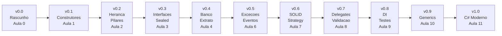

# Aula 11 - Novidades do C# que Fortalecem a POO

## Objetivo da aula

Fechar a trilha mostrando como recursos modernos de `C#` fortalecem contratos, imutabilidade, expressividade e seguranca do design OO.

## Pre-requisitos

- dominar a versao `v0.9`
- entender interfaces, generics, excecoes e eventos ja aplicados no `MiniBank`
- reconhecer o que e entidade mutavel e o que e objeto de valor

## Ao final, o aluno sera capaz de...

- usar records para objetos de valor
- aplicar nullable reference types de forma intencional
- usar pattern matching para tornar decisoes mais legiveis
- justificar quando recursos modernos melhoram o design OO em vez de apenas reduzir codigo

## Teoria essencial

`C#` evolui continuamente. Recursos de C# 8 em diante tem impacto direto na pratica de POO:

- **Nullable reference types** (C# 8): seguranca contra `null`
- **Default interface methods** (C# 8): interfaces evoluem sem quebrar implementadores
- **Switch expressions / pattern matching** (C# 8): decisoes por tipo mais expressivas
- **Records** (C# 9): objetos de valor imutaveis com igualdade por valor
- **Init-only properties** (C# 9): imutabilidade apos construcao
- **Required members** (C# 11): inicializacao obrigatoria
- **Primary constructors** (C# 12): menos boilerplate

## Erros e confusoes comuns

- trocar classes por records sem pensar em identidade e mutabilidade
- ativar nullable sem revisar contratos
- usar pattern matching apenas porque "ficou moderno"
- tratar recurso novo como substituto automatico de modelagem boa

---

## 🏦 Hands-on: App Bancario — Modernizando o MiniBank

### Estado atual do MiniBank

- Versao de entrada: `v0.9`
- Versao de saida: `v1.0`
- Classes novas: `record Transacao`, DTOs modernos e utilitarios com pattern matching
- Classes alteradas: `Cliente`, `IConta`, servicos e analise de contas
- Comportamentos novos: igualdade por valor, nulidade explicita, classificacao por pattern matching, interfaces com implementacao padrao
- Como testar no Main: comparar records, usar `with`, observar classificacoes e validar tratamento de nulos

### O que muda nesta aula

O sistema final nao muda de dominio, mas fica mais robusto e expressivo com recursos modernos da linguagem.

### Por que muda

Essa etapa fecha a trilha mostrando que evolucao de linguagem pode reforcar um bom design, e nao apenas encurtar sintaxe.

### Organizando o projeto

1. Crie a pasta `DTOs` para objetos usados na borda da aplicacao, como `AberturaConta`.
2. Crie a pasta `Analysis` para componentes como `AnalisadorConta.cs`.
3. Atualize `Models/Transacoes/Transacao.cs` para a versao em `record`.
4. Atualize `Models/Cliente.cs` e os contratos em `Contracts` para refletir nullable reference types e default interface methods.
5. Se criar resumos e projections, coloque-os em `DTOs/ContaResumo.cs` ou `ViewModels/ContaResumo.cs`, mantendo a ideia de separar modelo de dominio de objeto de exibicao.

Versao final: aplicamos os recursos modernos ao nosso sistema bancario.

### Passo 1: Records para Transacao

Transacoes sao objetos de valor — duas transacoes com mesmos dados sao iguais. Perfeito para `record`:

```csharp
// === MiniBank v1.0 — Versao final com C# moderno ===

public enum TipoTransacao { Deposito, Saque, Transferencia, Rendimento, Taxa }

public record Transacao(
    decimal Valor,
    TipoTransacao Tipo,
    string Descricao,
    DateTime Data)
{
    // Construtor conveniente — Data assume agora
    public Transacao(decimal valor, TipoTransacao tipo, string descricao)
        : this(valor, tipo, descricao, DateTime.Now) { }

    public override string ToString()
        => $"{Data:dd/MM HH:mm} | {Tipo,-15} | {Valor,12:C} | {Descricao}";
}
```

Beneficios do record:

```csharp
var t1 = new Transacao(100m, TipoTransacao.Deposito, "Deposito");
var t2 = new Transacao(100m, TipoTransacao.Deposito, "Deposito", t1.Data);
Console.WriteLine(t1 == t2); // True — igualdade por valor!

// Copia com alteracao:
var t3 = t1 with { Valor = 200m };
Console.WriteLine(t3); // mesma data, valor diferente
```

### Passo 2: Nullable reference types no Cliente

```csharp
#nullable enable

public class Cliente : IIdentificavel
{
    public string Id => Cpf;
    public string Nome { get; }
    public string Cpf { get; }
    public string Email { get; set; }
    public string? Telefone { get; set; }    // explicitamente opcional
    public string? Apelido { get; set; }     // explicitamente opcional

    public Cliente(string nome, string cpf, string email)
    {
        Nome = nome ?? throw new ArgumentNullException(nameof(nome));
        Cpf = cpf ?? throw new ArgumentNullException(nameof(cpf));
        Email = email ?? throw new ArgumentNullException(nameof(email));
    }

    public string ExibirResumo()
    {
        var apelido = Apelido != null ? $" ({Apelido})" : "";
        var fone = Telefone ?? "nao informado";
        return $"{Nome}{apelido} | Tel: {fone}";
    }
}
```

### Passo 3: Pattern matching para classificacao de contas

```csharp
public static class AnalisadorConta
{
    public static string Classificar(IConta conta) => conta switch
    {
        ContaCorrente { Saldo: < 0 } cc
            => $"⚠ {cc.Numero}: NEGATIVA ({cc.Saldo:C})",

        ContaCorrente { Saldo: >= 50_000 }
            => $"⭐ Conta Premium (saldo alto)",

        ContaCorrente cc
            => $"🏦 CC {cc.Numero}: {cc.Saldo:C}",

        ContaPoupanca { Saldo: > 10_000 } cp
            => $"💰 Poupanca grande: {cp.Saldo:C} (rende {cp.TaxaRendimento:P})",

        ContaPoupanca cp
            => $"🐷 Poupanca: {cp.Saldo:C}",

        _ => "Tipo de conta desconhecido"
    };

    public static decimal CalcularIof(Transacao t) => t.Tipo switch
    {
        TipoTransacao.Saque => t.Valor * 0.0038m,
        TipoTransacao.Transferencia => t.Valor * 0.0038m,
        TipoTransacao.Deposito => 0m,
        TipoTransacao.Rendimento => 0m,
        _ => 0m
    };
}
```

### Passo 4: Default interface methods

Adicionamos funcionalidade a `IConta` sem quebrar implementacoes existentes:

```csharp
public interface IConta : IDebitavel, ICreditavel, IExibivel
{
    string Numero { get; }
    decimal Saldo { get; }
    Cliente Titular { get; }

    // Metodo padrao — disponivel sem implementar
    string ResumoRapido()
        => $"{Numero}: {Saldo:C} ({Titular.Nome})";

    // Outro metodo padrao
    bool EstaPositiva() => Saldo >= 0;
}
```

Classes existentes ganham `ResumoRapido()` e `EstaPositiva()` automaticamente. Se quiserem, podem sobrescrever.

### Passo 5: Required members para DTOs

Para comunicacao entre camadas, usamos DTOs com campos obrigatorios:

```csharp
public class AberturaConta
{
    public required string NomeCliente { get; init; }
    public required string Cpf { get; init; }
    public required string Email { get; init; }
    public required string TipoConta { get; init; }
    public decimal SaldoInicial { get; init; } = 0;
}

// Uso:
var solicitacao = new AberturaConta
{
    NomeCliente = "Maria",
    Cpf = "444.555.666-77",
    Email = "maria@email.com",
    TipoConta = "corrente"
};
// Omitir qualquer campo required gera erro de compilacao!
```

### Passo 6: Juntando tudo — programa principal v1.0

```csharp
#nullable enable

// === Composicao raiz ===
var repoClientes = new RepositorioEmMemoria<Cliente>();
var repoContas = new RepositorioConta();
var taxa = new TaxaContaCorrente();
var servico = new ServicoBancario(repoClientes, repoContas, taxa);

// === Cadastro ===
var ana = servico.CadastrarCliente("Ana Silva", "123.456.789-00", "ana@email.com");
ana.Telefone = "(11) 99999-0000";
ana.Apelido = "Aninha";

var joao = servico.CadastrarCliente("Joao Santos", "987.654.321-00", "joao@email.com");

// === Abertura de contas ===
var ccAna = servico.AbrirContaCorrente(ana, 5000m);
var cpAna = new ContaPoupanca("CP-001", ana, 8000m);
repoContas.Adicionar(cpAna);

var ccJoao = servico.AbrirContaCorrente(joao, 1000m);

// === Notificacoes ===
var central = new CentralNotificacoes();
central.Inscrever(e => Console.WriteLine($"  📧 {e.Conta.Titular.Email}: {e.Transacao}"));
ccAna.Notificacoes = central;

// === Operacoes ===
Console.WriteLine("\n--- OPERACOES ---");
ccAna.Depositar(2000m);
try { ccAna.Sacar(20000m); }
catch (SaldoInsuficienteException ex) { Console.WriteLine($"  ❌ {ex.Message}"); }

servico.Transferir(ccAna.Numero, ccJoao.Numero, 1000m);

// === Classificacao com pattern matching ===
Console.WriteLine("\n--- CLASSIFICACAO ---");
foreach (var conta in repoContas.ListarTodos())
    Console.WriteLine(AnalisadorConta.Classificar(conta));

// === Extrato com records ===
Console.WriteLine($"\n--- EXTRATO {ccAna.Numero} ---");
Console.WriteLine(ccAna.ExibirExtrato());

// === Resumo rapido (default interface method) ===
Console.WriteLine("\n--- RESUMO RAPIDO ---");
foreach (IConta conta in repoContas.ListarTodos())
    Console.WriteLine(conta.ResumoRapido());

// === Info do cliente com nullable ===
Console.WriteLine($"\n--- CLIENTE ---");
Console.WriteLine(ana.ExibirResumo());  // Ana Silva (Aninha) | Tel: (11) 99999-0000
Console.WriteLine(joao.ExibirResumo()); // Joao Santos | Tel: nao informado
```

### Mapa de evolucao do MiniBank



### Tabela: recurso → onde usamos no MiniBank

| Recurso C# | Onde aplicamos |
|-------------|----------------|
| Nullable refs | `Cliente.Telefone?`, `Cliente.Apelido?` |
| Records | `Transacao` — igualdade por valor, `with` |
| Pattern matching | `AnalisadorConta.Classificar`, `CalcularIof` |
| Default interface | `IConta.ResumoRapido()`, `IConta.EstaPositiva()` |
| Required + init | `AberturaConta` DTO |

---

## Checklist de verificacao da versao

- `Transacao` agora e objeto de valor com semantica coerente
- `Cliente` explicita o que pode ser `null`
- ha ao menos um exemplo de pattern matching com impacto real no dominio
- a interface evolui sem quebrar implementadores existentes
- o aluno consegue explicar por que o recurso moderno melhora o design, e nao apenas a sintaxe

## Exercicios finais

1. Converta `TransacaoEventArgs` para record. Compare com a versao anterior.
2. Adicione pattern matching no `ServicoTransferencia` para aplicar regras diferentes por tipo de conta (corrente cobra taxa, poupanca nao).
3. Crie um `record ContaResumo(string Numero, string NomeTitular, decimal Saldo, string Tipo)` e um metodo que converte `IConta` em `ContaResumo`.
4. Use nullable no `Banco` para retornar `IConta?` em buscas e trate o resultado com `?.` e `??` no chamador.

### Gabarito comentado

1. Implementacao de referencia:

```csharp
public record TransacaoEventArgs(Transacao Transacao, IConta Conta);
```

Resposta esperada: a versao com `record` reduz boilerplate e ganha igualdade por valor, o que faz sentido se o objeto for tratado como pacote imutavel de dados do evento.

2. Implementacao de referencia:

```csharp
public decimal CalcularTaxa(IConta conta, decimal valor) => conta switch
{
    ContaCorrente => valor * 0.02m,
    ContaPoupanca => 0m,
    _ => 0m
};
```

Como verificar:
- corrente cobra taxa
- poupanca nao cobra taxa

3. Implementacao de referencia:

```csharp
public record ContaResumo(string Numero, string NomeTitular, decimal Saldo, string Tipo);

public static ContaResumo Converter(IConta conta)
    => new(conta.Numero, conta.Titular.Nome, conta.Saldo, conta.GetType().Name);
```

4. Implementacao de referencia:

```csharp
public IConta? BuscarConta(string numero)
    => contas.FirstOrDefault(c => c.Numero == numero);

var descricao = banco.BuscarConta("CC-001")?.ExibirExtrato() ?? "Conta nao encontrada";
```

Erros comuns:
- converter entidade com identidade forte em `record` sem refletir sobre semantica
- usar pattern matching sem cobrir caso padrao
- ativar nullable e continuar ignorando `null` no chamador

## Projeto final sugerido

Junte todo o codigo desenvolvido ao longo das aulas num unico projeto console. O sistema deve:

- Cadastrar clientes e abrir contas (corrente e poupanca)
- Realizar depositos, saques e transferencias com validacao
- Cobrar taxas via Strategy
- Notificar transacoes via eventos
- Persistir dados em repositorios genericos
- Gerar extrato e relatorios
- Usar excecoes customizadas para regras de negocio
- Incluir ao menos 3 testes automatizados simples

Bonus: adicione um menu interativo no console para o usuario operar o sistema.

## Definicao de pronto do projeto final

- o sistema cadastra clientes e abre pelo menos dois tipos de conta
- depositos, saques e transferencias funcionam com validacao observavel
- existe ao menos uma estrategia de taxa intercambiavel
- existe ao menos um mecanismo de notificacao de transacao
- a persistencia usa repositorio com abstracao clara
- ha extrato ou relatorio consultavel
- pelo menos 3 testes simples executam sem infraestrutura externa
- o `Main` demonstra um fluxo completo sem ajustes manuais entre passos

## Fechamento e conexao com a proxima aula

Esta aula fecha a trilha regular: o `MiniBank` chega a `v1.0` com contratos mais expressivos, nulidade explicita, pattern matching e objetos de valor mais adequados. A partir daqui, o projeto final sugerido funciona como consolidacao da jornada inteira.

### Versao esperada apos esta aula

- Versao de entrada: `v0.9`
- Versao de saida: `v1.0`
- Classes novas: records e DTOs modernos conforme necessidade
- Classes alteradas: `Transacao`, `Cliente`, `IConta` e servicos auxiliares
- Comportamentos novos: igualdade por valor, nullable explicito, pattern matching e implementacoes padrao em interfaces
- Como testar no Main: executar o programa final, comparar `record`, observar classificacoes e tratar buscas nulas com `?.` e `??`
