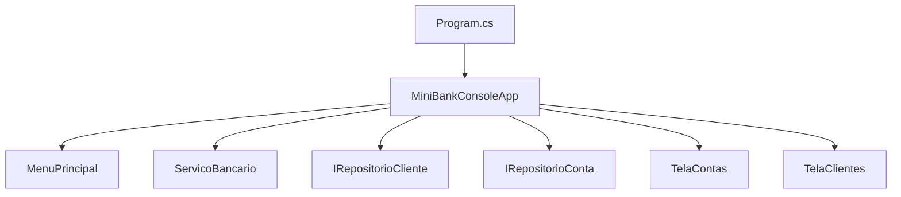

# Aula 12 - Interface de Console para o MiniBank com Spectre.Console

## Objetivo da aula

Construir uma interface de console adequada para o `MiniBank`, separando apresentacao de regra de negocio e usando `Spectre.Console` para menus, formularios, paineis e tabelas.

## Pre-requisitos

- dominar a versao `v1.0` do `MiniBank`
- entender `ServicoBancario`, repositorios e contratos principais
- saber criar e referenciar pacotes NuGet em um projeto `dotnet`

## Ao final, o aluno sera capaz de...

- instalar e usar `Spectre.Console` em um projeto console
- montar um menu principal com `SelectionPrompt`
- coletar entradas com `TextPrompt` e validacao
- exibir contas, clientes e extratos com `Table` e `Panel`
- manter a UI separada das regras de negocio do `MiniBank`

## Teoria essencial

Nas aulas anteriores, o `MiniBank` foi evoluido como um conjunto de entidades, servicos e contratos. Agora precisamos de uma interface melhor do que varios `Console.WriteLine()` soltos.

Uma boa interface de console para o projeto deve:

- reaproveitar o dominio existente, sem reescrever regra de negocio
- delegar operacoes para `ServicoBancario` e repositorios
- coletar dados do usuario com prompts claros
- apresentar resultados em formato mais legivel que texto cru

`Spectre.Console` e uma biblioteca para construir aplicacoes de console mais expressivas. Segundo a documentacao oficial, ela facilita a criacao de aplicacoes de console bonitas e multiplataforma, com suporte a tabelas, paineis, prompts e markup.

Para esta aula, usaremos principalmente:

- `SelectionPrompt<T>` para o menu principal
- `TextPrompt<T>` para coleta de dados
- `Table` para listagens
- `Panel` para cabecalho e mensagens importantes
- `AnsiConsole.MarkupLine()` para feedback visual

## Erros e confusoes comuns

- colocar regra de negocio dentro da interface
- transformar `Program.cs` em um arquivo gigante com tudo misturado
- usar `Spectre.Console` apenas como maquiagem, sem melhorar o fluxo da aplicacao
- esquecer de validar entrada do usuario antes de chamar o servico
- acoplar o menu a classes concretas que poderiam continuar sendo abstraidas

## 🏦 Hands-on: App Bancario — Interface de Console com Spectre.Console

### Estado atual do MiniBank

- Versao de entrada: `v1.0`
- Versao de saida: `v1.1`
- Classes novas: componentes de interface de console
- Classes alteradas: `Program.cs` e composicao raiz
- Comportamentos novos: menu interativo, formularios guiados, tabelas de listagem, extrato formatado
- Como testar no Main: executar o projeto e navegar pelo menu com teclado

### O que muda nesta aula

O `MiniBank` deixa de ser apenas um projeto demonstrado por chamadas manuais no `Main` e passa a ter uma interface interativa em console.

### Por que muda

Essa etapa aproxima o projeto de um produto real. O aluno passa a enxergar com clareza a diferenca entre dominio, aplicacao e apresentacao.

### Organizando o projeto

1. Adicione o pacote oficial:

```bash
dotnet add package Spectre.Console
```

2. Crie a pasta `UI/Console`.
3. Dentro dela, crie a subpasta `UI/Console/Screens`.
4. Crie os arquivos:
   - `UI/Console/MiniBankConsoleApp.cs`
   - `UI/Console/Screens/MenuPrincipal.cs`
   - `UI/Console/Screens/TelaContas.cs`
   - `UI/Console/Screens/TelaClientes.cs`
5. Mantenha `Program.cs` apenas para composicao raiz e inicializacao da aplicacao.

Estrutura sugerida:

```text
MiniBank/
|-- Program.cs
|-- Contracts/
|-- Models/
|-- Repositories/
|-- Services/
|-- Strategies/
`-- UI/
    `-- Console/
        |-- MiniBankConsoleApp.cs
        `-- Screens/
            |-- MenuPrincipal.cs
            |-- TelaClientes.cs
            `-- TelaContas.cs
```

### Passo 1: Composicao raiz com servicos e UI

No `Program.cs`, monte a aplicacao e entregue as dependencias para a UI:

```csharp
using MiniBank.Repositories.InMemory;
using MiniBank.Services;
using MiniBank.Strategies;
using MiniBank.UI.Console;

var repoClientes = new RepositorioClienteEmMemoria();
var repoContas = new RepositorioContaEmMemoria();
var calculadoraTaxa = new TaxaContaCorrente();

var servico = new ServicoBancario(repoClientes, repoContas, calculadoraTaxa);
var app = new MiniBankConsoleApp(servico, repoClientes, repoContas);

app.Executar();
```

Aqui, a UI nao cria regras de negocio. Ela apenas recebe o que precisa.

### Passo 2: Cabecalho e menu principal com `SelectionPrompt`

Crie um menu simples e legivel:

```csharp
using Spectre.Console;

namespace MiniBank.UI.Console.Screens;

public class MenuPrincipal
{
    public string Exibir()
    {
        AnsiConsole.Clear();
        AnsiConsole.Write(
            new Panel("[bold yellow]MiniBank[/]\n[grey]Sistema bancario em console[/]")
                .Border(BoxBorder.Rounded)
                .Expand());

        return AnsiConsole.Prompt(
            new SelectionPrompt<string>()
                .Title("\n[green]Escolha uma operacao[/]")
                .PageSize(10)
                .AddChoices(
                    "Cadastrar cliente",
                    "Abrir conta corrente",
                    "Abrir conta poupanca",
                    "Depositar",
                    "Sacar",
                    "Transferir",
                    "Listar contas",
                    "Ver extrato",
                    "Sair"));
    }
}
```

`SelectionPrompt` faz sentido aqui porque o usuario precisa escolher exatamente uma acao por vez.

### Passo 3: Aplicacao principal coordenando o fluxo

Agora crie a classe que coordena o loop principal:

```csharp
using MiniBank.Repositories.Contracts;
using MiniBank.Services;
using MiniBank.UI.Console.Screens;
using Spectre.Console;

namespace MiniBank.UI.Console;

public class MiniBankConsoleApp
{
    private readonly ServicoBancario servico;
    private readonly IRepositorioCliente repoClientes;
    private readonly IRepositorioConta repoContas;
    private readonly MenuPrincipal menu = new();

    public MiniBankConsoleApp(
        ServicoBancario servico,
        IRepositorioCliente repoClientes,
        IRepositorioConta repoContas)
    {
        this.servico = servico;
        this.repoClientes = repoClientes;
        this.repoContas = repoContas;
    }

    public void Executar()
    {
        bool executando = true;

        while (executando)
        {
            var opcao = menu.Exibir();

            try
            {
                switch (opcao)
                {
                    case "Cadastrar cliente":
                        CadastrarCliente();
                        break;
                    case "Abrir conta corrente":
                        AbrirContaCorrente();
                        break;
                    case "Abrir conta poupanca":
                        AbrirContaPoupanca();
                        break;
                    case "Depositar":
                        Depositar();
                        break;
                    case "Sacar":
                        Sacar();
                        break;
                    case "Transferir":
                        Transferir();
                        break;
                    case "Listar contas":
                        ListarContas();
                        break;
                    case "Ver extrato":
                        VerExtrato();
                        break;
                    case "Sair":
                        executando = false;
                        break;
                }
            }
            catch (Exception ex)
            {
                AnsiConsole.MarkupLine($"[red]Erro:[/] {Markup.Escape(ex.Message)}");
            }

            if (executando)
            {
                AnsiConsole.MarkupLine("\n[grey]Pressione qualquer tecla para continuar...[/]");
                System.Console.ReadKey(true);
            }
        }
    }
```

### Passo 4: Coletando dados com `TextPrompt`

Exemplo para cadastro de cliente:

```csharp
    private void CadastrarCliente()
    {
        var nome = AnsiConsole.Prompt(
            new TextPrompt<string>("Nome do [green]cliente[/]:")
                .Validate(n => string.IsNullOrWhiteSpace(n)
                    ? ValidationResult.Error("[red]Nome obrigatorio[/]")
                    : ValidationResult.Success()));

        var cpf = AnsiConsole.Prompt(
            new TextPrompt<string>("CPF:")
                .Validate(c => c.Length == 14
                    ? ValidationResult.Success()
                    : ValidationResult.Error("[red]Use o formato XXX.XXX.XXX-XX[/]")));

        var email = AnsiConsole.Prompt(
            new TextPrompt<string>("Email:"));

        servico.CadastrarCliente(nome, cpf, email);
        AnsiConsole.MarkupLine("[green]Cliente cadastrado com sucesso.[/]");
    }
```

`TextPrompt` e o componente correto quando o usuario precisa digitar texto livre ou valores simples com validacao imediata.

### Passo 5: Mostrando contas em `Table`

Crie uma tela de listagem:

```csharp
using MiniBank.Repositories.Contracts;
using Spectre.Console;

namespace MiniBank.UI.Console.Screens;

public class TelaContas
{
    public void Exibir(IRepositorioConta repoContas)
    {
        var table = new Table()
            .Border(TableBorder.Rounded)
            .Title("[yellow]Contas cadastradas[/]");

        table.AddColumn("Numero");
        table.AddColumn("Titular");
        table.AddColumn("Tipo");
        table.AddColumn("Saldo");

        foreach (var conta in repoContas.ListarTodas())
        {
            table.AddRow(
                conta.Numero,
                conta.Titular.Nome,
                conta.GetType().Name,
                conta.Saldo.ToString("C"));
        }

        AnsiConsole.Write(table);
    }
}
```

No `MiniBankConsoleApp`, o metodo pode ficar assim:

```csharp
    private void ListarContas()
    {
        var tela = new TelaContas();
        tela.Exibir(repoContas);
    }
```

### Passo 6: Exibindo extrato com `Panel`

Para destacar o extrato de uma conta:

```csharp
    private void VerExtrato()
    {
        var numero = AnsiConsole.Ask<string>("Numero da conta:");
        var conta = repoContas.BuscarPorNumero(numero);

        if (conta is null)
        {
            AnsiConsole.MarkupLine("[red]Conta nao encontrada.[/]");
            return;
        }

        AnsiConsole.Write(
            new Panel(new Text(conta.ExibirExtrato()))
                .Header($"Extrato da conta {conta.Numero}")
                .Border(BoxBorder.Double));
    }
```

Aqui, `new Text(conta.ExibirExtrato())` e a opcao mais segura. O motivo e que o extrato pode conter colchetes, como em `[ContaCorrente]`, e o `Spectre.Console` tentaria interpretar isso como markup se a `string` fosse passada diretamente ao `Panel`.

### Passo 7: Operacoes com feedback visual

Exemplo para deposito:

```csharp
    private void Depositar()
    {
        var numero = AnsiConsole.Ask<string>("Numero da conta:");
        var valor = AnsiConsole.Prompt(
            new TextPrompt<decimal>("Valor do deposito:")
                .Validate(v => v > 0
                    ? ValidationResult.Success()
                    : ValidationResult.Error("[red]Informe um valor positivo[/]")));

        var conta = repoContas.BuscarPorNumero(numero);
        if (conta is null)
        {
            AnsiConsole.MarkupLine("[red]Conta nao encontrada.[/]");
            return;
        }

        conta.Depositar(valor);
        repoContas.Salvar(conta);

        AnsiConsole.MarkupLine($"[green]Deposito realizado.[/] Novo saldo: [yellow]{conta.Saldo:C}[/]");
    }
```

O mesmo raciocinio vale para `Sacar()` e `Transferir()`: a UI coleta os dados, chama o dominio e mostra o resultado.

### Fluxo sugerido da aplicacao



## Checklist de verificacao da versao

- o projeto referencia `Spectre.Console`
- `Program.cs` ficou pequeno e focado em composicao raiz
- o menu principal usa `SelectionPrompt`
- entradas importantes usam `TextPrompt` com validacao
- listagens usam `Table`
- informacoes destacadas usam `Panel`
- a UI nao recria regra de negocio que ja existe em servicos e entidades

## Exercicios

1. Adicione a opcao `Listar clientes` ao menu principal e exiba o resultado em uma `Table`.
2. Crie uma tela de confirmacao para transferencia antes de executar a operacao.
3. Destaque contas com saldo negativo ou muito baixo usando markup colorido na listagem.
4. Adicione uma opcao `Dashboard` que mostre numero total de clientes, numero total de contas e maior saldo do banco.

### Gabarito comentado

1. Implementacao de referencia:

```csharp
public class TelaClientes
{
    public void Exibir(IRepositorioCliente repoClientes)
    {
        var table = new Table().Border(TableBorder.Rounded);
        table.AddColumn("Nome");
        table.AddColumn("CPF");
        table.AddColumn("Email");

        foreach (var cliente in repoClientes.ListarTodos())
            table.AddRow(cliente.Nome, cliente.Cpf, cliente.Email);

        AnsiConsole.Write(table);
    }
}
```

Como verificar:
- a nova opcao aparece no menu
- os clientes cadastrados aparecem em colunas bem definidas

2. Implementacao de referencia:

```csharp
var confirmar = AnsiConsole.Confirm("Confirma a transferencia?");
if (!confirmar)
    return;
```

Como verificar:
- ao responder `false`, a transferencia nao e executada
- ao responder `true`, o fluxo continua normalmente

3. Implementacao de referencia:

```csharp
var saldoFormatado = conta.Saldo < 100m
    ? $"[red]{conta.Saldo:C}[/]"
    : $"[green]{conta.Saldo:C}[/]";
```

Como verificar:
- contas com saldo baixo aparecem visualmente destacadas

4. Implementacao de referencia:

```csharp
var panel = new Panel(
    $"Clientes: {repoClientes.ListarTodos().Count()}\n" +
    $"Contas: {repoContas.ListarTodas().Count()}\n" +
    $"Maior saldo: {repoContas.ListarTodas().Max(c => c.Saldo):C}");

AnsiConsole.Write(panel.Header("Dashboard"));
```

Erros comuns:

- adicionar logica de calculo complexa diretamente na tela sem extrair quando necessario
- usar `Console.WriteLine` misturado com `AnsiConsole` sem criterio
- fazer menu, prompt e regra de negocio na mesma classe
- esquecer de escapar mensagens dinamicas quando usar markup

## Fechamento e conexao com a proxima aula

Com esta aula, o `MiniBank` ganha uma interface real de console sem perder a organizacao arquitetural conquistada ao longo da trilha. O aluno passa a enxergar com mais clareza como dominio, servicos, persistencia e apresentacao colaboram.

### Versao esperada apos esta aula

- Versao de entrada: `v1.0`
- Versao de saida: `v1.1`
- Classes novas: UI em console com Spectre.Console
- Classes alteradas: `Program.cs` e composicao raiz
- Comportamentos novos: menu interativo, formularios, tabelas e paineis
- Como testar no Main: executar a aplicacao, cadastrar clientes, abrir contas, movimentar saldo e consultar extrato pelo menu

## Referencias oficiais

- Documentacao principal: https://spectreconsole.net/
- Repositorio oficial: https://github.com/spectreconsole/spectre.console
- Instalacao e visao geral: https://github.com/spectreconsole/spectre.console
- `SelectionPrompt`: https://spectreconsole.net/console/prompts/selection-prompt
- `TextPrompt`: https://spectreconsole.net/console/prompts/text-prompt
- `Table`: https://spectreconsole.net/console/widgets/table
- `Panel`: https://spectreconsole.net/api/spectre.console/panel/
