# Prova de Programação Orientada a Objetos com C#

**Disciplina:** Programação Orientada a Objetos  
**Linguagem:** C#  
**Valor total:** 10,0 pontos  
**Tempo sugerido:** 60 a 90 minutos

---

## Instruções gerais

- Leia atentamente cada questão antes de responder.
- Esta avaliação aborda os **4 pilares da orientação a objetos**:
  - Encapsulamento
  - Herança
  - Polimorfismo
  - Abstração
- Na questão de modelagem, organize a resposta com clareza.
- Nas questões de múltipla escolha, assinale apenas **uma alternativa**.
- Nas questões objetivas, responda de forma direta.

---

# Parte 1 — Modelagem e Diagrama de Classes (5,0 pontos)

## Épico

Como **empresa dona de uma plataforma de cursos online**,  
queremos **organizar os diferentes tipos de usuários e cursos do sistema**,  
para **controlar matrículas, criação de cursos e administração da plataforma de forma orientada a objetos**.

## Histórias de usuário

- Como **aluno**, quero me matricular em cursos usando meus créditos para acessar conteúdos na plataforma.
- Como **instrutor**, quero criar e gerenciar cursos para disponibilizar minhas aulas.
- Como **administrador**, quero bloquear usuários e moderar cursos para manter a qualidade da plataforma.
- Como **sistema**, quero tratar diferentes tipos de usuário de forma genérica para facilitar manutenção e evolução do software.

## Regras de negócio

- Todo usuário possui: **nome**, **e-mail**, **senha** e **status da conta**.
- Um **aluno** possui saldo de créditos e pode comprar cursos.
- Um **instrutor** possui especialidade e pode ser responsável por cursos.
- Um **administrador** pode bloquear usuários e aprovar ou remover cursos.
- Um **curso** possui título, preço, carga horária, instrutor responsável e status.
- A senha não deve ser alterada sem validação.
- O saldo do aluno não pode ficar negativo.
- Todo tipo de usuário deve conseguir exibir seu perfil.

## Questão 1 (5,0 pontos)

Com base no épico e nas histórias de usuário acima:

1. Identifique as principais classes do sistema.
2. Monte um **diagrama de classes UML** contendo:
   - classes;
   - atributos principais;
   - métodos principais;
   - relacionamentos;
   - herança.
3. Indique, na sua modelagem, onde aparecem os 4 pilares da orientação a objetos.

### Diagrama de referência em Mermaid

> O Mermaid abaixo representa **uma possível resposta esperada**. Você pode usá-lo como gabarito do professor.

```mermaid
classDiagram
    class Usuario {
        <<abstract>>
        -string senha
        +string Nome
        +string Email
        +bool Ativo
        +AlterarSenha(string novaSenha) void
        +ExibirPerfil() string
        +Desativar() void
    }

    class Aluno {
        +decimal SaldoCreditos
        +ComprarCurso(Curso curso) void
        +AdicionarCreditos(decimal valor) void
        +ExibirPerfil() string
    }

    class Instrutor {
        +string Especialidade
        +decimal ValorPorCursoVendido
        +CriarCurso(string titulo, decimal preco, int cargaHoraria) Curso
        +ExibirPerfil() string
    }

    class Administrador {
        +BloquearUsuario(Usuario usuario) void
        +AprovarCurso(Curso curso) void
        +RemoverCurso(Curso curso) void
        +ExibirPerfil() string
    }

    class Curso {
        +string Titulo
        +decimal Preco
        +int CargaHoraria
        +string Status
        +Publicar() void
        +Remover() void
    }

    Usuario <|-- Aluno
    Usuario <|-- Instrutor
    Usuario <|-- Administrador
    Instrutor "1" --> "0..*" Curso : responsavel
    Aluno "0..*" --> "0..*" Curso : matriculado em
    Administrador ..> Usuario : bloqueia
    Administrador ..> Curso : aprova/remove
```



---

# Parte 2 — Questões de múltipla escolha (3,0 pontos)

## Questão 2 (0,5 ponto)

Analise o código:

```csharp
public class Conta
{
    public decimal Saldo { get; private set; }

    public void Depositar(decimal valor)
    {
        if (valor > 0)
            Saldo += valor;
    }
}
```

Assinale a alternativa correta:

A) `Saldo` pode ser modificado livremente por qualquer classe.  
B) O código apresenta encapsulamento.  
C) `private set` impede a leitura da propriedade.  
D) O método `Depositar` elimina a necessidade de validação.

---

## Questão 3 (0,5 ponto)

Analise o código:

```csharp
public abstract class Funcionario
{
    public string Nome { get; set; }
    public abstract decimal CalcularPagamento();
}
```

É correto afirmar que:

A) A classe pode ser instanciada normalmente.  
B) Toda subclasse deve implementar `CalcularPagamento()`.  
C) Métodos abstratos já possuem implementação padrão.  
D) Classes abstratas não podem ter atributos.

---

## Questão 4 (0,5 ponto)

Analise o código:

```csharp
public class Animal
{
    public virtual string EmitirSom() => "Som genérico";
}

public class Cachorro : Animal
{
    public override string EmitirSom() => "Au au";
}
```

Se executarmos:

```csharp
Animal a = new Cachorro();
Console.WriteLine(a.EmitirSom());
```

A saída será:

A) `Som genérico`  
B) `Cachorro`  
C) `Au au`  
D) Erro de compilação

---

## Questão 5 (0,5 ponto)

Analise o código:

```csharp
public interface IAutenticavel
{
    bool Autenticar(string senha);
}
```

Uma interface em C# é usada principalmente para:

A) Definir contrato de comportamento.  
B) Armazenar atributos privados automaticamente.  
C) Impedir herança entre classes.  
D) Substituir construtores.

---

## Questão 6 (0,5 ponto)

Analise o código:

```csharp
public class Usuario
{
    public string Nome { get; set; }
}

public class Aluno : Usuario
{
    public string Matricula { get; set; }
}
```

Sobre esse código, assinale a alternativa correta:

A) `Usuario` herda de `Aluno`.  
B) `Aluno` não herda nada.  
C) `Aluno` é uma especialização de `Usuario`.  
D) Não existe relação de orientação a objetos no exemplo.

---

## Questão 7 (0,5 ponto)

Analise o código:

```csharp
public class Pagamento
{
    public virtual decimal CalcularTaxa(decimal valor) => valor * 0.02m;
}

public class PagamentoPremium : Pagamento
{
    public override decimal CalcularTaxa(decimal valor) => 0;
}
```

Esse código representa:

A) Apenas encapsulamento.  
B) Sobrescrita com polimorfismo.  
C) Sobrecarga de construtor.  
D) Classe selada.

---

# Parte 3 — Questões objetivas curtas (2,0 pontos)

## Questão 8 (0,5 ponto)

Explique com suas palavras o que é **encapsulamento** em orientação a objetos.

---

## Questão 9 (0,5 ponto)

Qual a diferença entre **classe abstrata** e **interface** em C#?

---

## Questão 10 (0,5 ponto)

Cite um exemplo de uso de **herança** no contexto da prova.

---

## Questão 11 (0,5 ponto)

Explique o que é **polimorfismo** e dê um exemplo simples.

---

# Critérios de correção

## Parte 1 — 5,0 pontos

- Identificação correta das classes: **1,0**
- Relacionamentos e hierarquia: **1,5**
- Atributos e métodos coerentes: **1,0**
- Identificação dos 4 pilares da OO: **1,5**

## Parte 2 — 3,0 pontos

- 0,5 ponto por questão

## Parte 3 — 2,0 pontos

- 0,5 ponto por questão

---

# Gabarito do professor

## Gabarito — Parte 2

- **Questão 2:** B
- **Questão 3:** B
- **Questão 4:** C
- **Questão 5:** A
- **Questão 6:** C
- **Questão 7:** B

## Sugestão de correção — Parte 3

### Questão 8
**Resposta esperada:** Encapsulamento é proteger o estado interno do objeto e controlar como seus dados são acessados ou modificados, normalmente usando atributos privados e métodos ou propriedades com validação.

### Questão 9
**Resposta esperada:** Classe abstrata pode possuir implementação parcial, atributos e métodos concretos; interface define um contrato de comportamento que as classes devem implementar.

### Questão 10
**Resposta esperada:** `Aluno`, `Instrutor` e `Administrador` herdando de `Usuario`.

### Questão 11
**Resposta esperada:** Polimorfismo é a capacidade de tratar objetos diferentes por um tipo comum, executando comportamentos específicos conforme a implementação real. Exemplo: `Usuario u = new Aluno();` e chamar `ExibirPerfil()`.

## Observação sobre a Parte 1

Uma resposta completa deve apresentar pelo menos:

- classe abstrata `Usuario`;
- subclasses `Aluno`, `Instrutor` e `Administrador`;
- classe `Curso`;
- herança entre os tipos de usuário;
- relacionamento entre `Instrutor` e `Curso`;
- relacionamento entre `Aluno` e `Curso`;
- exemplos claros de encapsulamento, abstração, herança e polimorfismo.
